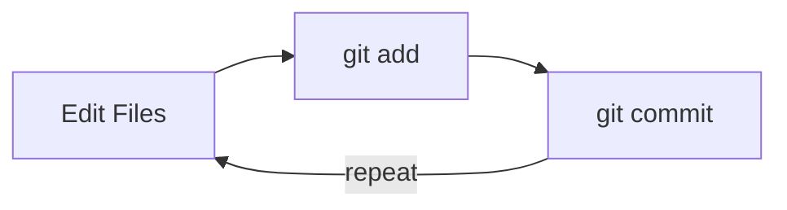

# Terminal & Git Basics

Welcome to your very first lesson! Before we build AI applications, we need to get comfortable with two foundational tools that every developer uses daily: the **terminal** (also called the command line) and **Git** (a version control system). These aren't just prerequisites — they're superpowers that will make everything else in this bootcamp smoother and more enjoyable.

Don't worry if this feels unfamiliar. By the end of this lesson, you'll be navigating your file system and saving snapshots of your work like a pro.

---

## Why the Terminal?

You're probably used to clicking through folders in a file explorer. The terminal lets you do the same things — and much more — by typing short commands. It might feel slower at first, but once you get the hang of it, you'll find it's actually faster and far more powerful.

AI tools, servers, and development workflows all rely heavily on the terminal. Getting comfortable here is the single best investment you can make as a beginner.

## Essential Terminal Commands

Let's walk through the commands you'll use most often.

### `pwd` — Print Working Directory

This tells you where you are right now in the file system.

```bash
pwd
# Output: /home/yourname
```

Think of it as asking "Where am I?"

### `ls` — List Files

Shows the files and folders in your current directory.

```bash
ls
# Output: Documents  Downloads  Desktop  projects
```

Add the `-la` flag to see hidden files and details:

```bash
ls -la
```

### `cd` — Change Directory

Move into a different folder.

```bash
cd Documents
cd ..          # Go back up one level
cd ~           # Go to your home directory
```

### `mkdir` — Make Directory

Create a new folder.

```bash
mkdir my-project
```

### `cat` — Display File Contents

Print the contents of a file to the screen.

```bash
cat notes.txt
```

### Putting It Together

Here's how these directories are structured — each folder can contain files and more folders:

```
  home/
  └── your-username/
      └── projects/
          └── my-first-project/   ← you are here
              ├── hello.py
              └── notes.txt
```

Here's a quick workflow — create a project folder and navigate into it:

```bash
mkdir my-first-project
cd my-first-project
pwd
# Output: /home/yourname/my-first-project
```

Practice these commands until they feel natural. Open your terminal right now and try each one!

---

## Why Version Control?

Imagine you're writing an essay. You save it as `essay.docx`, then `essay_v2.docx`, then `essay_final.docx`, then `essay_final_REAL.docx`. Sound familiar?

Git solves this problem. It tracks every change you make to your files and lets you:

- **Go back in time** to any previous version
- **Experiment safely** without fear of breaking things
- **Collaborate** with others without overwriting each other's work
- **Keep a history** of what changed, when, and why

For AI development, version control is essential. You'll be experimenting with different prompts, model configurations, and code approaches. Git lets you try things fearlessly.

## Getting Started with Git

### `git init` — Create a Repository

A **repository** (or "repo") is a folder that Git is tracking. To start tracking a folder:

```bash
mkdir ai-project
cd ai-project
git init
# Output: Initialized empty Git repository in /home/yourname/ai-project/.git/
```

Git creates a hidden `.git` folder that stores all the version history. You never need to touch this folder directly.

### `git status` — Check What's Changed

This is your go-to command. Run it often!

```bash
git status
```

It tells you which files are new, modified, or ready to be saved.

### `git add` — Stage Your Changes

Before saving a snapshot, you need to tell Git which files to include. This is called **staging**.

```bash
echo "Hello, AI world!" > readme.txt
git add readme.txt
```

To stage everything at once:

```bash
git add .
```

### `git commit` — Save a Snapshot

A **commit** is a saved snapshot of your staged changes, with a message describing what you did.

```bash
git commit -m "Add readme file"
```

Write clear commit messages. Your future self (and teammates) will thank you. Good messages describe *why* you made the change, not just *what* changed.

### `git log` — View Your History

See all the snapshots you've saved:

```bash
git log
```

You'll see each commit with its unique ID, author, date, and message.

### `git diff` — See What Changed

Before committing, you can see exactly what you modified:

```bash
git diff
```

This shows line-by-line differences — additions in green, deletions in red.

---

## The Git Workflow

Here's the pattern you'll follow hundreds of times:

1. **Make changes** to your files
2. **Check status** with `git status`
3. **Stage changes** with `git add`
4. **Commit** with `git commit -m "Your message"`

```bash
# Edit some files...
git status           # What changed?
git add .            # Stage everything
git commit -m "Add data processing function"
git log              # Verify the commit
```

Here's that cycle visualized:



This cycle becomes second nature very quickly.

---

## Your Turn

You now know enough to navigate your file system and manage your code with Git. In the exercise that follows, you'll put this into practice by creating a project directory, initializing a Git repo, and making your first commit.

Remember: every expert was once a beginner. The terminal and Git might feel awkward at first, but within a few days of practice, they'll feel like extensions of your hands. Let's go!
