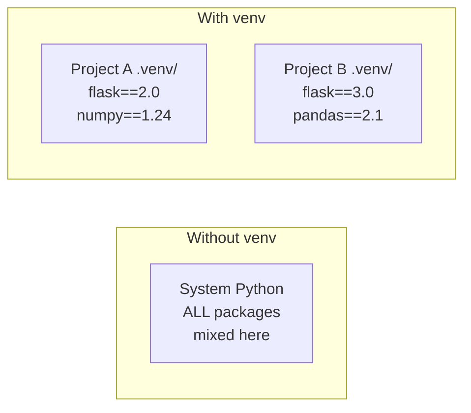

# Python Environment Setup

When you ran `bash scripts/setup.sh`, the setup script created a Python virtual environment, installed all the project's dependencies, and configured everything so the platform works out of the box. You didn't have to do any of that manually -- and that's by design.

But understanding **what happened and why** is essential. Virtual environments, package management, and Python scripting are skills you'll use in every single lesson and project in this bootcamp -- and in every professional AI/ML role.

---

## Why Python?

Python is the dominant language in AI and machine learning for good reason:

- **Readable syntax** -- it reads almost like English, so you can focus on ideas rather than wrestling with semicolons and curly braces.
- **Massive ecosystem** -- libraries like NumPy, pandas, PyTorch, LangChain, and thousands more are a single `pip install` away.
- **Community** -- when you get stuck, there are millions of tutorials, forum posts, and open-source examples to learn from.

You don't need to be a Python expert to build AI applications. You need to be comfortable enough to read code, modify it, and run it. That's exactly where this lesson takes you.

## What the Setup Script Did

Here's what `bash scripts/setup.sh` accomplished for your Python environment:

| Step | What it did | Why |
|------|------------|-----|
| Checked Python 3.11+ | Ran `python --version` and verified the version | AI libraries require modern Python features |
| Created `.venv/` | Ran `python -m venv .venv` in the project root | Isolates this project's packages from your system Python |
| Activated the venv | Ran `source .venv/bin/activate` (or Windows equivalent) | All subsequent installs go into the project, not system-wide |
| Installed tutor engine | Ran `pip install -e ".[dev]"` in `tutor/` | The FastAPI backend that powers AI chat, grading, and hints |
| Installed ACE framework | Ran `pip install -e ".[dev]"` in `ace/` | CLI tool that manages curriculum content |
| Installed web platform | Ran `npm install` in `platform/web/` | Next.js frontend you're using right now |

You can verify this yourself. Open your terminal and try:

```bash
python --version        # Should show 3.11 or higher
pip list                # Shows all installed packages
which python            # Should point to .venv/bin/python (or .venv/Scripts/python on Windows)
```

---

## Virtual Environments Explained

Here's the problem virtual environments solve: Project A needs version 1.0 of a library, but Project B needs version 2.0. If both projects share the same Python installation, they'll fight over which version to use.

**Virtual environments** give each project its own isolated copy of Python and its packages. This is a best practice that every professional developer follows.



### What `.venv/` Actually Contains

```
.venv/
  bin/ (or Scripts/ on Windows)
    python          # A private copy of the Python interpreter
    pip             # Package manager, scoped to this environment
    activate        # Shell script that configures your PATH
  lib/
    python3.11/
      site-packages/ # All installed packages live here
```

### Activating and Deactivating

When you need to work in this project's environment:

**macOS/Linux:**
```bash
source .venv/bin/activate
```

**Windows (Git Bash):**
```bash
source .venv/Scripts/activate
```

When activated, you'll see `(.venv)` at the start of your terminal prompt. This confirms that any `pip install` commands will only affect this project.

When you're done:
```bash
deactivate
```

> **Note:** The `bash scripts/start.sh` command activates the virtual environment automatically, so you don't need to do it manually when using the platform.

---

## Installing Packages with pip

`pip` is Python's package manager. With your virtual environment activated:

```bash
pip install httpx       # Install a specific package
pip list                # See what's installed
pip show httpx          # Details about a specific package
```

In this project, dependencies are defined in `pyproject.toml` files (not `requirements.txt`). This is the modern Python standard. You'll see them in `tutor/pyproject.toml` and `ace/pyproject.toml`.

---

## Running Python

### The REPL (Interactive Mode)

Type `python` in your terminal to enter the interactive Python shell:

```python
>>> 2 + 2
4
>>> name = "AI Learner"
>>> print(f"Hello, {name}!")
Hello, AI Learner!
>>> exit()
```

The REPL is great for quick experiments. Press `Ctrl+D` (or type `exit()`) to leave.

### Running a Script

Create a file called `hello.py`:

```python
name = "World"
print(f"Hello, {name}!")
```

Run it from the terminal:

```bash
python hello.py
# Output: Hello, World!
```

### Python Basics You'll Need

Here's a quick taste of the Python features we'll use most:

```python
# Variables -- no type declarations needed
greeting = "Hello"
count = 42
pi = 3.14

# F-strings -- embed variables and expressions in strings
message = f"{greeting}, you are number {count}!"
score = f"Your grade: {80 + 20}%"

# Functions -- define reusable blocks of code
def greet(name):
    return f"Hello, {name}! Welcome to AI."

result = greet("Nagaraju")
print(result)  # Hello, Nagaraju! Welcome to AI.
```

Don't worry about memorizing everything. You'll build fluency through practice in the exercises ahead.

---

## Your Development Workflow

Here's the process you'll repeat throughout this bootcamp:

1. **Start the platform** with `bash scripts/start.sh` (activates venv automatically)
2. **Open a lesson** in the browser at http://localhost:3000
3. **Read the content**, then open the exercise
4. **Write your solution** in the code editor
5. **Submit** to get graded (tests + AI rubric)
6. **Use hints** or the **AI tutor** if you're stuck
7. **Mark as complete** and move to the next lesson

This workflow keeps you focused on learning, not on environment setup.

---

## Your Turn

In the exercise that follows, you'll write a small Python script that creates variables, uses f-strings, and defines a function. It's a simple but satisfying first step -- and it sets the foundation for everything we'll build together.

You're making real progress. Let's keep going!
