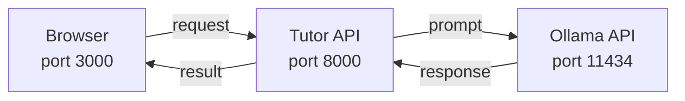

# VS Code & AI Tools Setup

This is where things get exciting. You've got your terminal skills, Git is tracking your work, and Python is ready to go. When you ran `bash scripts/setup.sh`, it also installed **Ollama** and pulled an AI model to your machine. You already have a local language model running -- now let's understand what that means and how to use it.

By the end of this lesson, you'll understand how local AI works, set up your code editor, and write Python code that talks to an AI model. No cloud APIs, no API keys, no cost. Just you and a model running on your hardware.

---

## Setting Up VS Code

**Visual Studio Code** (VS Code) is a free, open-source code editor built by Microsoft. It's lightweight but incredibly powerful thanks to its extension ecosystem. Most professional developers -- including those working on AI -- use it daily.

### Installation

1. Go to [code.visualstudio.com](https://code.visualstudio.com/)
2. Download the installer for your operating system
3. Run the installer (on Windows, check "Add to PATH" if prompted)
4. Launch VS Code

### Essential Extensions

Extensions add superpowers to VS Code. Install these by clicking the Extensions icon in the left sidebar (it looks like four squares) and searching for each one:

**Python** (by Microsoft)
- Syntax highlighting, linting, debugging, and IntelliSense for Python
- This is non-negotiable -- install it first

**GitLens** (by GitKraken)
- Shows who changed each line of code, when, and why
- Makes Git visual and intuitive right inside your editor

**Prettier** (by Prettier)
- Automatically formats your code so it's clean and consistent

**Even Better TOML** and **JSON** extensions are nice to have for config files.

### The Integrated Terminal

One of VS Code's best features is its built-in terminal. Press `` Ctrl+` `` (backtick) to toggle it open. This means you can edit code and run commands without switching windows.

Try it now:

1. Open VS Code
2. Press `` Ctrl+` `` to open the terminal
3. Type `python --version` to confirm Python is accessible

### Setting Your Python Interpreter

Press `Ctrl+Shift+P` to open the Command Palette, then type "Python: Select Interpreter". Choose the Python from your virtual environment (`.venv`). This ensures VS Code uses the correct Python and packages for your project.

---

## Your AI Model Is Already Running

When you ran `bash scripts/setup.sh`, the setup script:

1. **Detected your hardware** -- checked for GPU (NVIDIA) and available VRAM
2. **Selected the best model** for your machine:
   - 16+ GB VRAM: `llama3.1:8b` (most capable)
   - 8-12 GB VRAM: `llama3.2:3b` (good balance)
   - Less or CPU-only: `llama3.2:1b` (lightweight, fast)
3. **Downloaded the model** via `ollama pull` (~1-4 GB depending on model)
4. **Verified it works** with a test prompt
5. **Saved the model name** to `.env` so the tutor engine uses it automatically

And when you run `bash scripts/start.sh`, it starts Ollama as one of the three services.

### Verify It's Running

Open your terminal and try:

```bash
ollama list
```

You should see at least one model listed. You can also check the API directly:

```bash
curl http://localhost:11434/api/tags
```

This returns JSON listing all available models.

---

## What Is Ollama?

**Ollama** is a tool that runs large language models (LLMs) locally on your computer. Think of it as a lightweight server that hosts AI models on your machine. You send it a prompt, it sends back a response -- just like ChatGPT, but running privately on your hardware.

### Why Local AI?

- **Privacy** -- your data never leaves your machine
- **Cost** -- no API fees, no usage limits
- **Speed** -- no network latency for smaller models
- **Learning** -- you'll understand how AI APIs work from the inside out

### How It Works

Ollama runs as a background service on port **11434**. It exposes a REST API that any program can call. When you submit code through the platform, the tutor engine calls Ollama to grade your work and power the AI tutor chat.



This is exactly the same architecture used by production AI applications -- just running locally instead of in the cloud.

---

## Talking to Ollama Directly

Let's talk to the AI yourself! Open a terminal and run:

```bash
curl http://localhost:11434/api/generate -d '{
  "model": "llama3.2:1b",
  "prompt": "Explain what Python is in one sentence.",
  "stream": false
}'
```

> **Note:** Replace `llama3.2:1b` with whatever model `ollama list` shows. The setup script configured the right model for your hardware.

You should get a JSON response with the model's answer in the `"response"` field.

---

## Talking to Ollama with Python

Now let's do the same thing using Python. The `httpx` library (already installed by the setup script) is a modern HTTP client:

```python
import httpx

response = httpx.post(
    "http://localhost:11434/api/generate",
    json={
        "model": "llama3.2:1b",
        "prompt": "What is machine learning? Explain in two sentences.",
        "stream": False,
    },
    timeout=60.0,
)

data = response.json()
print(data["response"])
```

Save this as `ask_ai.py` and run it:

```bash
python ask_ai.py
```

Your Python code is now talking to an AI model running on your own machine. This is the same pattern used by production AI applications, just at a smaller scale. Every AI app you'll build in this bootcamp builds on this foundation: **send a prompt, get a response, do something useful with it.**

---

## Understanding the API

The Ollama API is simple and consistent:

- **Endpoint:** `POST http://localhost:11434/api/generate`
- **Request body:**
  - `model` -- which model to use (check with `ollama list`)
  - `prompt` -- the text you want the AI to respond to
  - `stream` -- set to `false` to get the complete response at once (set to `true` to stream token by token)
- **Response:** JSON containing a `response` field with the model's output

This is the same structure you'll see with OpenAI, Anthropic, and other AI APIs. Learn it once, use it everywhere.

---

## Your Turn

In the exercise, you'll write a Python function that calls the Ollama API, sends a prompt, and returns the response. The tests mock the API call so you don't need Ollama running to pass -- but do try it with a real model too!

You've now set up a complete AI development environment. Terminal, Git, Python, VS Code, and a local language model -- all working together on your machine. That's a huge accomplishment. Let's keep building!
