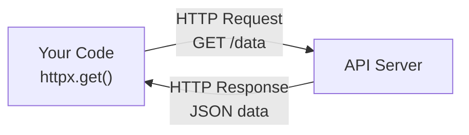

# Working with Files & APIs

So far you've been working with data that lives only in memory — once your program ends, it's gone. In this lesson, you'll learn to **persist data** by reading and writing files, work with **JSON** (the universal data format of the web), and **call APIs** to fetch data from the internet. These skills are essential for AI development, where you'll constantly be loading datasets, saving results, and communicating with AI services.

---

## Reading Files

Python makes file reading straightforward with the `open()` function and the `with` statement:

```python
with open("notes.txt", "r") as f:
    content = f.read()
    print(content)
```

The `with` statement ensures the file is properly closed when you're done, even if an error occurs. Always use `with` — it's the Pythonic way.

### Reading Line by Line

For large files, reading all at once can use too much memory. Read line by line instead:

```python
with open("data.txt", "r") as f:
    for line in f:
        print(line.strip())  # .strip() removes trailing newlines
```

---

## Writing Files

Writing is just as simple — change the mode from `"r"` (read) to `"w"` (write):

```python
with open("output.txt", "w") as f:
    f.write("Hello, file!\n")
    f.write("Second line.\n")
```

Here's a quick reference for file modes:

```
  Mode   Opens for...       If file exists     If file missing
  ────   ──────────────     ──────────────     ───────────────
  "r"    Reading            Opens it           Error!
  "w"    Writing            Overwrites it      Creates it
  "a"    Appending          Adds to end        Creates it
```

**Warning**: `"w"` mode overwrites the file completely. To add to an existing file, use `"a"` (append) mode:

```python
with open("log.txt", "a") as f:
    f.write("New log entry\n")
```

---

## Working with JSON

**JSON** (JavaScript Object Notation) is the standard format for data exchange on the web. It looks almost identical to Python dictionaries and lists, which makes it very natural to work with.

```json
{
    "name": "Ada",
    "age": 30,
    "skills": ["Python", "AI", "Math"]
}
```

Python's built-in `json` module handles conversion between JSON strings and Python objects:

### Writing JSON to a File

```python
import json

data = {
    "name": "Ada",
    "age": 30,
    "skills": ["Python", "AI", "Math"]
}

with open("profile.json", "w") as f:
    json.dump(data, f, indent=2)
```

The `indent=2` parameter makes the output human-readable with nice formatting.

### Reading JSON from a File

```python
import json

with open("profile.json", "r") as f:
    data = json.load(f)

print(data["name"])     # "Ada"
print(data["skills"])   # ["Python", "AI", "Math"]
```

### JSON Strings

Sometimes you work with JSON as a string rather than a file:

```python
json_string = json.dumps(data, indent=2)   # Python dict -> JSON string
parsed = json.loads(json_string)             # JSON string -> Python dict
```

Remember: `dump`/`load` work with **files**, `dumps`/`loads` work with **strings** (the "s" stands for "string").

---

## Making HTTP Requests

APIs (Application Programming Interfaces) let your code talk to other services over the internet. To call an API, you send an **HTTP request** and get back a **response**.



We'll use the `httpx` library, which is modern, fast, and supports both sync and async patterns:

```python
import httpx

response = httpx.get("https://api.example.com/data")
print(response.status_code)   # 200 means success
print(response.json())         # Parse JSON response
```

### POST Requests

Some APIs require you to send data. Use `httpx.post()`:

```python
import httpx

payload = {"prompt": "Hello, AI!", "model": "tinyllama"}
response = httpx.post("http://localhost:11434/api/generate", json=payload)
result = response.json()
```

The `json=payload` parameter automatically converts your dict to JSON and sets the right headers.

### Handling Errors

Network requests can fail for many reasons — the server might be down, the URL might be wrong, or your internet might be out. Always handle errors:

```python
import httpx

try:
    response = httpx.get("https://api.example.com/data", timeout=10)
    response.raise_for_status()  # Raises exception for 4xx/5xx errors
    data = response.json()
except httpx.ConnectError:
    print("Could not connect to the server")
except httpx.TimeoutException:
    print("Request timed out")
except httpx.HTTPStatusError as e:
    print(f"HTTP error: {e.response.status_code}")
```

---

## Error Handling with try/except

The `try/except` pattern is Python's way of handling errors gracefully. Instead of your program crashing, you can catch the error and respond appropriately:

```python
try:
    # Code that might fail
    result = int("not a number")
except ValueError:
    # Handle the specific error
    print("That's not a valid number")
```

You can catch multiple exception types:

```python
try:
    data = json.loads(bad_string)
except json.JSONDecodeError:
    print("Invalid JSON")
except TypeError:
    print("Expected a string")
```

And you can use `finally` for cleanup that should always happen:

```python
try:
    result = risky_operation()
except Exception as e:
    print(f"Error: {e}")
finally:
    print("This runs no matter what")
```

---

## Putting It All Together

Here's a real-world pattern: fetch data from an API and save it locally as JSON:

```python
import httpx
import json

def fetch_and_save(url: str, filepath: str) -> dict:
    """Fetch JSON data from a URL and save it to a file."""
    response = httpx.get(url, timeout=10)
    response.raise_for_status()
    data = response.json()

    with open(filepath, "w") as f:
        json.dump(data, f, indent=2)

    return data
```

This pattern is incredibly common in AI development: download a dataset, save it, process it later.

---

## Your Turn

In the exercise that follows, you'll write two functions: one that fetches JSON from a URL and saves it to a file, and another that loads JSON back from a file. You'll practice file I/O, JSON handling, HTTP requests, and error handling all in one exercise.

These are skills you'll use in nearly every project going forward. Let's go!
