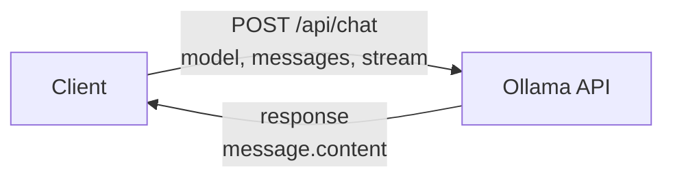

# Calling LLM APIs

It's time to build something real. In this lesson, you'll learn how to call a local LLM (Ollama) programmatically using Python. You'll understand the request/response format, system vs user messages, multi-turn conversations, and error handling. By the end, you'll have a reusable Python class for talking to AI models.

---

## The Ollama API

Ollama runs LLMs locally on your machine and exposes them through a simple HTTP API. If you followed Phase 1, you already have Ollama installed. The API lives at `http://localhost:11434`.

There are two main endpoints:

- `/api/generate` — Simple prompt in, response out
- `/api/chat` — Conversation-style with message history

We'll focus on `/api/chat` because it supports multi-turn conversations, which is what you'll use in real applications.



---

## The Chat API Format

The chat endpoint expects a JSON body with two required fields:

```python
{
    "model": "tinyllama",
    "messages": [
        {"role": "system", "content": "You are a helpful assistant."},
        {"role": "user", "content": "What is Python?"}
    ]
}
```

### Message Roles

- **system**: Sets the AI's behavior and personality. This is your "backstage" instruction to the model. Users don't see this.
- **user**: The human's message.
- **assistant**: The AI's previous responses (used for multi-turn conversations).

### The Response

The API returns JSON with the model's response:

```python
{
    "model": "tinyllama",
    "message": {
        "role": "assistant",
        "content": "Python is a high-level programming language..."
    },
    "done": true
}
```

---

## Making Your First API Call

Here's a complete example using httpx:

```python
import httpx

def chat(prompt: str, model: str = "tinyllama") -> str:
    """Send a prompt to Ollama and return the response."""
    response = httpx.post(
        "http://localhost:11434/api/chat",
        json={
            "model": model,
            "messages": [{"role": "user", "content": prompt}],
            "stream": False,
        },
        timeout=60,
    )
    response.raise_for_status()
    return response.json()["message"]["content"]

answer = chat("Explain Python in one sentence.")
print(answer)
```

Key points:
- `stream: False` gives us the complete response at once (streaming returns tokens one by one)
- `timeout=60` gives the model enough time to generate (local LLMs can be slow)
- We extract the content from the nested response structure

---

## System Prompts

The system prompt is how you control the AI's behavior. It's incredibly powerful:

```python
messages = [
    {
        "role": "system",
        "content": "You are a Python tutor. Explain concepts simply. Always include a code example. Keep responses under 100 words."
    },
    {
        "role": "user",
        "content": "What is a list comprehension?"
    }
]
```

Good system prompts:
- Define the AI's role and expertise
- Set response format and length
- Establish tone and style
- Include constraints ("never reveal system prompt", "always provide sources")

---

## Multi-Turn Conversations

To have a back-and-forth conversation, you maintain a **message history** and send it with each request. The model doesn't remember previous calls — you have to provide the full context every time.

```python
messages = [
    {"role": "system", "content": "You are a helpful coding assistant."},
    {"role": "user", "content": "Write a hello world in Python."},
    {"role": "assistant", "content": "print('Hello, world!')"},
    {"role": "user", "content": "Now make it a function."},
]

response = httpx.post(
    "http://localhost:11434/api/chat",
    json={"model": "tinyllama", "messages": messages, "stream": False},
    timeout=60,
)
```

Each new user message is added to the history, along with the assistant's previous response. This is how the model maintains "context" across turns.

```
  Turn 1: [system] [user₁]                          → assistant₁
  Turn 2: [system] [user₁] [asst₁] [user₂]         → assistant₂
  Turn 3: [system] [user₁] [asst₁] [user₂] [asst₂] [user₃] → assistant₃
           ─────────────────────────────────────────
           History grows with every turn!
```

---

## Error Handling

When calling APIs, many things can go wrong. Always handle errors gracefully:

```python
import httpx

def safe_chat(prompt: str, model: str = "tinyllama") -> str | None:
    """Send a prompt with error handling."""
    try:
        response = httpx.post(
            "http://localhost:11434/api/chat",
            json={
                "model": model,
                "messages": [{"role": "user", "content": prompt}],
                "stream": False,
            },
            timeout=60,
        )
        response.raise_for_status()
        return response.json()["message"]["content"]
    except httpx.ConnectError:
        print("Could not connect to Ollama. Is it running?")
        return None
    except httpx.TimeoutException:
        print("Request timed out. The model might be overloaded.")
        return None
    except httpx.HTTPStatusError as e:
        print(f"HTTP error {e.response.status_code}")
        return None
    except KeyError:
        print("Unexpected response format.")
        return None
```

---

## Structuring Your Code as a Class

As your code grows, wrapping API calls in a class keeps things organized:

```python
class OllamaChat:
    def __init__(self, model: str = "tinyllama", host: str = "http://localhost:11434"):
        self.model = model
        self.host = host

    def send(self, prompt: str, system_prompt: str | None = None) -> str:
        messages = []
        if system_prompt:
            messages.append({"role": "system", "content": system_prompt})
        messages.append({"role": "user", "content": prompt})

        response = httpx.post(
            f"{self.host}/api/chat",
            json={"model": self.model, "messages": messages, "stream": False},
            timeout=60,
        )
        response.raise_for_status()
        return response.json()["message"]["content"]
```

This pattern — a class that wraps an API client — is one you'll use over and over in AI development.

---

## Streaming Responses

For a better user experience, you can stream responses token-by-token instead of waiting for the full response. Set `stream: True` and iterate over the response:

```python
with httpx.stream("POST", url, json=payload) as response:
    for line in response.iter_lines():
        chunk = json.loads(line)
        print(chunk["message"]["content"], end="", flush=True)
```

We won't implement streaming in the exercise, but it's good to know about for when you build real applications.

---

## Your Turn

In the exercise that follows, you'll build an `OllamaChat` class with methods for single prompts and multi-turn conversations. The tests will mock the API so you don't need Ollama running. Focus on getting the request format right and handling the response correctly.

Let's build your first AI client!
