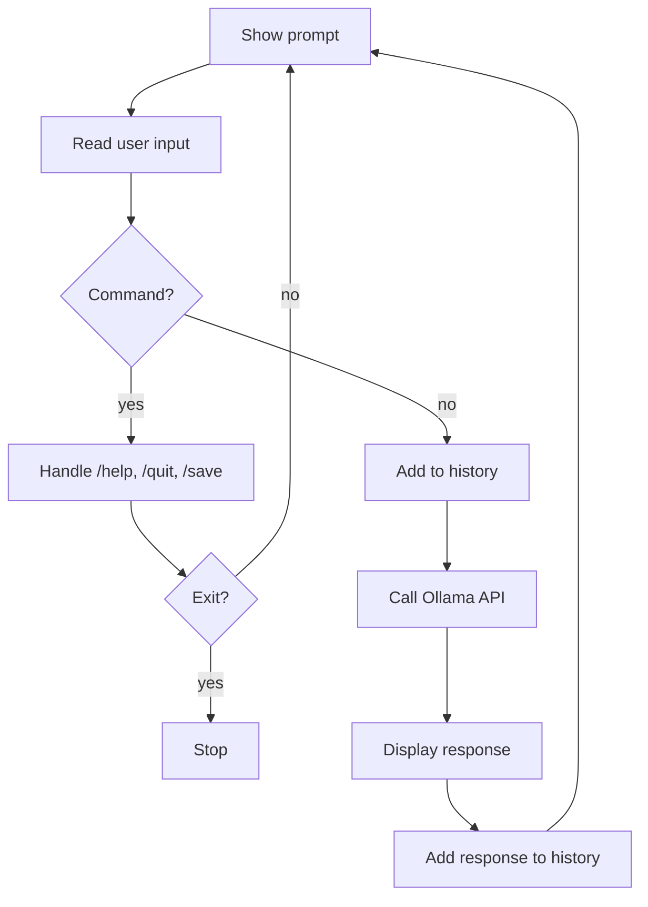

# Building a CLI AI Assistant

You can talk to an LLM from Python. Now let's turn that into a real application — an interactive command-line AI assistant. This is the pattern behind tools like ChatGPT's interface, just running in your terminal. You'll learn about conversation history management, system prompts for personality, saving and loading conversations, and building a simple command parser.

By the end of this lesson, you'll have the building blocks for any conversational AI application.

---

## The Architecture

A CLI AI assistant has a simple loop:

1. Display a prompt and wait for user input
2. Add the user's message to conversation history
3. Send the history to the LLM
4. Display the response
5. Add the response to conversation history
6. Repeat until the user types "quit"



```python
while True:
    user_input = input("You: ")
    if user_input.lower() in ("quit", "exit"):
        break

    messages.append({"role": "user", "content": user_input})
    response = call_llm(messages)
    messages.append({"role": "assistant", "content": response})
    print(f"AI: {response}")
```

Simple, but powerful. Let's build each piece.

---

## System Prompts for Personality

The system prompt defines who your assistant is. A well-crafted system prompt transforms a generic model into a specialized tool:

```python
def create_system_prompt(name: str, personality: str) -> str:
    """Create a system prompt that gives the assistant a name and personality."""
    return (
        f"You are {name}, an AI assistant. "
        f"{personality} "
        f"Keep responses concise and helpful."
    )
```

### Examples of Good System Prompts

**Coding Tutor**:
```
You are CodeBuddy, a patient Python tutor. Explain concepts step by step.
Always include code examples. If the user makes a mistake, gently correct
them and explain why.
```

**Creative Writer**:
```
You are Muse, a creative writing assistant. Help users brainstorm ideas,
improve their prose, and overcome writer's block. Be encouraging and
imaginative.
```

**Data Analyst**:
```
You are DataBot, a data analysis assistant. Help users understand their
data, suggest visualizations, and write pandas code. Always explain your
reasoning.
```

The system prompt is the most important design decision in any AI application. Spend time getting it right.

```
  Same question: "Explain variables"

  System: "You are a coding tutor"     System: "You are a pirate"
  ┌────────────────────────────┐       ┌────────────────────────────┐
  │ A variable is a container  │       │ Arrr! A variable be like  │
  │ that stores a value. Think │       │ a treasure chest, matey!  │
  │ of it as a labeled box...  │       │ Ye stash yer gold in it...│
  └────────────────────────────┘       └────────────────────────────┘
```

---

## Managing Conversation History

The conversation history is a list of message dictionaries. Each message has a `role` and `content`:

```python
messages = [
    {"role": "system", "content": "You are a helpful assistant named Aria."},
    {"role": "user", "content": "What's the weather like?"},
    {"role": "assistant", "content": "I don't have access to weather data..."},
    {"role": "user", "content": "That's okay. Tell me a joke instead."},
]
```

### Displaying History

For a nice user experience, format the history for display:

```python
def format_history(messages: list[dict]) -> str:
    """Format conversation history for display."""
    lines = []
    for msg in messages:
        if msg["role"] == "user":
            lines.append(f"You: {msg['content']}")
        elif msg["role"] == "assistant":
            lines.append(f"AI: {msg['content']}")
        # Skip system messages in display
    return "\n".join(lines)
```

### Context Window Management

Remember from the LLM lesson: models have a limited context window. Long conversations will eventually exceed it. Strategies:

- **Truncate old messages**: Keep only the last N messages
- **Summarize**: Ask the LLM to summarize the conversation so far
- **Always keep the system prompt**: It should never be truncated

---

## Saving and Loading Conversations

Users expect to pick up where they left off. Since conversations are just lists of dicts, JSON is the perfect format:

```python
import json

def save_conversation(messages: list[dict], filepath: str) -> None:
    """Save conversation history to a JSON file."""
    with open(filepath, "w") as f:
        json.dump(messages, f, indent=2)

def load_conversation(filepath: str) -> list[dict]:
    """Load conversation history from a JSON file."""
    try:
        with open(filepath, "r") as f:
            return json.load(f)
    except FileNotFoundError:
        return []
```

This lets users save interesting conversations, review them later, or continue them in a new session.

---

## Command Parsing

A good CLI assistant supports special commands beyond just chatting. Common patterns:

```
/help     - Show available commands
/save     - Save the conversation
/load     - Load a previous conversation
/clear    - Start a new conversation
/system   - Change the system prompt
/quit     - Exit the assistant
```

You can implement this with simple string checking:

```python
def handle_command(user_input: str, messages: list[dict]) -> bool:
    """Handle special commands. Returns True if input was a command."""
    if user_input.startswith("/help"):
        print("Available commands: /help, /save, /load, /clear, /quit")
        return True
    if user_input.startswith("/save"):
        save_conversation(messages, "conversation.json")
        print("Conversation saved!")
        return True
    if user_input.startswith("/clear"):
        messages.clear()
        print("Conversation cleared!")
        return True
    return False
```

---

## Putting It All Together

Here's how all the pieces fit into a complete CLI assistant:

```python
def main():
    system = create_system_prompt("Aria", "You are friendly and knowledgeable.")
    messages = [{"role": "system", "content": system}]

    print("Chat with Aria! Type /help for commands, /quit to exit.\n")

    while True:
        user_input = input("You: ").strip()
        if not user_input:
            continue
        if user_input == "/quit":
            break
        if handle_command(user_input, messages):
            continue

        messages.append({"role": "user", "content": user_input})
        response = chat.send_with_history(messages)
        messages.append({"role": "assistant", "content": response})
        print(f"Aria: {response}\n")
```

This is a real, functional AI assistant. Everything from here — web interfaces, Discord bots, API services — is just a different frontend for this same core pattern.

---

## Your Turn

In the exercise that follows, you'll build the utility functions for a CLI assistant: creating system prompts, formatting conversation history, and saving/loading conversations to JSON. These are the building blocks you'll reuse in every conversational AI project.

Let's wrap up Phase 4 with something you can actually use!
