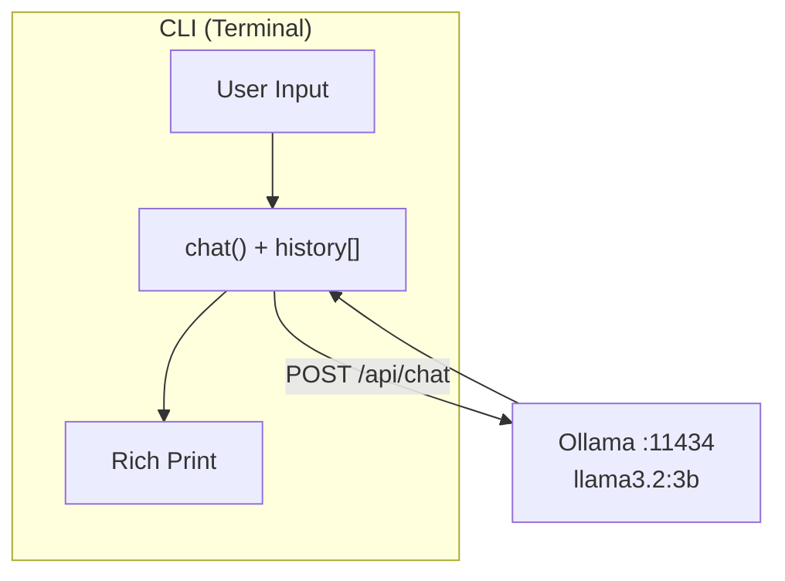

# Milestone Project: AI Chatbot

Congratulations on completing Phase 4! You have learned how to connect to a local LLM, send prompts, parse responses, and work with the Ollama API. Now it is time to put it all together and build something real.

This is your **first milestone project** -- not just an exercise with a single function to fill in, but a complete, working application that you will build from scratch. When you finish, you will have a multi-turn CLI chatbot that remembers your conversation and responds with formatted output. This is the same foundation used by tools like ChatGPT, except yours runs entirely on your machine.

## What You'll Build

A **multi-turn command-line chatbot** that:

- Accepts user input in a loop
- Sends messages to Ollama's `/api/chat` endpoint with full conversation history
- Displays AI responses with rich Markdown formatting
- Exits cleanly with `/quit` or Ctrl+C
- Handles connection errors gracefully

### Architecture

The key idea is the **conversation history** list. Every time you send a message, you include the entire history of previous messages so the LLM has context. This is what makes the conversation feel natural -- the model can refer back to earlier turns.

## Step-by-Step Guide

### Step 1: Implement `chat()`

The `chat()` function is the core of your chatbot. It takes the user's message as a string and returns the assistant's reply.

1. **Append** the user's message to the `history` list as `{"role": "user", "content": user_message}`.
2. **POST** to `http://localhost:11434/api/chat` with a JSON body containing the model name, the full message history, and `"stream": False`.
3. **Parse** the response JSON. The assistant's reply lives at `response["message"]["content"]`.
4. **Append** the assistant's reply to `history` as `{"role": "assistant", "content": reply}`.
5. **Return** the reply text.

The history list grows with every turn. This is what gives the model memory -- it sees the entire conversation each time.

### Step 2: Implement `main()`

The `main()` function ties everything together with a user-friendly interface.

1. **Print a welcome banner** using `rich.panel.Panel` or a simple styled message. Let the user know how to exit.
2. **Start an input loop** that runs forever:
   - Read the user's input (use `console.input()` for styled prompts).
   - If the input is empty, skip to the next iteration.
   - If the input is `/quit`, print a goodbye message and break.
   - Otherwise, call `chat()` and display the result using `rich.markdown.Markdown` for nicely formatted output.
3. **Wrap the loop** in a `try/except KeyboardInterrupt` so Ctrl+C exits with a friendly message instead of a traceback.

### Step 3: Handle Edge Cases

Robust software handles the unexpected:

- **`KeyboardInterrupt` (Ctrl+C):** Catch it and print "Goodbye!" instead of crashing.
- **Connection errors:** If Ollama is not running, catch `requests.exceptions.ConnectionError` and print a helpful message telling the user to start Ollama.
- **Empty input:** Skip blank lines instead of sending them to the model.

## Tips

- **Use `rich.console.Console`** for colored output. The `console.status()` context manager shows a nice "Thinking..." spinner while waiting for the LLM.
- **Test with short prompts first.** Try "Say hello in one word" to verify your implementation before having long conversations.
- **Check your history list** by printing `len(history)` after each turn. It should grow by 2 each time (one user message + one assistant reply).
- **Start simple.** Get the basic loop working first, then add rich formatting and error handling.

## Your Turn

Open the starter code in `exercises/ex-01/starter/main.py`. The functions are stubbed out with detailed TODO comments and hints. Implement each function, run the tests with `pytest`, and then try chatting with your bot!
