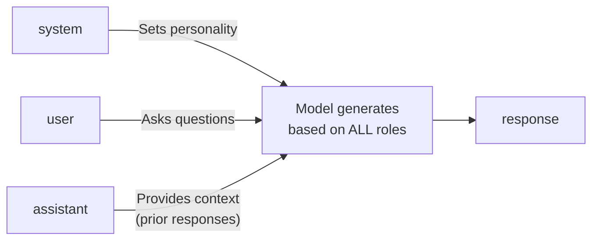

# Role Prompting & System Messages

You've already sent messages to an LLM. Now it's time to learn the single most powerful technique for controlling AI behavior: **system prompts and role assignment**. By the end of this lesson, you'll understand how to craft system messages that turn a general-purpose LLM into a specialized assistant for any task.

---

## What Is a System Prompt?

A system prompt is a special message sent before the user's input. It tells the model *how to behave* -- its role, personality, constraints, and output format. Think of it as stage directions for an actor: the audience (user) never sees them, but they shape the entire performance.

```python
messages = [
    {"role": "system", "content": "You are a friendly Python tutor for beginners."},
    {"role": "user", "content": "What is a variable?"}
]
```



Without a system prompt, the model defaults to a generic helpful assistant. With one, you can make it a code reviewer, a translator, a creative writer, or anything else.

---

## Why System Prompts Matter

System prompts solve a fundamental problem: LLMs are generalists. They can do many things, but they don't know *what you want* unless you tell them. A well-crafted system prompt:

- **Focuses the model** on a specific task or domain
- **Sets the tone** (formal, casual, technical, playful)
- **Defines constraints** (word limits, forbidden topics, required formats)
- **Improves consistency** across multiple interactions

Without a system prompt, you might get wildly different response styles each time. With one, the model stays in character.

---

## Anatomy of a Good System Prompt

A strong system prompt has up to four components:

```
  System Prompt Structure:
  ┌─────────────────────────────────────────┐
  │ 1. Role      "You are a code reviewer"  │
  │ 2. Expertise "Senior Python developer"  │
  │ 3. Style     "Be concise and direct"    │
  │ 4. Rules     "Never write code for the  │
  │               user, only review"        │
  └─────────────────────────────────────────┘
         ↓ shapes every response
```

### 1. Role Assignment
Tell the model *who* it is:
```
You are an experienced Python code reviewer at a tech company.
```

### 2. Expertise Definition
Specify *what it knows*:
```
You specialize in clean code, PEP 8 style, and performance optimization.
```

### 3. Tone and Style
Define *how it communicates*:
```
Be direct and constructive. Use bullet points for feedback.
```

### 4. Constraints
Set *boundaries*:
```
Keep reviews under 200 words. Never rewrite the entire code -- suggest specific changes.
```

Putting it all together:

```python
system_prompt = """You are an experienced Python code reviewer at a tech company.
You specialize in clean code, PEP 8 style, and performance optimization.
Be direct and constructive. Use bullet points for feedback.
Keep reviews under 200 words. Never rewrite the entire code -- suggest specific changes."""
```

---

## Examples of Effective System Prompts

### Teacher Persona
```
You are a patient math teacher for middle school students. Explain concepts
using everyday analogies. Always include one practice problem at the end.
Never give the answer to the practice problem directly.
```

### Code Reviewer Persona
```
You are a senior developer reviewing pull requests. Point out bugs,
suggest improvements, and note what's done well. Be concise and specific.
Reference line numbers when possible.
```

### Translator Persona
```
You are a professional translator. Translate the user's text from English
to Spanish. Preserve the original tone and meaning. If a phrase has no
direct translation, explain the closest equivalent in parentheses.
```

Each persona produces dramatically different responses to the same input because the system prompt shapes the model's "mindset."

---

## Temperature and Role Interaction

Temperature controls randomness in the model's output (0.0 = deterministic, 1.0+ = creative). Different roles work better with different temperatures:

| Role | Suggested Temperature | Why |
|---|---|---|
| Code reviewer | 0.1 - 0.3 | Consistency and precision matter |
| Creative writer | 0.7 - 0.9 | Variety and creativity are desired |
| Translator | 0.1 - 0.2 | Accuracy is critical |
| Brainstorming partner | 0.8 - 1.0 | Diverse ideas are the goal |
| Factual Q&A | 0.0 - 0.2 | Accuracy over creativity |

When you combine a focused role with the right temperature, you get much better results than either technique alone.

---

## Few-Shot Examples in System Prompts

You can include examples directly in your system prompt to show the model the exact format you want:

```
You are a sentiment classifier. Classify the user's text as POSITIVE,
NEGATIVE, or NEUTRAL. Respond with only the label.

Examples:
User: "I love this product!" -> POSITIVE
User: "It broke after one day." -> NEGATIVE
User: "It arrived on Tuesday." -> NEUTRAL
```

This technique -- called few-shot prompting -- dramatically improves output consistency. We'll explore it in depth in Lesson 3.

---

## Building Prompt Engineering Utilities

In practice, you'll create and reuse prompts across your application. Rather than hardcoding strings everywhere, it helps to build utility functions that:

- Assemble system prompts from components (role, expertise, tone, constraints)
- Format few-shot examples into prompts
- Validate prompts before sending (check length, catch empty prompts)

This is exactly what you'll build in the exercise. These utilities form the foundation of any prompt engineering workflow.

---

## Common Mistakes

1. **Vague roles**: "Be helpful" is too generic. Be specific: "You are a Docker expert who helps debug container issues."
2. **Too many constraints**: If you overload the system prompt, the model may ignore some instructions. Keep it focused.
3. **No examples**: When you need a specific output format, show it -- don't just describe it.
4. **Ignoring token limits**: System prompts consume tokens from your context window. A 2,000-word system prompt leaves less room for the actual conversation.

---

## Your Turn

In the exercise, you'll build three prompt engineering utility functions: one to create system prompts from components, one to format few-shot prompts, and one to validate prompts before sending. These are practical tools you'll reuse throughout the rest of this course.

Let's start engineering prompts!
