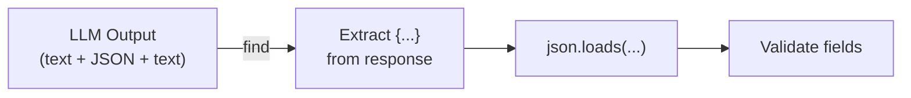

# Structured Outputs

LLMs generate free-form text by default. But real applications need structured data -- JSON for APIs, markdown for documents, CSV for spreadsheets. In this lesson, you'll learn how to get LLMs to produce structured output reliably, and how to parse and validate what they return.

---

## Why Structured Output Matters

Imagine you're building an app that uses an LLM to extract product information from reviews. You need the output as JSON so your code can process it. But the model might respond with:

```
The product is a wireless mouse. It costs $29.99 and has 4.5 stars.
```

That's helpful for a human, but useless for your program. You need:

```json
{"product": "wireless mouse", "price": 29.99, "rating": 4.5}
```

Getting models to consistently produce parseable output is one of the most important prompt engineering skills.

---

There are three main approaches to getting structured output, each more reliable than the last:

```
  Reliability:  Low ──────────────────────────→ High

  1. Ask nicely         2. Provide schema       3. Show example
  "Return JSON"         "Use this format:       "Here's an example:
                         {name: str,             {name: 'Alice',
                          age: int}"              age: 30}"

  Model may ignore      Model follows format    Model copies pattern
```

## Technique 1: Explicit Format Instructions

The simplest approach is to tell the model exactly what format you want:

```
Extract the following information from the text and return it as JSON:
- product_name (string)
- price (number)
- rating (number)

Return ONLY the JSON object, no additional text.
```

The key phrase is **"Return ONLY the JSON object, no additional text."** Without this, models often wrap their JSON in explanatory text like "Here's the JSON:" which breaks your parser.

---

## Technique 2: Provide a Schema

Give the model an explicit schema or example of the expected structure:

```
Return your response as JSON matching this schema:
{
    "product_name": "string",
    "price": 0.00,
    "rating": 0.0,
    "in_stock": true
}
```

This works better than just saying "return JSON" because the model knows exactly which fields to include and what types they should be.

---

## Technique 3: Show an Example

Few-shot examples are even more reliable. Show the model an input and the exact output you want:

```
Extract product info as JSON.

Example:
Input: "The BlueTech keyboard is $49.99, rated 4.2 stars."
Output: {"product_name": "BlueTech keyboard", "price": 49.99, "rating": 4.2}

Now extract from this text:
Input: "The QuickMouse Pro costs $29.99 and has 4.5 stars."
Output:
```

The model will follow the pattern almost every time.

---

## Parsing LLM Output

Even with perfect prompts, LLMs sometimes add extra text around the structured data. You need to handle responses like:

```
Here's the extracted data:
{"product_name": "wireless mouse", "price": 29.99}
Hope that helps!
```

The strategy: **find the JSON within the text** rather than assuming the entire response is valid JSON.



```python
import json
import re

def extract_json(text):
    """Find and parse the first JSON object in a text string."""
    # Look for content between { and }
    match = re.search(r'\{.*\}', text, re.DOTALL)
    if match:
        return json.loads(match.group())
    return None
```

This regex approach finds the first `{...}` block and tries to parse it. It handles the common case where the model wraps JSON in extra text.

---

## Working with Markdown Output

Markdown is another useful structured format. You might ask the model to respond with specific sections:

```
Analyze this code and respond in markdown with these sections:
## Summary
## Issues Found
## Suggestions
```

To parse this programmatically, split the text on headings:

```python
def extract_markdown_sections(text):
    """Parse markdown text into a dict of heading -> content."""
    sections = {}
    current_heading = None
    current_content = []

    for line in text.split('\n'):
        if line.startswith('# '):
            if current_heading:
                sections[current_heading] = '\n'.join(current_content).strip()
            current_heading = line.lstrip('#').strip()
            current_content = []
        else:
            current_content.append(line)

    if current_heading:
        sections[current_heading] = '\n'.join(current_content).strip()

    return sections
```

---

## Handling Malformed Responses

No matter how good your prompt is, LLMs will occasionally produce malformed output. Build defensively:

1. **Always try/except your JSON parsing** -- don't assume it will work
2. **Validate required fields** -- even valid JSON might be missing fields
3. **Have a fallback** -- if parsing fails, you can retry with a stricter prompt or return an error gracefully
4. **Log failures** -- track when parsing fails so you can improve your prompts

```python
def validate_llm_json(text, required_fields):
    """Extract JSON and validate required fields."""
    try:
        data = extract_json(text)
        if data is None:
            return {"valid": False, "data": None, "missing_fields": required_fields}

        missing = [f for f in required_fields if f not in data]
        return {
            "valid": len(missing) == 0,
            "data": data,
            "missing_fields": missing,
        }
    except json.JSONDecodeError:
        return {"valid": False, "data": None, "missing_fields": required_fields}
```

---

## Crafting JSON-Specific Prompts

When building a prompt that requests JSON output, include three things:

1. **The task description** -- what to extract or generate
2. **The schema** -- what fields and types you expect
3. **An example** -- what the output should look like

```python
def create_json_prompt(task, schema_description, example_output):
    prompt = f"{task}\n\n"
    prompt += f"Return your response as JSON with these fields:\n{schema_description}\n\n"
    prompt += f"Example output:\n{example_output}\n\n"
    prompt += "Return ONLY valid JSON, no additional text."
    return prompt
```

This pattern works reliably across different models and tasks.

---

## Your Turn

In the exercise, you'll build four output parsing utilities: extracting JSON from messy text, parsing markdown sections, creating JSON-specific prompts, and validating LLM JSON output. These functions handle the real-world messiness of working with LLM outputs.

Let's build some parsers!
