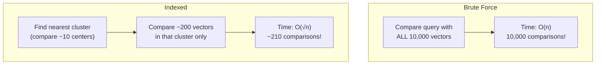

# Vector Databases

You know how to turn text into vectors and measure similarity. But where do you *store* millions of vectors and search them efficiently? That's what vector databases are for. In this lesson, you'll understand why regular databases fall short, explore popular vector DB options, and build your own simple in-memory vector store.

---

## Why Regular Databases Aren't Enough

Imagine you have 1 million document embeddings, each with 768 dimensions. A user searches for "how to train a neural network". You generate an embedding for that query and need to find the 10 most similar documents.

With a regular SQL database, you'd need to:
1. Load all 1 million vectors
2. Compute cosine similarity between the query and every single vector
3. Sort by similarity
4. Return the top 10

That's 1 million similarity computations for every single query. It works for 100 documents. It's painfully slow for 1 million. It's impossible for 1 billion.

---

## What Vector Databases Do

Vector databases solve this with specialized indexing. Instead of comparing against every vector, they use clever algorithms to narrow down candidates quickly:

- **Approximate Nearest Neighbor (ANN)**: Finds results that are *very likely* the closest, not guaranteed to be exact, but 100x-1000x faster
- **Indexing structures**: Like HNSW (Hierarchical Navigable Small World) graphs that create "shortcuts" through the vector space
- **Quantization**: Compresses vectors to use less memory while preserving most of the similarity information

The tradeoff: you might miss the absolute best match occasionally, but you get results in milliseconds instead of minutes.

---

## Popular Vector Databases

### ChromaDB
- **Best for**: Beginners and prototyping
- **Runs**: In-process (Python library) or as a server
- **Storage**: In-memory or persistent
- **Unique feature**: Built-in embedding generation
- Installation: `pip install chromadb`

### FAISS (Facebook AI Similarity Search)
- **Best for**: High-performance, large-scale search
- **Runs**: In-process (Python/C++ library)
- **Storage**: In-memory
- **Unique feature**: GPU acceleration, billions of vectors
- Installation: `pip install faiss-cpu`

### Qdrant
- **Best for**: Production deployments
- **Runs**: As a server (Docker) or in-process
- **Storage**: Persistent on disk
- **Unique feature**: Rich filtering, payload support

### Pinecone
- **Best for**: Managed cloud service
- **Runs**: Cloud-hosted (API)
- **Storage**: Managed
- **Unique feature**: Zero infrastructure management

For learning and prototyping, ChromaDB is the go-to choice. For production at scale, FAISS or Qdrant are common.

---

## How Indexing Works (Simplified)

Think of a library. Without an index, finding a book means walking through every shelf. With a catalog system, you go directly to the right section.

Vector database indexes work similarly.



One popular method is **IVF (Inverted File Index)**:

1. **Cluster** the vectors into groups using k-means (e.g., 100 clusters)
2. **Store** which vectors belong to each cluster
3. **At query time**, find which cluster(s) the query is closest to
4. **Only compare** against vectors in those nearby clusters

Instead of checking 1 million vectors, you might only check 10,000 -- the ones in the nearest clusters.

---

## CRUD Operations on Vector Stores

Vector databases support familiar operations:

```
  ┌────────────────────────────────────────────────┐
  │              Vector Store                       │
  │                                                │
  │  add("doc1", [0.1, 0.8, ...], {src: "faq"})  │  ← Store
  │  search([0.2, 0.7, ...], top_k=3)             │  ← Query
  │  delete("doc1")                                │  ← Remove
  │                                                │
  │  Internally: {id → (vector, metadata)}         │
  └────────────────────────────────────────────────┘
```

### Create (Add)
```python
store.add(
    id="doc_1",
    vector=[0.1, 0.2, 0.3, ...],
    metadata={"title": "Intro to Python", "category": "tutorial"}
)
```

### Read (Search)
```python
results = store.search(
    query_vector=[0.15, 0.22, 0.28, ...],
    top_k=5
)
# Returns: [{"id": "doc_1", "score": 0.95, "metadata": {...}}, ...]
```

### Update
```python
store.update(id="doc_1", vector=new_vector, metadata=new_metadata)
```

### Delete
```python
store.delete(id="doc_1")
```

---

## Metadata Filtering

One of the most powerful features of vector databases is **metadata filtering**. You can combine vector similarity with traditional filters:

```python
# Find similar documents, but only in the "tutorial" category
results = store.search(
    query_vector=query,
    top_k=5,
    filter={"category": "tutorial"}
)
```

This is like saying "find me the most similar documents, but only look at tutorials." Without metadata filtering, you'd have to search everything and then filter -- much less efficient.

---

## Building a Simple Vector Store

To understand how vector databases work, let's build one from scratch. Our simple version will:

- Store vectors with IDs and optional metadata in a Python dict
- Use brute-force cosine similarity search (no fancy indexing)
- Support add, search, delete, and count operations

This won't scale to millions of vectors, but it teaches the concepts perfectly:

```python
class SimpleVectorStore:
    def __init__(self):
        self._store = {}  # {id: {"vector": [...], "metadata": {...}}}

    def add(self, id, vector, metadata=None):
        self._store[id] = {"vector": vector, "metadata": metadata or {}}

    def search(self, query_vector, top_k=5):
        scores = []
        for doc_id, doc in self._store.items():
            score = cosine_similarity(query_vector, doc["vector"])
            scores.append({"id": doc_id, "score": score, "metadata": doc["metadata"]})
        scores.sort(key=lambda x: x["score"], reverse=True)
        return scores[:top_k]

    def delete(self, id):
        self._store.pop(id, None)

    def count(self):
        return len(self._store)
```

---

## When to Use a Vector Database

Use a vector database when you need:

- **Semantic search** over more than a few hundred documents
- **Fast retrieval** for RAG pipelines
- **Persistent storage** of embeddings
- **Metadata filtering** on search results

For small projects (under 1,000 documents), a simple in-memory store like the one you'll build is perfectly fine. For anything bigger, use a proper vector database.

---

## Your Turn

In the exercise, you'll build a `SimpleVectorStore` class with add, search, delete, and count methods. It uses cosine similarity for search ranking and supports metadata. This is a miniature version of what ChromaDB and FAISS do under the hood.

Let's build a vector store!
