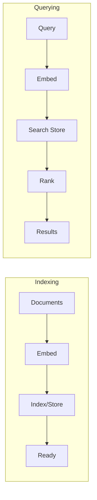

# Building Semantic Search

You've learned embeddings, similarity math, and vector stores. Now it's time to put it all together into a complete **semantic search engine**. In this lesson, you'll build an end-to-end pipeline: embedding documents, indexing them, querying by meaning, and combining semantic search with keyword search for the best of both worlds.

---

## The Semantic Search Pipeline

A semantic search system has four stages:

1. **Embed**: Convert each document's text into a vector
2. **Index**: Store the vectors in a searchable data structure
3. **Query**: Convert the search query into a vector
4. **Rank**: Find the most similar document vectors and return them



The key insight: instead of matching keywords, you're matching *meaning*. A search for "how to fix bugs" will find documents about "debugging techniques" even if they never use the word "bugs."

---

## Generating Embeddings with Ollama

Ollama provides an embedding endpoint at `/api/embeddings`:

```python
import httpx

def get_embedding(text, model="tinyllama"):
    response = httpx.post(
        "http://localhost:11434/api/embeddings",
        json={"model": model, "prompt": text},
        timeout=30,
    )
    response.raise_for_status()
    return response.json()["embedding"]

vector = get_embedding("How to train a neural network")
# vector is a list of floats, e.g., [0.023, -0.156, ...]
```

For our exercise, we'll use a **mock embedding function** so you don't need Ollama running. This is a common testing pattern -- you define the interface (text in, vector out) and swap implementations.

---

## Indexing Documents

Indexing means embedding each document and storing it in your vector store:

```python
documents = [
    {"id": "doc1", "text": "Python is a programming language", "metadata": {"source": "wiki"}},
    {"id": "doc2", "text": "Machine learning uses data to learn patterns", "metadata": {"source": "textbook"}},
    {"id": "doc3", "text": "Neural networks are inspired by the brain", "metadata": {"source": "paper"}},
]

for doc in documents:
    vector = get_embedding(doc["text"])
    store.add(id=doc["id"], vector=vector, metadata=doc["metadata"])
```

This is the expensive part -- embedding each document takes time (especially with large models). But you only do it once. After indexing, searches are fast.

---

## Querying and Ranking

To search, embed the query and find the closest vectors:

```python
query = "how do neural networks work?"
query_vector = get_embedding(query)
results = store.search(query_vector, top_k=3)

for r in results:
    print(f"{r['id']} (score: {r['score']:.3f})")
```

The results are already ranked by cosine similarity. The highest score is the best match.

---

## Keyword Search as a Fallback

```
  Query: "How do I fix a broken pipe?"

  Keyword Search:                 Semantic Search:
  ✓ "Fix a broken pipe in        ✓ "Plumbing repair guide
     your bathroom"                  for damaged pipes"
  ✓ "Broken pipe errors           ✓ "How to repair leaking
     in Python logging"              water lines at home"

  Matches exact words             Matches meaning
  (both plumbing AND coding)      (understands context)
```

Semantic search is powerful but not perfect. It can miss exact matches and struggles with rare terms, acronyms, or proper nouns. **Keyword search** complements it well.

A simple keyword approach uses **term frequency (TF)**: count how many query words appear in each document.

```python
def keyword_search(query, documents):
    query_terms = set(query.lower().split())
    scores = []
    for doc in documents:
        doc_terms = doc["text"].lower().split()
        # Count how many query terms appear in the document
        matches = sum(1 for term in query_terms if term in doc_terms)
        score = matches / len(query_terms) if query_terms else 0
        scores.append({"id": doc["id"], "score": score, "text": doc["text"]})
    scores.sort(key=lambda x: x["score"], reverse=True)
    return scores
```

This is crude compared to TF-IDF or BM25, but it catches exact keyword matches that semantic search might miss.

---

## Hybrid Search: The Best of Both Worlds

**Hybrid search** combines semantic and keyword scores. The idea is simple: take the weighted average of both scores.

```python
def hybrid_search(query, documents, alpha=0.5):
    """
    alpha controls the balance:
    - alpha=1.0: pure semantic search
    - alpha=0.0: pure keyword search
    - alpha=0.5: equal weight to both
    """
    semantic_results = semantic_search(query)
    keyword_results = keyword_search(query, documents)

    # Combine scores
    combined = {}
    for r in semantic_results:
        combined[r["id"]] = alpha * r["score"]
    for r in keyword_results:
        combined[r["id"]] = combined.get(r["id"], 0) + (1 - alpha) * r["score"]

    # Sort by combined score
    ranked = sorted(combined.items(), key=lambda x: x[1], reverse=True)
    return [{"id": id, "score": score} for id, score in ranked]
```

In practice, hybrid search consistently outperforms either approach alone. Most production search systems use some form of it.

---

## The Embedding Function Pattern

Notice how we pass the embedding function as a parameter:

```python
class SemanticSearch:
    def __init__(self, embedding_fn):
        self.embedding_fn = embedding_fn
        self._store = {}

    def index_documents(self, documents):
        for doc in documents:
            vector = self.embedding_fn(doc["text"])
            self._store[doc["id"]] = {
                "vector": vector,
                "text": doc["text"],
                "metadata": doc.get("metadata", {}),
            }
```

This **dependency injection** pattern is important for two reasons:
1. **Testing**: You can pass a mock function that returns predictable vectors
2. **Flexibility**: You can swap Ollama for OpenAI or any other embedding provider

---

## Choosing Embedding Models

Different embedding models produce different quality results:

| Model | Dimensions | Speed | Quality |
|---|---|---|---|
| TinyLlama | 2048 | Fast | Good for prototyping |
| nomic-embed-text | 768 | Medium | Good quality |
| mxbai-embed-large | 1024 | Slow | High quality |

For learning and development, any model works. For production, run benchmarks on your specific data to find the best tradeoff.

---

## Your Turn

In the exercise, you'll build a complete `SemanticSearch` class with document indexing, semantic search, keyword search, and hybrid search. The embedding function is injected, so tests can mock it with predictable vectors. This is the foundation for RAG systems in the next phase.

Let's build a search engine!
