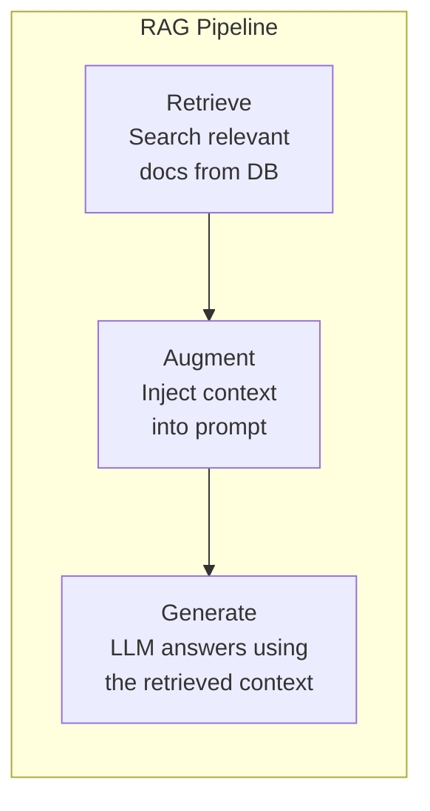

# RAG Architecture

You have probably noticed that LLMs sometimes make things up. Ask a model about your company's internal policies or yesterday's news, and it will confidently produce an answer that sounds right but is completely fabricated. This is the hallucination problem, and it is one of the biggest barriers to using LLMs in production.

Retrieval-Augmented Generation (RAG) solves this by giving the model access to external knowledge at query time. Instead of relying only on what the model memorized during training, you fetch relevant documents first and include them in the prompt. The model then generates its answer based on real, up-to-date information.

---

## The RAG Pipeline

Every RAG system follows the same three-step pattern:

1. **Retrieve** — Given a user's question, search a knowledge base for relevant documents or passages.
2. **Augment** — Take those retrieved documents and inject them into the prompt as context.
3. **Generate** — Send the augmented prompt to the LLM and get an answer grounded in real data.

Think of it like an open-book exam. The student (LLM) doesn't need to memorize every fact. Instead, they look up the relevant pages (retrieve), read the key passages (augment), and write their answer based on what they found (generate).



> "open-book exam" — the model looks up answers

---

## Why LLMs Need External Knowledge

LLMs have a knowledge cutoff date. They were trained on data up to a certain point and know nothing about what happened after that. Even within their training data, they may have shallow knowledge about niche topics.

RAG fixes several problems at once:

- **Freshness** — Your knowledge base can be updated daily, while retraining a model takes weeks and significant resources.
- **Accuracy** — The model cites actual documents instead of generating from memory.
- **Domain specificity** — You can load your own proprietary data without fine-tuning the model.
- **Transparency** — You can show users which documents the answer came from.

---

## Components of a RAG System

A production RAG system has several moving parts:

- **Document Store** — Where your source documents live (files, databases, APIs).
- **Chunker** — Splits large documents into smaller passages that fit in the model's context window.
- **Embedder** — Converts text chunks into numerical vectors for similarity search.
- **Vector Store** — A database optimized for finding similar vectors (like FAISS, ChromaDB, or Pinecone).
- **Retriever** — Takes a query, embeds it, and finds the most similar chunks in the vector store.
- **Prompt Builder** — Combines the retrieved context with the user's question into a well-structured prompt.
- **Generator** — The LLM that produces the final answer.

You do not need to build all of these from scratch. In this lesson, we focus on the pipeline logic that connects them.

---

## RAG vs Fine-Tuning

When should you use RAG instead of fine-tuning a model?

| Factor | RAG | Fine-Tuning |
|---|---|---|
| Data changes frequently | Great fit | Poor fit — need to retrain |
| Need source citations | Built-in | Not naturally supported |
| Domain-specific style | Limited style control | Great for tone/format |
| Setup complexity | Moderate | Higher |
| Cost | Lower (no training) | Higher (GPU hours) |

In practice, many teams start with RAG because it is faster to set up and easier to maintain. You can always add fine-tuning later for style and format improvements.

```
  RAG                              Fine-Tuning
  ┌────────────────────┐           ┌────────────────────┐
  │ Keep base model     │           │ Modify model       │
  │ + add external docs │           │ weights directly   │
  │                    │           │                    │
  │ ✓ Easy to update    │           │ ✓ Faster at runtime│
  │ ✓ No training       │           │ ✓ No retrieval     │
  │ ✗ Needs vector DB   │           │ ✗ Expensive to     │
  │ ✗ Slower (retrieval)│           │   train            │
  └────────────────────┘           └────────────────────┘
```

---

## Real-World Use Cases

RAG is already powering real applications:

- **Customer Support** — A chatbot retrieves relevant help articles and answers user questions based on your actual documentation.
- **Documentation QA** — Developers ask questions about their codebase or API docs and get answers with page references.
- **Legal Research** — Lawyers search case law databases and get summaries grounded in actual rulings.
- **Internal Knowledge** — Employees search company wikis, Slack archives, and meeting notes using natural language.

The pattern is always the same: a user asks a question, relevant documents are retrieved, and the model answers using those documents as context.

---

## The Pipeline in Code

At its simplest, a RAG pipeline is just three function calls chained together:

```python
def rag_query(question):
    documents = retriever(question)        # Step 1: Retrieve
    context = build_context(documents)     # Step 2: Augment
    prompt = f"Context:\n{context}\n\nQuestion: {question}"
    answer = generator(prompt)             # Step 3: Generate
    return answer
```

The retriever and generator are pluggable — you can swap in different search backends and different LLMs without changing the pipeline logic. This separation of concerns is what makes RAG systems flexible and maintainable.

---

## Your Turn

In the exercise that follows, you will build a `RAGPipeline` class that wires together a retriever and generator. You will implement context building with character limits, prompt construction, and a full query method that returns both the answer and its sources. The tests use mock functions, so you do not need any external services running.

Let's build your first RAG pipeline!
