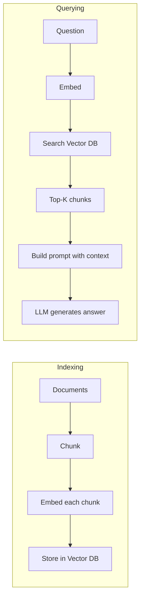

# Building a RAG Pipeline

You have learned about RAG architecture and document chunking. Now it is time to put everything together into a complete, working system. In this lesson, you will build a document QA system from scratch — one that loads files, chunks them, stores embeddings, retrieves relevant passages, and generates answers.

This is the kind of system you would build at a company to let employees ask questions about internal documentation, or to power a customer-facing FAQ bot that always gives accurate, sourced answers.

---

## The Complete Pipeline

Here is every step your document QA system will perform:

1. **Load documents** — Read text files from disk.
2. **Chunk documents** — Split each document into smaller passages.
3. **Embed chunks** — Convert each chunk into a numerical vector.
4. **Store embeddings** — Save chunks and their vectors for later search.
5. **Query** — When a question arrives, embed it and find the most similar chunks.
6. **Generate** — Build a prompt with the retrieved chunks and generate an answer.

Each step is a building block. In production systems, you would use specialized tools for each (FAISS for vectors, an embedding API, a powerful LLM). In this exercise, we keep things simple with mock functions so you can focus on the pipeline logic.



---

## Loading Documents

The first step is getting text into your system. A simple approach is to read files from a directory:

```python
def load_documents(file_paths):
    documents = []
    for path in file_paths:
        with open(path, "r") as f:
            documents.append({"path": path, "content": f.read()})
    return documents
```

Each document is a dictionary with the file path (for source attribution) and the full text content. In production, you would handle different file types, character encodings, and errors.

---

## A Simple Vector Store

A vector store holds your embedded chunks and supports similarity search. At its core, it is just a list of vectors with a function to find the closest matches.

**Cosine similarity** measures how similar two vectors are, regardless of their magnitude. Values range from -1 (opposite) to 1 (identical). For normalized vectors, this simplifies to a dot product.

```python
import math

def cosine_similarity(a, b):
    dot = sum(x * y for x, y in zip(a, b))
    norm_a = math.sqrt(sum(x * x for x in a))
    norm_b = math.sqrt(sum(x * x for x in b))
    if norm_a == 0 or norm_b == 0:
        return 0.0
    return dot / (norm_a * norm_b)
```

Your vector store keeps a list of `(embedding, chunk_text, metadata)` tuples. To search, you compute the cosine similarity between the query embedding and every stored embedding, then return the top-k most similar chunks.

---

## Processing Documents

Processing combines loading and chunking:

```python
def process_documents(documents, chunk_size=500):
    all_chunks = []
    for doc in documents:
        chunks = chunk_by_size(doc["content"], chunk_size)
        for i, chunk in enumerate(chunks):
            all_chunks.append({
                "text": chunk,
                "source": doc["path"],
                "index": i,
            })
    return all_chunks
```

After chunking, you embed each chunk using your embedding function and store the results in the vector store. This is the indexing phase — it happens once (or whenever documents change), not on every query.

---

## Answering Questions

When a user asks a question:

1. Embed the question using the same embedding function.
2. Search the vector store for the top-k most similar chunks.
3. Build a prompt: "Based on the following context: {chunks}. Answer: {question}"
4. Send the prompt to the LLM and return the answer along with source information.

The `answer` method ties everything together into a single function call that hides all the complexity.

---

## Evaluating RAG Answers

How do you know if your RAG system is working well? There are three key dimensions:

- **Faithfulness** — Is the answer supported by the retrieved documents? A faithful answer does not add information that is not in the context.
- **Relevance** — Are the retrieved documents actually relevant to the question? Irrelevant context leads to poor answers.
- **Completeness** — Does the answer address all parts of the question? Missing key information is a failure mode.

A simple evaluation approach is keyword checking: given a list of expected keywords, check how many appear in the generated answer. This is crude but effective for automated testing.

```python
def evaluate_answer(answer, expected_keywords):
    answer_lower = answer.lower()
    found = [kw for kw in expected_keywords if kw.lower() in answer_lower]
    score = len(found) / len(expected_keywords) if expected_keywords else 0.0
    return {"score": score, "found": found, "missing": [k for k in expected_keywords if k not in found]}
```

In production, you would use more sophisticated evaluation frameworks like RAGAS or human evaluation, but keyword checking is a practical starting point.

---

## Confidence Scoring

A simple way to estimate confidence is to look at the similarity scores of retrieved documents. If the top results have high similarity to the query, the system is more confident it found relevant context. If the scores are low, the answer might be unreliable.

You can compute a confidence score as the average similarity of the top-k retrieved chunks. This gives users a signal about whether to trust the answer.

```
  Similarity Scores:          Confidence:

  Chunk A: 0.92  ████████▉   High — very relevant
  Chunk B: 0.85  ████████▌   High — relevant
  Chunk C: 0.61  ██████░░░   Medium — maybe useful
  Chunk D: 0.34  ███░░░░░░   Low — probably irrelevant

  → Use chunks A & B, maybe C. Skip D.
```

---

## Your Turn

In the exercise that follows, you will build a complete `DocumentQA` class. It will have methods to load documents, process and embed them, answer questions, and evaluate answers. The tests mock the embedding and generation functions so you can focus on building the pipeline logic.

This is the most complete thing you have built so far. Let's do it!
