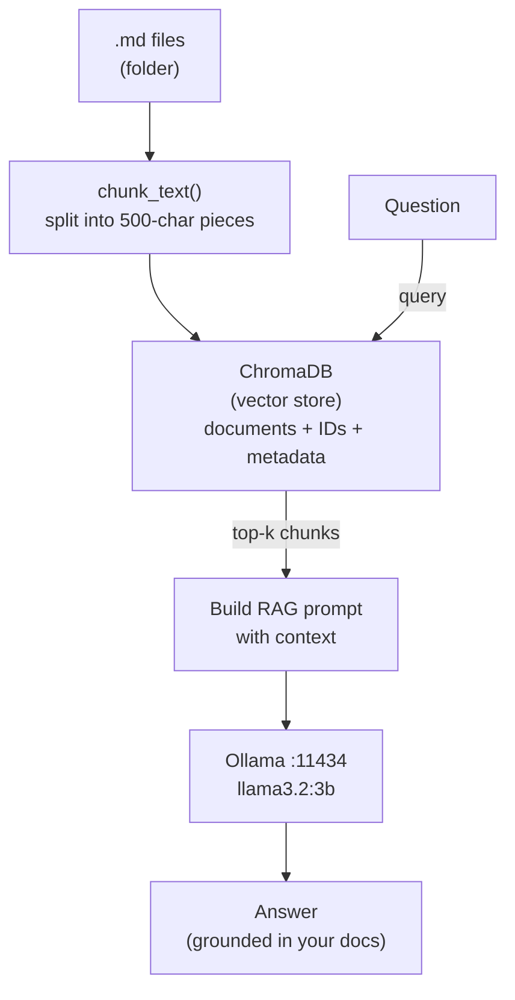

# Milestone Project: RAG Knowledge Base

Congratulations on completing Phase 7! You now understand embeddings, vector databases, retrieval strategies, and how to combine them with an LLM to build intelligent applications. It is time to bring all of that knowledge together.

This is your **second milestone project**. You are building a complete Retrieval-Augmented Generation (RAG) system -- a CLI tool that ingests a folder of Markdown notes into a vector database and answers questions about them. This is the same pattern used by production AI tools like GitHub Copilot, Cursor, and enterprise knowledge bases.

## What You'll Build

A **RAG-powered question-answering CLI** that:

- Reads all `.md` files from a folder you specify
- Splits them into chunks and stores them in ChromaDB with metadata
- Accepts natural language questions in a loop
- Retrieves the most relevant chunks from the vector database
- Sends those chunks as context to Ollama to generate grounded answers
- Attributes answers to their source files

### Architecture



The pipeline has two phases: **ingestion** (files to vectors) and **retrieval** (question to answer). You will implement both.

## Setup

This project uses ChromaDB, which is not installed by default with the tutor. Install it once before starting:

```bash
pip install chromadb
```

## Step-by-Step Guide

### Step 1: Implement `chunk_text()`

Chunking splits a long document into smaller pieces that fit the embedding model's context window and improve retrieval precision.

1. Take the input `text` and a `chunk_size` parameter (default 500 characters).
2. Slice the text into consecutive pieces of `chunk_size` characters: `text[0:500]`, `text[500:1000]`, etc.
3. Filter out any chunks that are empty or whitespace-only.
4. Return the list of chunks.

A list comprehension works well here: `[text[i:i+chunk_size] for i in range(0, len(text), chunk_size)]`.

### Step 2: Implement `ingest_folder()`

This function reads all Markdown files from a folder and stores their chunks in ChromaDB.

1. Use `Path(folder_path).glob("**/*.md")` to find all `.md` files recursively.
2. For each file, read its content and pass it through `chunk_text()`.
3. Generate unique IDs for each chunk (e.g., `"filename.md_chunk_0"`, `"filename.md_chunk_1"`).
4. Create metadata for each chunk: `{"source": "filename.md"}`.
5. Call `collection.add(documents=chunks, ids=ids, metadatas=metadatas)` to store them.
6. Return a tuple of `(total_files_ingested, total_chunks_stored)`.

### Step 3: Implement `ask()`

This is the RAG retrieval and generation step.

1. Check if the collection has any documents with `collection.count()`. If empty, return an informative message.
2. Query ChromaDB: `results = collection.query(query_texts=[question], n_results=n_results)`.
3. Extract the documents and their source metadata from the results.
4. Build a RAG prompt that includes the retrieved context, the user's question, and instructions telling the LLM to answer based only on the provided context.
5. Include source file names in the prompt so the LLM can attribute its answer.
6. Call `chat()` with the prompt and return the answer.

### Step 4: Implement `main()`

Tie it all together with an interactive CLI.

1. Ask the user for a folder path to ingest.
2. Call `ingest_folder()` and display how many files and chunks were processed.
3. Enter a question loop: read a question, call `ask()`, print the answer.
4. Exit on "quit" or Ctrl+C with a friendly message.

## Tips

- **Start with a small test folder.** Create 2-3 short `.md` files and ingest those first. Verify the chunk count matches what you expect before scaling up.
- **Use unique chunk IDs.** ChromaDB requires unique IDs. The pattern `f"{filename}_chunk_{i}"` guarantees uniqueness as long as filenames are unique.
- **Check `collection.count()`** after ingestion to verify chunks were stored. This is your best debugging tool.
- **Keep your RAG prompt clear.** Tell the LLM exactly what the context is, what the question is, and that it should answer based only on the context. This prevents hallucination.

## Your Turn

Open the starter code in `exercises/ex-01/starter/main.py`. Each function has detailed TODO comments explaining exactly what to implement. Build the pipeline one function at a time, test with `pytest`, and then try it on a real folder of notes!
