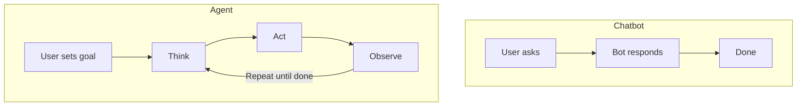
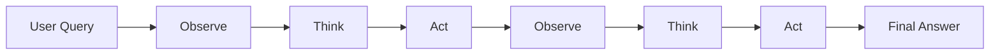

# Agent Concepts & Patterns

So far, you have built systems where a human sends a prompt and an LLM returns a response. One turn, one answer. But what if the task requires multiple steps? What if the model needs to look something up, do a calculation, check a result, and then decide what to do next?

That is what AI agents do. An agent is an LLM that can take actions in a loop — observing results, reasoning about them, and deciding on next steps — until the task is complete.

---

## Agent vs Chatbot

A **chatbot** responds to messages. You ask a question, it answers. Every interaction is independent (unless you manually maintain conversation history).

An **agent** pursues goals. Given a task, it breaks it into steps, uses tools to gather information or perform actions, evaluates its progress, and keeps going until the task is done or it runs out of attempts.

The key difference is autonomy. A chatbot waits for you to tell it what to do next. An agent decides for itself.



---

## The Agent Loop

Every agent follows the same core loop:

1. **Observe** — Look at the current state: the original task, previous actions, and their results.
2. **Think** — Reason about what to do next. The LLM generates a plan or selects an action.
3. **Act** — Execute the chosen action (call a tool, make an API request, write code).
4. **Repeat** — Feed the action's result back into the loop and go to step 1.

The loop continues until the agent produces a final answer or hits a maximum iteration limit (to prevent infinite loops).



This is sometimes called the "agentic loop" or "reasoning loop."

---

## Types of Agents

### ReAct (Reasoning + Acting)

The most common pattern. The model alternates between reasoning ("I need to find the user's order") and acting ("I'll search the orders database"). Each step produces a thought, an action, and an observation.

```
Thought: I need to find the capital of France.
Action: search("capital of France")
Observation: Paris is the capital of France.
Thought: I now have the answer.
Final Answer: The capital of France is Paris.
```

### Plan & Execute

The model first creates a complete plan (a list of steps), then executes each step one by one. This works well for complex tasks where you want to see the full plan before execution begins.

### Reflexion

After completing a task, the agent reviews its own output and identifies mistakes. It then tries again with the self-critique in mind. This iterative self-improvement leads to better results on complex reasoning tasks.

---

## Tools and Function Calling

Tools are what give agents their power. A tool is simply a function that the agent can call — a calculator, a web search, a database query, a file reader, an API call.

The agent needs to know:
- **What tools are available** — A list of tool names and descriptions.
- **How to call them** — The expected format for tool invocations.
- **What they return** — So it can use the results in its reasoning.

In practice, you describe your tools in the system prompt and define a format for the agent to request tool calls. The agent outputs something like `ACTION: calculator(2 + 2)`, your code parses that, executes the calculator, and feeds the result back.

---

## Agent Memory

Agents need to remember what they have done. There are two types of memory:

- **Short-term memory** — The conversation history within a single task. This includes the original query, all actions taken, and all results received. It grows with each iteration.
- **Long-term memory** — Information that persists across tasks. This could be a database of past interactions, learned preferences, or accumulated knowledge.

For most agents, short-term memory (the message list) is sufficient. The key is to include enough context in each iteration for the model to make good decisions without exceeding the context window.

---

## When to Use Agents vs Direct Prompting

Agents add complexity. Use them only when you need them:

**Use direct prompting when:**
- The task can be completed in a single LLM call
- No external data or tools are needed
- The task is well-defined with a clear output format

**Use agents when:**
- The task requires multiple steps that depend on each other
- External tools (search, calculators, APIs) are needed
- The task requires adaptive decision-making based on intermediate results
- You need the system to recover from errors and try alternative approaches

Start simple. Many tasks that seem like they need an agent can actually be solved with a well-crafted prompt and a single LLM call.

---

## Action Parsing

A practical challenge with agents is parsing the model's output to identify tool calls. A common approach is to define a simple format:

```
ACTION: tool_name(argument)
```

If the model's response contains this pattern, you extract the tool name and argument, execute the tool, and continue the loop. If the response does not contain an action, the model is providing its final answer.

This is a simplified version of what frameworks like LangChain and AutoGen do internally.

---

## Your Turn

In the exercise that follows, you will build a `SimpleAgent` class with a tool system, action parsing, and the core agent loop. You will define tools, parse LLM responses for action requests, execute tools, and run the loop until completion. The tests mock the LLM so you can focus on the agent logic.

Let's build your first AI agent!
