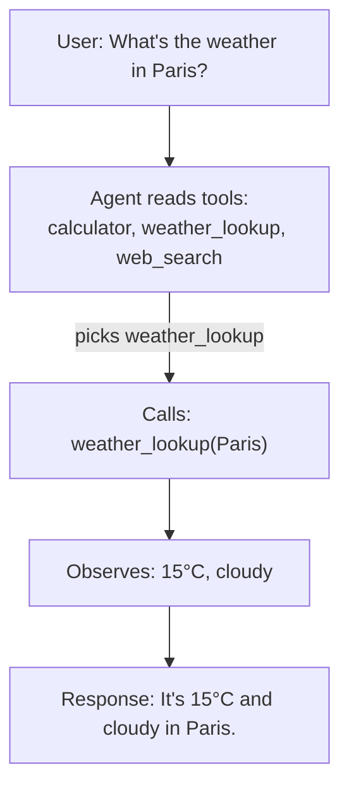
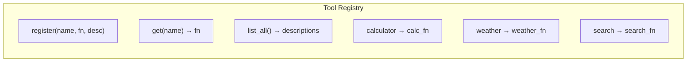

# Tool Use & Function Calling

In the previous lesson, you built an agent that could parse actions and call tools. But we glossed over an important question: how do you design tools that an LLM can actually use well?

Tool design is a critical skill in AI engineering. A poorly described tool confuses the model. A poorly implemented tool crashes your agent. In this lesson, you will learn how to build a robust toolkit system — registering tools, describing them for LLMs, handling errors gracefully, and executing them safely.

---

## What Makes a Good Tool?

An LLM decides which tool to use based on text descriptions. This means your tool descriptions need to be clear, specific, and unambiguous:

**Bad description:** "Does math stuff"
**Good description:** "Evaluates a mathematical expression and returns the numeric result. Input should be a valid math expression like '2 + 3' or '(10 * 5) / 2'."

A good tool has these properties:

- **Clear name** — Short, descriptive, no abbreviations. `calculator` is better than `calc` or `math_util`.
- **Specific description** — Explains what the tool does, what input it expects, and what it returns.
- **Defined parameters** — The model needs to know what arguments to pass and their format.
- **Predictable output** — Always returns a string. Errors are returned as error messages, not exceptions.
- **Single responsibility** — Each tool does one thing well. Don't combine search and calculation into one tool.

---

## Parameter Schemas

In production systems (like OpenAI's function calling), tools are defined with JSON schemas that specify parameter names, types, and descriptions:

```python
{
    "name": "calculator",
    "description": "Evaluate a math expression.",
    "parameters": {
        "expression": {
            "type": "string",
            "description": "A math expression to evaluate, e.g. '2 + 3'"
        }
    }
}
```

This structure helps the LLM understand exactly what to pass. Even in simpler systems, documenting your parameters clearly is essential.

---

## Formatting Tools for the Prompt

The agent needs to know what tools are available. You include this information in the prompt:

```
You have access to the following tools:

1. calculator(expression) - Evaluates a math expression and returns the result.
2. word_count(text) - Counts the number of words in the given text.
3. search(query) - Searches a list of items for matches.

To use a tool, respond with: ACTION: tool_name(argument)
```

This formatted list goes into the system prompt or the beginning of the user prompt. The clearer the formatting, the better the model will use the tools.

---

## Error Handling in Tools

Tools will encounter errors — invalid inputs, missing data, network failures. The key principle is: **never let a tool crash the agent**. Instead, return a descriptive error message that the agent can reason about.

```python
def calculator(expression):
    try:
        result = safe_eval(expression)
        return str(result)
    except Exception as e:
        return f"Error: Could not evaluate '{expression}'. {str(e)}"
```

When the agent sees an error message, it can decide to try a different approach, rephrase the input, or use a different tool. If the tool raises an unhandled exception, the entire agent crashes.

---

## Safe Evaluation

If you build a calculator tool, you need to be careful about using `eval()` — it can execute arbitrary Python code, which is a serious security risk. Consider what happens if someone passes `__import__('os').system('rm -rf /')` as a "math expression."

### The Character Whitelist Approach

The simplest safe approach is to check that the expression contains only characters that could appear in a math expression — digits, operators, decimal points, parentheses, and spaces:

```python
def calculator(expression: str) -> str:
    """Evaluate a math expression safely."""
    safe_chars = '0123456789+-*/.() '
    if not all(c in safe_chars for c in expression):
        return f"Error: unsafe characters in expression: {expression}"
    try:
        result = eval(expression)
        return str(result)
    except Exception as e:
        return f"Error: {e}"
```

This works because:
- Only digits `0-9`, operators `+-*/`, decimal `.`, grouping `()`, and spaces are allowed
- No letters means no function calls, no `import`, no variable access
- The `eval()` can only see math, making it safe

### The AST Approach (Advanced)

For even more control, Python's `ast` module can parse expressions into a tree and evaluate only allowed operations:

```python
import ast
import operator

ALLOWED_OPS = {
    ast.Add: operator.add,
    ast.Sub: operator.sub,
    ast.Mult: operator.mul,
    ast.Div: operator.truediv,
}

def safe_eval(expression):
    """Evaluate simple math using the AST — no arbitrary code execution."""
    tree = ast.parse(expression, mode='eval')
    # Walk the tree and only evaluate allowed operations
    # Each node is either a number (ast.Constant) or an operation (ast.BinOp)
```

Both approaches are used in production. The character whitelist is simpler and what the exercise uses. The AST approach is more robust for complex cases.

> **Note:** The `ast` and `operator` modules are already imported in the exercise starter code. You can use either approach — the character whitelist is recommended for this exercise.

---

## Common Tool Patterns

Here are tools you will see in real agent systems:

- **Search** — Queries a database, API, or text collection. Returns relevant results.
- **Calculator** — Evaluates math expressions. LLMs are notoriously bad at arithmetic.
- **File operations** — Read, write, or list files. Useful for code agents.
- **API calls** — Fetch data from external services (weather, stock prices, etc.).
- **Code execution** — Run code in a sandbox. Powerful but requires security measures.
- **Text processing** — Word count, summarization, translation.

---

## Tool Selection Strategies

When an agent has many tools, how does it pick the right one? The model reads the tool descriptions and selects based on relevance to the current task. You can improve selection by:

- Writing descriptions that clearly differentiate tools
- Grouping related tools with consistent naming (e.g., `file_read`, `file_write`, `file_list`)
- Limiting the number of tools to what the task actually needs
- Providing examples in the system prompt showing which tool to use for common tasks



---

## Your Turn

In the exercise that follows, you will build a `ToolRegistry` class that manages tool registration, description formatting, and execution. You will also implement three built-in tools: a safe calculator, a word counter, and a list searcher. The tests verify registration, execution, error handling, and prompt formatting.



Let's build a toolkit!
