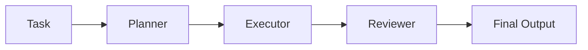
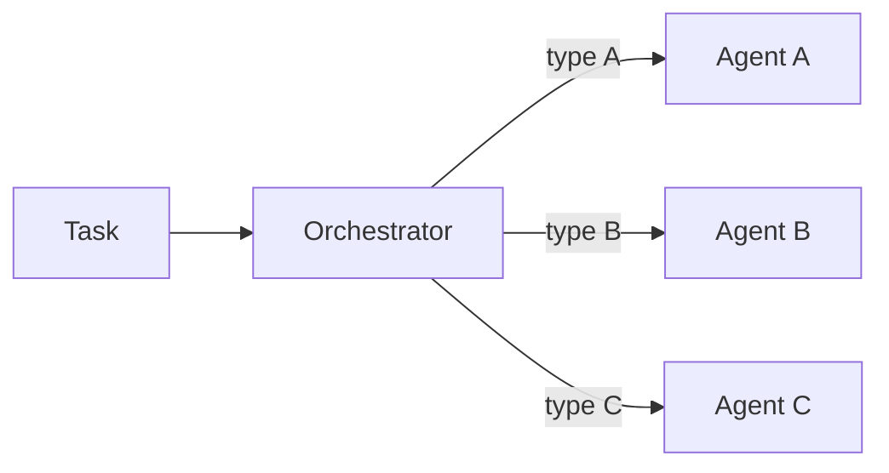
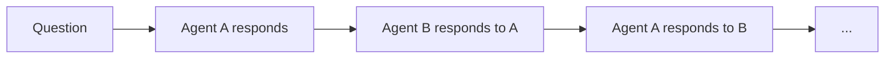
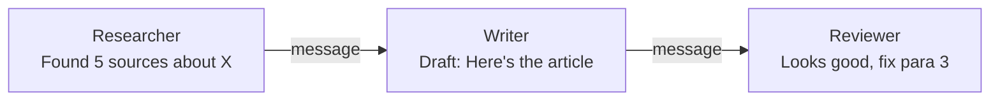

# Multi-Agent Systems

In the previous lessons, you built a single agent that uses tools to complete tasks. But some problems are too complex or too broad for one agent to handle well. Just like a team of specialists outperforms a single generalist on complex projects, multiple AI agents working together can produce better results than one agent trying to do everything.

Multi-agent systems assign different roles to different agents and coordinate their work. One agent plans, another executes, a third reviews the output. Each agent has a focused system prompt and a clear set of capabilities.

---

## Why Multiple Agents?

A single agent has limitations:

- **Context window** — One agent must fit all instructions, tools, history, and reasoning into its context. With multiple agents, each has a focused context.
- **Role clarity** — An agent told to "plan, code, test, and review" often does all of these poorly. Separate agents with clear roles perform each task better.
- **Error isolation** — If one agent makes a mistake, another can catch it. A reviewer agent can spot errors that the original agent missed.
- **Specialization** — Different tasks may benefit from different system prompts, temperature settings, or even different models.

---

## Agent Roles

In a multi-agent system, each agent has a defined role:

- **Planner** — Breaks a complex task into smaller steps. Creates a strategy before execution begins.
- **Executor** — Carries out the plan step by step. Uses tools and generates outputs.
- **Reviewer** — Evaluates the executor's output. Checks for errors, quality, and completeness.
- **Debugger** — Analyzes failures and suggests fixes when something goes wrong.
- **Researcher** — Gathers information from external sources before the executor begins.

You do not always need all of these roles. Start with the minimum set that your task requires and add more agents only when they provide clear value.

---

## Orchestration Patterns

How do multiple agents work together? Here are the three most common patterns:

### Sequential Pipeline

Agents run one after another, each passing its output to the next:

This is the simplest pattern. Each agent takes the previous agent's output as input and adds its contribution. It works well for tasks with clear stages.

### Routing

A central orchestrator examines the task and routes it to the most appropriate agent:

This is useful when different types of tasks require different expertise. A customer support system might route billing questions to one agent and technical questions to another.

### Debate

Multiple agents discuss the same topic, building on each other's responses:

Each agent sees the other's previous response and can agree, disagree, or add nuance. After several rounds, you get a more thorough analysis than any single agent would produce.

---

## Message Passing

Agents communicate through messages. Each message has:

- **From** — Which agent sent it.
- **To** — Which agent should receive it.
- **Content** — The actual text.
- **Type** — What kind of message: a task assignment, a result, feedback, etc.

A message log tracks all communication between agents, which is essential for debugging and auditing.

---

## Consensus and Conflict Resolution

When agents disagree, you need a strategy:

- **Majority vote** — If three agents review an output, go with the majority opinion.
- **Authority** — Designate one agent as the final decision-maker.
- **Escalation** — If agents cannot agree, escalate to a human reviewer.
- **Synthesis** — Have a final agent read all perspectives and produce a synthesized output.

In practice, sequential pipelines avoid most conflicts because each agent has a clear, non-overlapping role.

---

## Real-World Multi-Agent Examples

Multi-agent systems are being used in production:

- **Software development** — One agent writes code, another writes tests, a third reviews the code for bugs. This mimics a real engineering team.
- **Content creation** — A researcher gathers information, a writer produces a draft, an editor refines it.
- **Customer support** — A classifier routes tickets, specialized agents handle different categories, a quality checker reviews responses.
- **Data analysis** — A planner designs the analysis approach, an analyst writes the code, a reviewer checks the results.

---

## Practical Tips

- **Start simple** — Begin with two agents (executor + reviewer) and add more only when needed.
- **Clear boundaries** — Each agent should have a distinct role with no overlap.
- **Limit rounds** — Always cap the number of debate rounds or pipeline steps to prevent infinite loops.
- **Log everything** — Record all messages between agents for debugging.
- **Test individually** — Test each agent in isolation before testing the full system.

---

## Your Turn

In the exercise that follows, you will build an `Orchestrator` class that manages multiple agents. You will implement task routing (matching tasks to agents by capabilities), sequential pipelines (agents processing in order), and debates (agents responding to each other). This is real architecture used in production multi-agent systems.

Let's orchestrate some agents!
