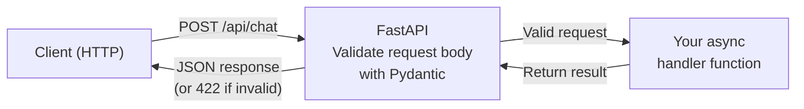

# FastAPI Basics for AI Backends

You've built AI pipelines and agents -- now it's time to put them behind a real web API so the world can use them. In this lesson, you'll learn **FastAPI**, the modern Python framework that's become the go-to choice for AI backend development. By the end, you'll know how to create endpoints, validate data with Pydantic, and serve AI models over HTTP.

---

## Why FastAPI for AI?

If you've used Flask before, FastAPI will feel familiar but better in every way that matters for AI work:

- **Async by default** -- AI calls (like sending prompts to an LLM) are slow and IO-bound. FastAPI handles async natively, so your server doesn't freeze while waiting for a model response.
- **Automatic data validation** -- Pydantic models validate every request and response, catching bad data before it hits your AI pipeline.
- **Auto-generated docs** -- Visit `/docs` and you get an interactive Swagger UI for free. This is incredibly useful when teammates or frontend developers need to test your AI endpoints.
- **Type hints everywhere** -- Python type hints aren't just for documentation; FastAPI uses them to validate data, generate docs, and provide editor support.

```python
from fastapi import FastAPI

app = FastAPI()

@app.get("/health")
def health_check():
    return {"status": "ok"}
```

That's it. You have a working API endpoint. No boilerplate, no configuration files.

---

## Pydantic Models: Your Data Contracts

In AI backends, data quality is everything. If someone sends malformed input to your model, you want to catch it immediately -- not after burning GPU cycles. Pydantic models define the exact shape of your data:

```python
from pydantic import BaseModel

class PredictRequest(BaseModel):
    text: str
    model: str = "default"  # optional with default value

class PredictResponse(BaseModel):
    result: str
    confidence: float
    model: str
```

When a request comes in, FastAPI automatically:
1. Parses the JSON body
2. Validates every field against the type hints
3. Returns a clear 422 error if anything is wrong
4. Converts the validated data into your Pydantic model

```
  Incoming JSON:              Pydantic Model:
  {"prompt": "hello",        class ChatRequest:
   "temperature": 1.5}          prompt: str
        ↓                       temperature: float = 0.7
  ┌──────────────────┐              ↓
  │ prompt: str ✓    │       Validates types,
  │ temp: float ✓    │       applies defaults,
  │ model: uses      │       returns clean object
  │   default ✓      │       or 422 error
  └──────────────────┘
```

You never write manual validation code again.

---

## Creating Endpoints

FastAPI uses decorators to define routes, just like Flask. But it also uses type hints to define request bodies:

```python
@app.post("/predict")
def predict(request: PredictRequest):
    # Your AI logic here
    confidence = len(request.text) / 100.0
    return PredictResponse(
        result=f"Processed: {request.text[:50]}",
        confidence=min(confidence, 1.0),
        model=request.model
    )
```

Notice how the `request` parameter is typed as `PredictRequest`. FastAPI sees this and knows to parse the JSON body into that model. The return value is a `PredictResponse`, which gets serialized back to JSON automatically.

### Path and Query Parameters

```python
@app.get("/models/{model_id}")
def get_model(model_id: str, verbose: bool = False):
    return {"model_id": model_id, "verbose": verbose}
```

- `model_id` is a **path parameter** -- it's part of the URL (`/models/gpt-4`)
- `verbose` is a **query parameter** -- it's appended to the URL (`/models/gpt-4?verbose=true`)

---

## Request and Response Patterns for AI

Here's how a request flows through FastAPI:



AI backends have common patterns that differ from typical web APIs:

### Batch Processing

Users often want to process multiple inputs at once. Instead of making 100 separate API calls, they send a batch:

```python
class BatchRequest(BaseModel):
    texts: list[str]

class BatchResponse(BaseModel):
    results: list[str]
    count: int

@app.post("/batch")
def batch_predict(request: BatchRequest):
    results = [process(text) for text in request.texts]
    return BatchResponse(results=results, count=len(results))
```

### Listing Available Models

AI APIs typically expose an endpoint that lists available models:

```python
@app.get("/models")
def list_models():
    return ["default", "fast", "accurate"]
```

---

## Automatic Documentation

One of FastAPI's killer features is auto-generated documentation. Once your app is running, visit:

- `http://localhost:8000/docs` -- Interactive Swagger UI
- `http://localhost:8000/redoc` -- Alternative ReDoc UI

Every endpoint, request model, and response model is documented automatically from your type hints and docstrings. This means your API documentation is always up to date.

---

## Testing with TestClient

FastAPI includes a `TestClient` that lets you test endpoints without starting a server:

```python
from fastapi.testclient import TestClient

client = TestClient(app)

def test_health():
    response = client.get("/health")
    assert response.status_code == 200
    assert response.json() == {"status": "ok"}
```

This is how you'll test your exercise. The `TestClient` sends real HTTP requests to your app in-memory, so tests run fast and don't need a running server.

---

## Flask vs FastAPI: Quick Comparison

| Feature | Flask | FastAPI |
|---|---|---|
| Async support | Needs extensions | Built-in |
| Data validation | Manual or Flask-Marshmallow | Pydantic (automatic) |
| Auto docs | Needs Flask-Swagger | Built-in |
| Performance | Good | Great (Starlette + uvicorn) |
| Type hints | Optional decoration | Core feature |

For AI backends, FastAPI wins on every metric that matters: async support for slow model calls, automatic validation for complex inputs, and built-in docs for team collaboration.

---

## What You'll Build

In the exercise, you'll create a complete AI-ready API with health checks, prediction endpoints, batch processing, and proper Pydantic models. It's a pattern you'll reuse in every AI project going forward.

Let's build it.
