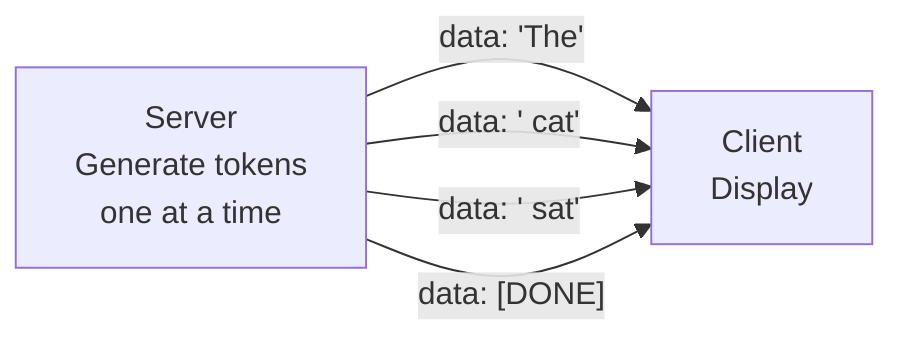

# Async AI Services

You've built a FastAPI backend. Now let's tackle the reality of AI applications: **LLM calls are slow**. A single call to a language model can take 2-30 seconds. If your server blocks while waiting, it can only handle one user at a time. In this lesson, you'll learn async programming patterns that keep your AI backend responsive, even under heavy load.

---

## Why Async Matters for AI

Think about what happens when a user sends a prompt to your API:

1. Your server receives the request (~1ms)
2. You send the prompt to an LLM (~3,000-15,000ms)
3. You process the response (~1ms)
4. You send the result back (~1ms)

Step 2 is 99.9% of the total time, and during all of it, your server is just *waiting*. In a synchronous server, that means no other requests can be processed. With async, your server says "I'll check back when the LLM responds" and handles other requests in the meantime.

```python
import asyncio

# Synchronous: blocks the entire server
def generate_sync(prompt):
    response = slow_llm_call(prompt)  # Server frozen for 5 seconds
    return response

# Asynchronous: server stays responsive
async def generate_async(prompt):
    response = await slow_llm_call(prompt)  # Server handles other requests
    return response
```

The `async` keyword marks a function as a coroutine. The `await` keyword says "pause here and let other tasks run until this finishes."

```
  Synchronous (blocking):
  Request A ████████████████░░░░░░░░░░░░░░  (idle while waiting)
  Request B ░░░░░░░░░░░░░░░░████████████████
  Total:     ──────────────────────────────→  16 seconds

  Asynchronous (non-blocking):
  Request A ████░░░░████░░░░████            (does other work while waiting)
  Request B ░░░░████░░░░████░░░░████
  Total:     ──────────────────→              10 seconds
```

---

## asyncio Basics

Python's `asyncio` module is the foundation of async programming. Here are the key concepts:

### Coroutines

A coroutine is a function defined with `async def`. It doesn't run immediately when called -- it returns a coroutine object that must be awaited:

```python
async def fetch_data():
    await asyncio.sleep(1)  # Simulates a slow operation
    return "data"

# Wrong: result = fetch_data()  # Returns a coroutine object, not "data"
# Right: result = await fetch_data()  # Actually runs and returns "data"
```

### Running Concurrent Tasks

The real power of async is running multiple slow operations at the same time:

```python
async def process_batch(prompts):
    tasks = [generate(prompt) for prompt in prompts]
    results = await asyncio.gather(*tasks)
    return results
```

`asyncio.gather()` runs all tasks concurrently. If each LLM call takes 5 seconds and you have 10 prompts, synchronous processing takes 50 seconds. With `gather`, it takes about 5 seconds.

---

## Async HTTP Clients with httpx

The `requests` library is synchronous -- it blocks. For async AI backends, use `httpx`:

```python
import httpx

async def call_llm(prompt: str) -> str:
    async with httpx.AsyncClient() as client:
        response = await client.post(
            "http://localhost:11434/api/generate",
            json={"model": "llama3", "prompt": prompt},
            timeout=30.0,
        )
        return response.json()["response"]
```

`httpx.AsyncClient` works like `requests.Session` but doesn't block. Always use `async with` to ensure connections are properly closed.

---

## Streaming Responses with SSE

When an LLM generates a long response, users don't want to wait for the entire thing. **Server-Sent Events (SSE)** let you stream tokens as they're generated:

```python
async def generate_stream(prompt):
    async with httpx.AsyncClient() as client:
        async with client.stream("POST", url, json=data) as response:
            async for line in response.aiter_lines():
                yield line
```

Each chunk is sent to the client as a `data: {content}\n\n` message. The client sees the response build up in real time, just like ChatGPT.



User sees words appear in real-time, not waiting for full response.

The SSE format is simple:
```
data: Hello
data:  world
data: !
data: [DONE]
```

---

## Controlling Concurrency with Semaphores

Running 1000 LLM calls at once would overwhelm any server. A **semaphore** limits how many tasks run concurrently:

```python
semaphore = asyncio.Semaphore(3)  # Max 3 concurrent calls

async def limited_generate(prompt):
    async with semaphore:
        return await call_llm(prompt)

async def batch_generate(prompts):
    tasks = [limited_generate(p) for p in prompts]
    return await asyncio.gather(*tasks)
```

With a semaphore of 3, even if you submit 100 prompts, only 3 LLM calls happen at a time. The rest queue up automatically.

---

## Retry with Exponential Backoff

LLM APIs fail. Servers get overloaded, networks hiccup, rate limits kick in. A retry function with exponential backoff handles transient failures gracefully:

```python
async def retry_with_backoff(fn, max_retries=3, base_delay=1.0):
    for attempt in range(max_retries):
        try:
            return await fn()
        except Exception as e:
            if attempt == max_retries - 1:
                raise
            delay = base_delay * (2 ** attempt)  # 1s, 2s, 4s
            await asyncio.sleep(delay)
```

The delay doubles each time: 1 second, 2 seconds, 4 seconds. This gives the server time to recover without hammering it with retries.

---

## Background Tasks

Some work doesn't need to happen before the response is sent. FastAPI's `BackgroundTasks` let you do work after responding:

```python
from fastapi import BackgroundTasks

@app.post("/generate")
async def generate(request: Request, background_tasks: BackgroundTasks):
    result = await call_llm(request.prompt)
    background_tasks.add_task(log_usage, request.prompt, result)
    return {"result": result}
```

The user gets their response immediately, and the logging happens in the background.

---

## What You'll Build

In the exercise, you'll build an `AsyncLLMClient` class with generate, streaming, and batch methods, plus a retry utility and SSE formatter. These are the exact patterns used in production AI services.

Let's make your backend async.
