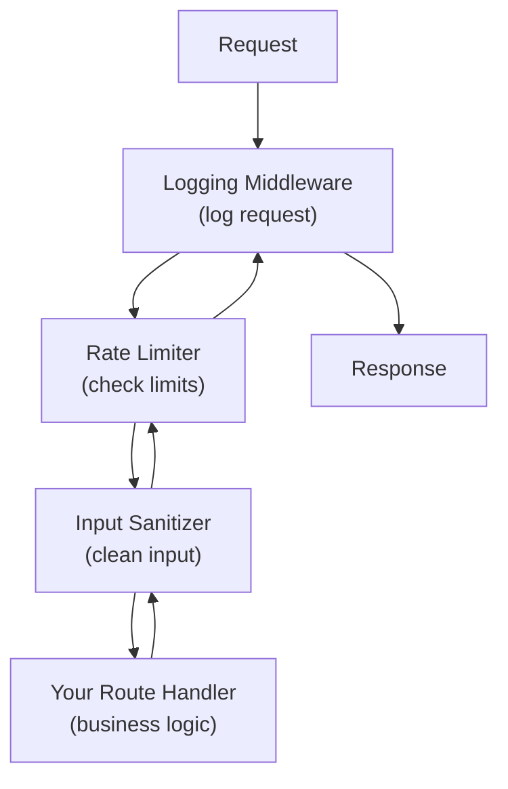

# Production Patterns for AI Backends

Your API works. Your async services hum along. But production is a different beast. Real users will send garbage input, hammer your endpoints, and expect instant responses 24/7. In this lesson, you'll learn the patterns that separate a demo from a production-ready AI backend: rate limiting, caching, input sanitization, and proper error handling.

---

## Rate Limiting: Protecting Your Resources

LLM calls are expensive -- both in compute and in API costs. Without rate limiting, a single user (or bot) could burn through your entire budget in minutes. A rate limiter controls how many requests each client can make in a given time window.

The **sliding window** approach is simple and effective:

```python
import time

class RateLimiter:
    def __init__(self, max_requests, window_seconds):
        self.max_requests = max_requests
        self.window_seconds = window_seconds
        self.requests = {}  # client_id -> list of timestamps

    def is_allowed(self, client_id):
        now = time.time()
        # Remove old timestamps outside the window
        if client_id in self.requests:
            self.requests[client_id] = [
                t for t in self.requests[client_id]
                if now - t < self.window_seconds
            ]
        else:
            self.requests[client_id] = []

        if len(self.requests[client_id]) < self.max_requests:
            self.requests[client_id].append(now)
            return True
        return False
```

A client gets `max_requests` within each rolling `window_seconds` period. Once they hit the limit, they have to wait.

```
  Sliding Window (10 requests / minute):

  Time: ──────────────────────────────────→

  Req:  ✓ ✓ ✓ ✓ ✓ ✓ ✓ ✓ ✓ ✓ ✗ ✗ ✗     ✓ ✓
        ├──────── 1 minute ────────┤     ├──→
        10 allowed                       window slides,
                                         new requests OK
```

---

## Caching LLM Responses

If ten users ask "What is Python?", do you really need to call the LLM ten times? A response cache stores previous answers and serves them instantly on repeat queries.

Key decisions for your cache:
- **Max size**: How many entries to store (memory is finite)
- **TTL (Time To Live)**: How long a cached response stays valid
- **Cache key**: What makes two requests "the same"

```python
import hashlib
import time

class ResponseCache:
    def __init__(self, max_size=100, ttl_seconds=300):
        self.max_size = max_size
        self.ttl_seconds = ttl_seconds
        self.cache = {}  # key -> {"value": ..., "timestamp": ...}

    def make_key(self, prompt, model):
        raw = f"{prompt}::{model}"
        return hashlib.sha256(raw.encode()).hexdigest()

    def get(self, key):
        if key in self.cache:
            entry = self.cache[key]
            if time.time() - entry["timestamp"] < self.ttl_seconds:
                return entry["value"]
            del self.cache[key]  # Expired
        return None
```

The cache key combines the prompt and model name into a deterministic hash. This way, "What is Python?" with model "llama3" always maps to the same key.

---

## Input Sanitization

Users will send you everything: megabytes of text, prompt injection attacks, control characters, and empty strings. Your backend needs to handle all of it gracefully.

```python
def sanitize_input(text, max_length=10000):
    if not isinstance(text, str):
        return ""
    # Strip control characters (except newlines and tabs)
    cleaned = "".join(
        ch for ch in text
        if ch in ("\n", "\t") or (ord(ch) >= 32 and ord(ch) < 127)
        or ord(ch) > 127  # Keep unicode
    )
    # Enforce length limit
    cleaned = cleaned[:max_length]
    return cleaned.strip()
```

Key sanitization steps:
1. **Type check** -- make sure it's actually a string
2. **Strip dangerous characters** -- remove control characters that could break logging or downstream systems
3. **Enforce length limits** -- prevent memory exhaustion from massive inputs
4. **Trim whitespace** -- clean up the edges

---

## Standardized Error Responses

When things go wrong (and they will), your API should return consistent, informative errors:

```python
def create_error_response(error, status_code=500):
    return {
        "error": {
            "message": str(error),
            "type": type(error).__name__,
            "status_code": status_code,
        }
    }
```

This pattern gives clients a predictable structure to parse. They always know to check `response["error"]["message"]` for details.

---

## CORS and Middleware

If your AI backend serves a web frontend, you need CORS (Cross-Origin Resource Sharing):

```python
from fastapi.middleware.cors import CORSMiddleware

app.add_middleware(
    CORSMiddleware,
    allow_origins=["http://localhost:3000"],
    allow_methods=["*"],
    allow_headers=["*"],
)
```

Middleware runs on every request. Common AI backend middleware includes:
- **Request logging** -- log every request for debugging and monitoring
- **Timing** -- measure how long each request takes
- **Error handling** -- catch unhandled exceptions and return clean error responses
- **Authentication** -- verify API keys before processing



Each layer wraps the next -- like layers of an onion.

---

## Environment Configuration

Never hardcode API keys, model names, or server URLs:

```python
import os

LLM_BASE_URL = os.getenv("LLM_BASE_URL", "http://localhost:11434")
MAX_REQUESTS_PER_MINUTE = int(os.getenv("RATE_LIMIT", "60"))
CACHE_TTL = int(os.getenv("CACHE_TTL", "300"))
```

Use environment variables with sensible defaults. This lets you change behavior between development, staging, and production without touching code.

---

## Health Checks

Production services need health endpoints that monitoring systems can poll:

```python
@app.get("/health")
def health():
    return {"status": "ok", "version": "1.0.0"}

@app.get("/ready")
async def readiness():
    # Check that the LLM is reachable
    try:
        await check_llm_connection()
        return {"ready": True}
    except Exception:
        return {"ready": False}
```

A `/health` endpoint confirms the server is running. A `/ready` endpoint confirms it can actually serve requests (LLM is reachable, cache is warm, etc.).

---

## What You'll Build

In the exercise, you'll implement a `RateLimiter`, a `ResponseCache`, and utility functions for input sanitization and error responses. These are the building blocks of every production AI service.

Let's harden your backend.
