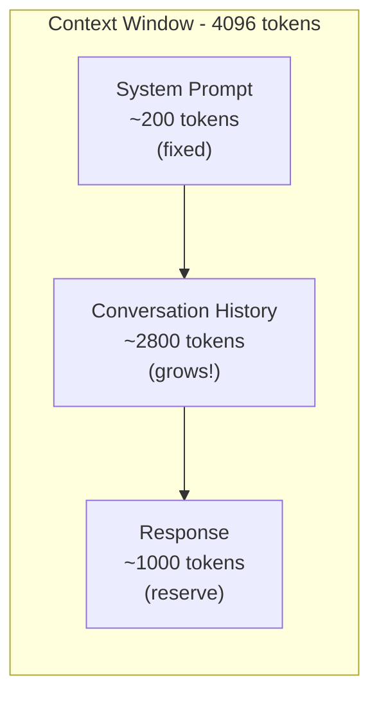

# Token & Cost Management

Every time you call an LLM, you're spending money -- or compute resources if you're running locally. In production, costs can spiral fast. A chatbot handling 10,000 users per day, each sending 5 messages, at $0.01 per call, costs $1,500 per month. Double the prompt length? Double the cost. In this lesson, you'll learn how tokens work, how to track costs, and how to optimize prompts to get the same quality at a fraction of the price.

---

## Understanding Tokens

LLMs don't read words -- they read **tokens**. A token is a chunk of text, roughly 3-4 characters in English. Here's how common text maps to tokens:

| Text | Approximate Tokens |
|---|---|
| "Hello" | 1 |
| "Hello, world!" | 4 |
| "Explain quantum computing in simple terms" | 7 |
| A 500-word essay | ~650-750 |

The rule of thumb: **1 token is about 4 characters** or **0.75 words** in English. This varies by language and model -- code and non-English text often use more tokens per character.

```
  Text:    "Hello, how are you today?"
  Tokens:  [Hello] [,]  [ how]  [ are]  [ you]  [ today] [?]
  Count:     1      2     3       4       5        6       7

  Rule of thumb: 1 token ≈ 4 characters ≈ ¾ of a word
```

### Why Tokens Matter

- **Cost** -- Most API providers charge per token (input + output separately)
- **Context window** -- Every model has a maximum token limit (4K, 8K, 32K, 128K). Your prompt + response must fit within this window.
- **Speed** -- More tokens = longer generation time

```python
def estimate_tokens(text):
    """Rough token estimate: ~4 characters per token."""
    return len(text) // 4
```

---

## Tracking Costs

You can't optimize what you don't measure. A cost tracker records every LLM call and calculates running totals:

```python
class CostTracker:
    def __init__(self, price_per_1k_input, price_per_1k_output):
        self.price_per_1k_input = price_per_1k_input
        self.price_per_1k_output = price_per_1k_output
        self.records = []

    def track(self, input_text, output_text, model="default"):
        input_tokens = estimate_tokens(input_text)
        output_tokens = estimate_tokens(output_text)
        cost = (input_tokens / 1000 * self.price_per_1k_input +
                output_tokens / 1000 * self.price_per_1k_output)
        self.records.append({
            "input_tokens": input_tokens,
            "output_tokens": output_tokens,
            "cost": cost,
            "model": model,
        })
```

Typical pricing (as of 2025):
- GPT-4-class models: ~$0.01-0.03 per 1K input, ~$0.03-0.06 per 1K output
- GPT-3.5-class models: ~$0.0005 per 1K input, ~$0.0015 per 1K output
- Local models (Ollama): Free, but you pay for hardware and electricity

---

## Prompt Optimization

The cheapest token is the one you don't send. Here are practical ways to reduce prompt length:

### 1. Remove Redundancy

```python
# Before (68 tokens)
"""You are a helpful assistant. Please help me with the following task.
I would like you to summarize the following text. The text is a news
article about technology. Please make the summary concise."""

# After (15 tokens)
"""Summarize this tech news article concisely."""
```

### 2. Strip Whitespace and Filler

Extra spaces, blank lines, and filler phrases ("I would like you to", "Please note that", "It is important to") add tokens without adding meaning.

```python
def optimize_prompt(prompt, max_tokens=500):
    # Remove extra whitespace
    import re
    cleaned = re.sub(r'\s+', ' ', prompt).strip()
    # Trim to token budget
    max_chars = max_tokens * 4
    if len(cleaned) > max_chars:
        cleaned = cleaned[:max_chars]
    return cleaned
```

### 3. Use Shorter Instructions

| Verbose | Concise |
|---|---|
| "Please provide me with" | "Give" |
| "I would like you to" | "" (just state the task) |
| "Could you please" | "" (just state the task) |
| "In order to" | "To" |
| "It is important to note that" | "Note:" |

---

## Model Selection

Not every task needs the biggest, most expensive model. A smart model selector matches task complexity to model capability:

| Task Complexity | Best Model Type | Why |
|---|---|---|
| Low (classification, extraction) | Small/fast model | Simple pattern matching |
| Medium (summarization, Q&A) | Mid-tier model | Needs understanding but not creativity |
| High (reasoning, code generation) | Large model | Needs deep understanding |

```python
def select_model(task_complexity, available_models):
    """Pick the best model for the task complexity."""
    if task_complexity == "low":
        # Prioritize speed
        return max(available_models, key=lambda m: m["speed"])
    elif task_complexity == "high":
        # Prioritize quality
        return max(available_models, key=lambda m: m["quality"])
    else:
        # Balance speed and quality
        return max(available_models, key=lambda m: m["speed"] + m["quality"])
```

---

## Context Window Management

When your conversation or document exceeds the context window, you need a strategy:



Trim old messages from conversation history when the context window is full.

1. **Truncation** -- Cut older messages from the conversation
2. **Summarization** -- Summarize earlier parts of the conversation
3. **Sliding window** -- Keep only the last N messages
4. **RAG** -- Retrieve only the relevant chunks instead of sending everything

Each approach trades off between cost, context quality, and implementation complexity.

---

## Usage Reports

A good cost tracker doesn't just count -- it reports. Your usage report should answer:
- How many requests have been made?
- How many tokens consumed (input vs output)?
- What's the total cost?
- What's the average cost per request?
- Which models are most/least expensive?

This data drives decisions: "We spend 80% of our budget on model X for task Y. Can we use a cheaper model?"

---

## What You'll Build

In the exercise, you'll create a `CostTracker` class, a prompt optimizer, and a model selector. These tools will help you monitor and reduce AI costs in any project.

Let's get your costs under control.
