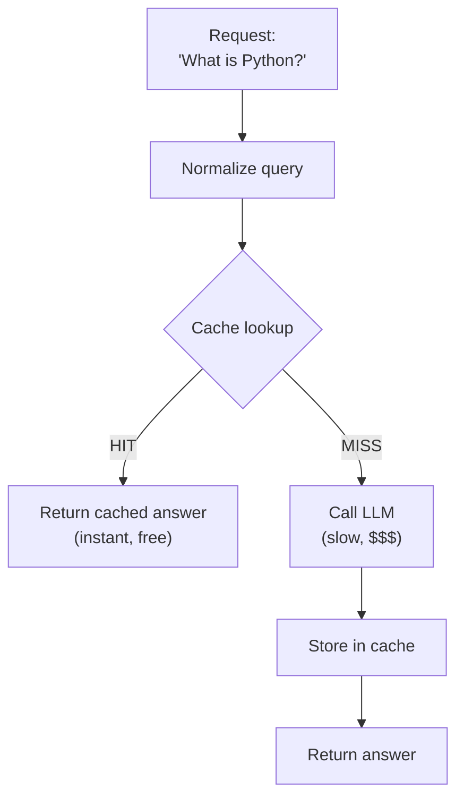
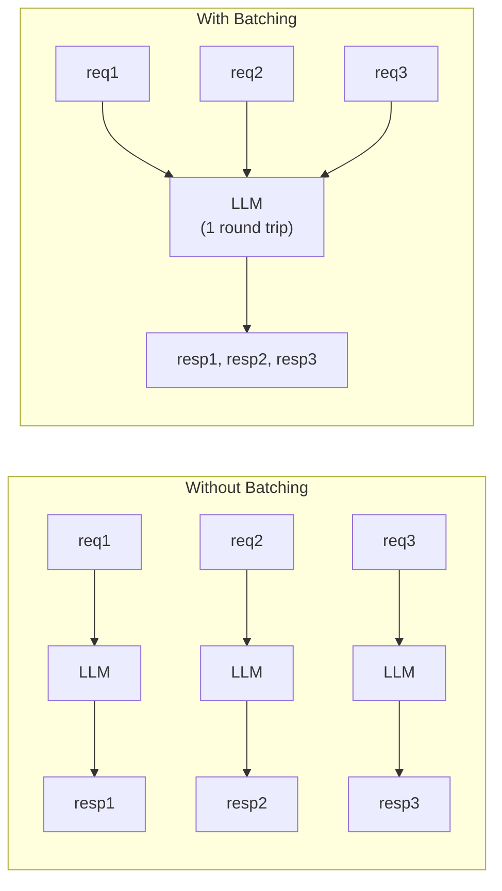

# Caching & Batching for AI Applications

Here's a costly truth about AI applications: users ask the same questions over and over. "What's your return policy?" "How do I reset my password?" "Explain recursion." Every duplicate question burns the same tokens, takes the same time, and costs the same money. In this lesson, you'll learn how to cache intelligently and batch efficiently to dramatically cut costs and latency.

---

## Why Caching Matters More for AI

Caching isn't new -- web developers have cached database queries for decades. But AI caching has unique properties that make it even more valuable:

- **Extreme cost**: A single LLM call costs 100-1000x more than a database query
- **High latency**: LLM responses take seconds, not milliseconds
- **Deterministic-ish output**: The same prompt with temperature=0 produces very similar results
- **Expensive computation**: Every cached response saves real compute/money

A simple cache with 50% hit rate cuts your AI costs in half. That's not an optimization -- that's a business decision.

---

## Cache Strategies

### Exact Match Cache

The simplest approach: hash the exact prompt and model, check if you've seen it before.

```python
key = hash(prompt + model)
if key in cache:
    return cache[key]  # Instant, free
else:
    response = call_llm(prompt, model)
    cache[key] = response
    return response
```



**Pros**: Simple, zero false positives
**Cons**: "What is Python?" and "what is python?" are different keys

### Normalized Match Cache

Normalize prompts before hashing: lowercase, strip whitespace, remove punctuation. Now "What is Python?" and "what is python ?" both hit the same cache entry.

```python
def normalize_key(text):
    text = text.lower().strip()
    text = re.sub(r'[^\w\s]', '', text)  # Remove punctuation
    text = re.sub(r'\s+', ' ', text)      # Collapse whitespace
    return text
```

**Pros**: Catches more duplicates
**Cons**: "Python language" and "Python snake" would match if only differing by punctuation -- but in practice, normalization helps much more than it hurts.

### Semantic Similarity Cache

The most sophisticated approach: check if the *meaning* is similar, not the exact text. "What is Python?" and "Tell me about the Python programming language" should hit the same cache.

This requires embeddings and similarity search -- which you learned in the embeddings phase. For this exercise, we'll focus on exact and normalized matching, which cover 80% of real-world cache hits.

---

## Cache Statistics

A cache without stats is flying blind. Track:

- **Hits**: How many requests were served from cache
- **Misses**: How many required a fresh LLM call
- **Hit rate**: hits / (hits + misses) -- your key metric
- **Size**: Current number of cached entries

```python
class SemanticCache:
    def __init__(self):
        self.hits = 0
        self.misses = 0

    def get(self, query):
        result = self._lookup(query)
        if result:
            self.hits += 1
        else:
            self.misses += 1
        return result

    def get_stats(self):
        total = self.hits + self.misses
        return {
            "hits": self.hits,
            "misses": self.misses,
            "hit_rate": self.hits / total if total > 0 else 0.0,
            "size": len(self.store),
        }
```

A hit rate below 20% means your cache isn't helping much. Above 50% and you're saving serious money.

---

## When NOT to Cache

Not everything should be cached:

- **Creative tasks** -- Users expect different poetry/stories each time
- **Time-sensitive queries** -- "What's the weather?" changes constantly
- **Personalized responses** -- Different users need different answers
- **Low-frequency queries** -- If a question is only asked once, caching wastes memory

The key insight: **cache factual, repetitive, non-personalized responses**.

---

## Batch Processing

Instead of processing requests one at a time, batch them:



This helps in several ways:

- **Deduplication** -- If 5 users ask the same question in 10 seconds, make one LLM call instead of five
- **Throughput** -- Some APIs offer batch endpoints with lower per-request costs
- **Resource efficiency** -- One batch of 10 is often faster than 10 individual requests

### The Batch Processor Pattern

```python
class BatchProcessor:
    def __init__(self, process_fn, batch_size=10):
        self.process_fn = process_fn
        self.batch_size = batch_size
        self.queue = []

    def add(self, item):
        self.queue.append(item)

    def flush(self):
        results = []
        while self.queue:
            batch = self.queue[:self.batch_size]
            self.queue = self.queue[self.batch_size:]
            results.extend(self.process_fn(batch))
        return results
```

Items accumulate in the queue. When you call `flush()`, they're processed in batches of `batch_size`.

---

## Deduplication

Before sending a batch to the LLM, remove duplicates. Why pay for the same question twice?

```python
def deduplicate_requests(requests, key_fn=None):
    if key_fn is None:
        key_fn = lambda x: x
    seen = {}
    unique = []
    index_map = {}  # original_index -> unique_index
    for i, req in enumerate(requests):
        key = key_fn(req)
        if key not in seen:
            seen[key] = len(unique)
            unique.append(req)
        index_map[i] = seen[key]
    return unique, index_map
```

The `index_map` lets you map results back to the original request order. If requests 0, 3, and 7 all asked "What is Python?", they all map to the same unique index.

---

## Queue-Based Architectures

In high-traffic AI applications, requests go into a queue rather than being processed immediately:

1. Request arrives, gets added to queue
2. Background worker pulls batches from the queue
3. Worker deduplicates, processes, and caches results
4. Results are returned to waiting clients

This smooths out traffic spikes and enables optimal batching. You don't need to build a full queue system for this exercise, but understanding the pattern is important for production.

---

## What You'll Build

In the exercise, you'll create a `SemanticCache` with exact and normalized matching, a `BatchProcessor` that groups items for efficient processing, and a deduplication utility. These patterns save real money in production AI systems.

Let's stop paying for the same answer twice.
