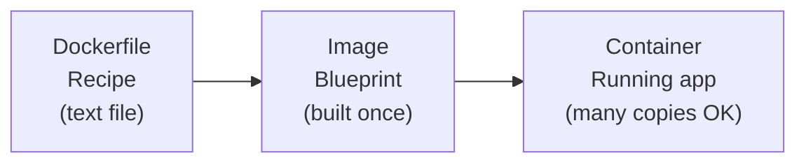
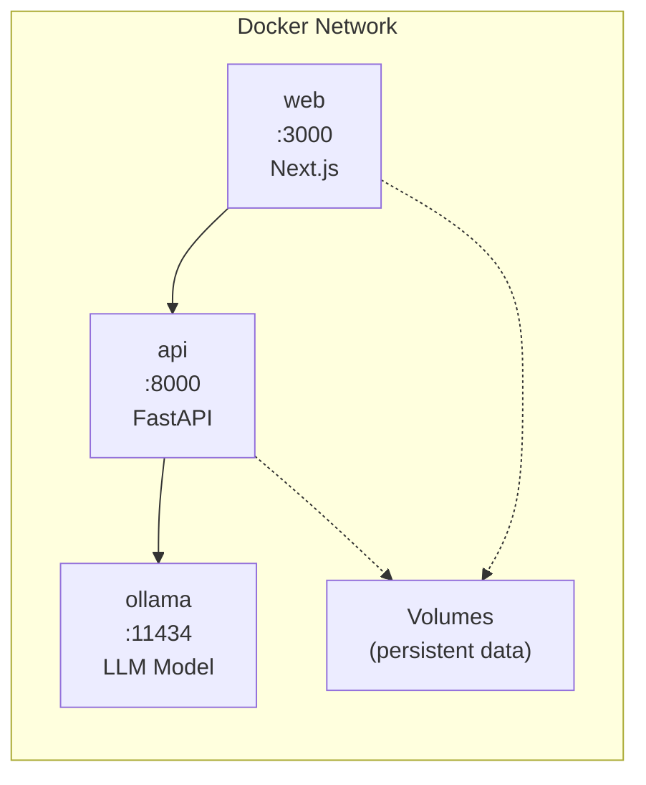

# Docker Basics for AI Apps

You've built AI applications that work on your machine. But what happens when you need to share them with the world, deploy them on a server, or hand them off to a teammate? Without careful setup, you'll run into the dreaded "it works on my machine" problem. Docker solves this -- and in this lesson, you'll learn how.

---

## Why Docker for AI?

AI applications are notoriously tricky to deploy. They depend on specific Python versions, exact library versions (PyTorch 2.1 vs 2.2 can behave very differently), system libraries, model files, and sometimes even GPU drivers. Docker packages all of these dependencies into a single, portable unit called a **container**.

Here's why Docker is a game-changer for AI work:

- **Reproducibility**: Your app runs the same way everywhere -- your laptop, a cloud server, a colleague's machine.
- **Dependency isolation**: Your AI app needs Python 3.11 with specific packages? No conflict with other projects.
- **Easy deployment**: Ship a container instead of a 20-step installation guide.
- **Scalability**: Run multiple instances of your app with a single command.

---

## Core Docker Concepts

### Images
An image is a blueprint for your application. It contains your code, Python packages, configuration, and everything needed to run. Think of it like a snapshot of a fully configured machine.

### Containers
A container is a running instance of an image. You can start, stop, and delete containers without affecting the image. One image can spawn many containers.

### Volumes
Volumes let containers persist data and share files with the host machine. Without volumes, any data written inside a container disappears when it stops -- not great for model files or databases.

### Dockerfiles
A Dockerfile is a recipe that tells Docker how to build an image. Each instruction creates a layer.

Here's how these concepts relate to each other:



Each instruction creates a layer:

```dockerfile
FROM python:3.11-slim
WORKDIR /app
COPY requirements.txt .
RUN pip install --no-cache-dir -r requirements.txt
COPY . .
EXPOSE 8000
CMD ["uvicorn", "app:app", "--host", "0.0.0.0", "--port", "8000"]
```

---

## Writing Dockerfiles for Python AI Apps

A good Dockerfile for AI applications follows a specific pattern:

1. **Start with a slim base image** -- `python:3.11-slim` is much smaller than the full image.
2. **Copy requirements first** -- This lets Docker cache the pip install layer. If your code changes but dependencies don't, Docker skips reinstalling packages.
3. **Copy source code after dependencies** -- Changes to your code won't invalidate the dependency cache.
4. **Expose the correct port** -- Tell Docker which port your app listens on.
5. **Set the startup command** -- Use CMD to define how your app starts.

### Multi-Stage Builds

For production, multi-stage builds keep your final image small:

```dockerfile
FROM python:3.11-slim AS builder
WORKDIR /build
COPY requirements.txt .
RUN pip install --no-cache-dir -r requirements.txt

FROM python:3.11-slim
WORKDIR /app
COPY --from=builder /usr/local/lib/python3.11/site-packages /usr/local/lib/python3.11/site-packages
COPY . .
CMD ["python", "main.py"]
```

The builder stage installs packages; the final stage copies only what's needed.

---

## Environment Variables

Never hardcode API keys, model paths, or configuration values. Use environment variables:

```dockerfile
ENV MODEL_NAME=llama2
ENV OLLAMA_HOST=http://ollama:11434
```

At runtime, override them: `docker run -e MODEL_NAME=mistral myapp`

---

## Docker Compose for Multi-Service Apps

Real AI applications often involve multiple services: a web frontend, an API backend, a model server (like Ollama), and maybe a database. Docker Compose lets you define and run all of them together.

```yaml
version: "3.8"
services:
  web:
    build: ./frontend
    ports:
      - "3000:3000"
    depends_on:
      - api
  api:
    build: ./backend
    ports:
      - "8000:8000"
    environment:
      - OLLAMA_HOST=http://ollama:11434
    depends_on:
      - ollama
  ollama:
    image: ollama/ollama
    ports:
      - "11434:11434"
    volumes:
      - ollama_data:/root/.ollama

volumes:
  ollama_data:
```

With `docker compose up`, all three services start together, connected on a shared network where they can communicate by service name.



---

## The .dockerignore File

Just like `.gitignore` keeps unwanted files out of your repository, `.dockerignore` keeps them out of your Docker image. This makes builds faster and images smaller:

```
__pycache__
*.pyc
.venv
.git
.env
node_modules
*.egg-info
.pytest_cache
```

Without a `.dockerignore`, Docker copies everything -- including your virtual environment, git history, and secret `.env` files -- into the image.

---

## Common Dockerfile Issues

Watch out for these frequent mistakes:

1. **Missing FROM**: Every Dockerfile must start with a FROM instruction.
2. **No EXPOSE**: Forgetting to expose the port means your app can't receive traffic.
3. **Hardcoded secrets**: Never put API keys directly in a Dockerfile -- use environment variables.
4. **Missing WORKDIR**: Without WORKDIR, files end up scattered in the root directory.
5. **Fat images**: Using `python:3.11` instead of `python:3.11-slim` adds hundreds of megabytes.

---

## Generating Docker Compose with Python

In the exercise, you'll generate docker-compose.yml files programmatically. Here's what you need to know about working with YAML in Python.

### The yaml Module

Python's `yaml` module (from the `pyyaml` package, already installed) converts between Python dictionaries and YAML text:

```python
import yaml

config = {
    "version": "3.8",
    "services": {
        "api": {
            "build": "./api",
            "ports": ["8000:8000"],
            "environment": {
                "MODEL_NAME": "llama3.2:3b",
                "DEBUG": "false",
            },
            "depends_on": ["ollama"],
        },
        "ollama": {
            "image": "ollama/ollama",
            "ports": ["11434:11434"],
        },
    },
}

yaml_text = yaml.dump(config, default_flow_style=False, sort_keys=False)
print(yaml_text)
```

Key parameters for `yaml.dump()`:
- `default_flow_style=False` -- produces readable multi-line YAML (not inline `{key: value}`)
- `sort_keys=False` -- preserves the order you defined (important for readability)

### Build vs Image

In docker-compose, each service either **builds** from a local Dockerfile or **pulls** a pre-built image:

```yaml
services:
  # Build from a local directory (starts with . or /)
  api:
    build: ./api        # Path to directory containing Dockerfile

  # Pull a pre-built image (a name, not a path)
  ollama:
    image: ollama/ollama  # Image name from Docker Hub
```

**Rule of thumb:** If the value starts with `.` or `/`, it's a local build path (use the `build` key). Otherwise, it's an image name (use the `image` key).

---

## Your Turn

In the exercise, you'll build Docker configuration generators -- functions that produce Dockerfiles, docker-compose.yml files, and .dockerignore content programmatically. These are practical utilities you could use in a real project scaffolding tool.

Let's containerize!
