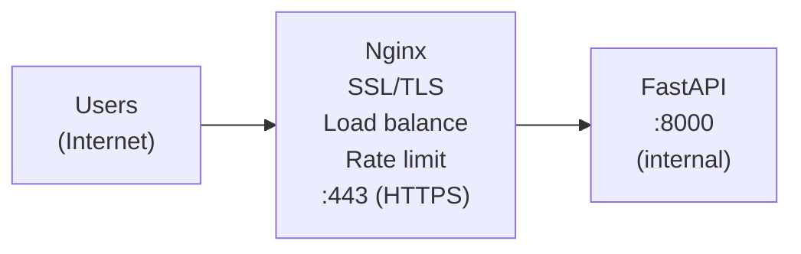

# Cloud Deployment

Your AI app is containerized and running locally. Now it's time to put it on a server where the world can use it. In this lesson, you'll learn practical deployment strategies for AI applications -- with a focus on self-hosting, since our Ollama-based stack gives you full control over your infrastructure.

---

## Deployment Options for AI Apps

Not all deployment platforms are equal when it comes to AI. Here's the landscape:

### VPS (Virtual Private Server)
A VPS gives you a full Linux server in the cloud. You install everything yourself -- Docker, your app, Ollama, the models. Providers like Hetzner, DigitalOcean, and Linode offer GPU-equipped servers starting around $30/month.

**Best for**: Self-hosted AI apps where you need GPU access and full control.

### Cloud Platforms (AWS, GCP, Azure)
Major cloud providers offer managed container services (ECS, Cloud Run, AKS). They handle scaling and networking, but costs can escalate quickly -- especially for GPU instances.

**Best for**: Teams that need auto-scaling and have budget for managed services.

### Serverless
Platforms like AWS Lambda or Google Cloud Functions run your code on demand. You pay only for execution time. However, cold starts (10-30 seconds) and memory limits make them a poor fit for LLM inference.

**Best for**: Lightweight API endpoints, not model inference.

### Self-Hosting
Running on your own hardware or a dedicated server. Maximum control, predictable costs, and no vendor lock-in. This is the approach we'll focus on.

**Best for**: Ollama-based apps, privacy-sensitive applications, learning.

Here's how the options compare:

```
  Complexity:  Low ────────────────────────→ High
  Control:     Low ────────────────────────→ High

  ┌──────────┐  ┌──────────┐  ┌──────────┐  ┌──────────┐
  │ Platform │  │Containers│  │   VPS    │  │ Self-    │
  │ (Render, │  │ (Fly.io, │  │(DigitalO-│  │  Hosted  │
  │  Railway)│  │  GCP Run)│  │ cean,AWS)│  │ (own HW) │
  └──────────┘  └──────────┘  └──────────┘  └──────────┘
   git push      Dockerfile    Full SSH       Full control
   and done      + deploy      access         max effort
```

---

## Environment Configuration

Production environments need different settings than development. The standard approach is environment variables loaded from a `.env` file:

```bash
# .env.production
APP_NAME=my-ai-app
APP_PORT=8000
OLLAMA_HOST=http://localhost:11434
MODEL_NAME=llama2
LOG_LEVEL=warning
DEBUG=false
```

Never commit `.env` files to git. Instead, provide a `.env.example` with placeholder values.

---

## Secrets Management

API keys, database passwords, and tokens need special handling:

1. **Never hardcode secrets** in source code or Dockerfiles.
2. **Use environment variables** for simple deployments.
3. **Use a secrets manager** (like HashiCorp Vault or cloud-native options) for production.
4. **Rotate secrets regularly** -- if a key leaks, limit the damage window.

For our self-hosted stack, environment variables in a `.env` file (readable only by the app user) are a solid starting point.

---

## Health Checks

A health check endpoint tells you (and your load balancer) whether your app is alive and functioning:

```python
@app.get("/health")
def health_check():
    return {"status": "healthy", "model_loaded": True}
```

Good health checks verify:
- The application process is running
- Database connections work
- The model server (Ollama) is reachable
- Critical dependencies are available

Set up automated monitoring that hits your health endpoint every 30-60 seconds. If it fails repeatedly, trigger an alert.

---

## Reverse Proxy with Nginx

In production, you don't expose your Python app directly to the internet. Instead, you put a reverse proxy (Nginx) in front of it:

```nginx
server {
    listen 80;
    server_name myapp.example.com;

    location / {
        proxy_pass http://127.0.0.1:8000;
        proxy_set_header Host $host;
        proxy_set_header X-Real-IP $remote_addr;
    }
}
```



Nginx handles:
- **SSL termination** -- encrypts traffic with HTTPS
- **Load balancing** -- distributes requests across multiple app instances
- **Static file serving** -- serves CSS, JS, images without hitting your Python app
- **Rate limiting** -- protects against abuse

---

## Systemd for Process Management

On Linux servers, systemd keeps your app running, restarts it if it crashes, and starts it on boot:

```ini
[Unit]
Description=My AI Application
After=network.target

[Service]
Type=simple
User=app
WorkingDirectory=/app
ExecStart=/usr/bin/python main.py
Restart=always
RestartSec=5
Environment=PYTHONUNBUFFERED=1

[Install]
WantedBy=multi-user.target
```

Key systemd features:
- **Restart=always**: Automatically restarts your app if it crashes
- **After=network.target**: Waits for networking before starting
- **User=app**: Runs with limited permissions (never run as root)

---

## Zero-Downtime Deployment

When you deploy a new version, you don't want users to see errors. Zero-downtime deployment strategies include:

1. **Blue-green**: Run old and new versions simultaneously, switch traffic all at once.
2. **Rolling update**: Gradually replace old instances with new ones.
3. **Canary**: Send a small percentage of traffic to the new version first.

For a simple self-hosted setup, a basic approach works: start the new version on a different port, verify it's healthy, then update Nginx to point to the new port and gracefully stop the old version.

---

## Cost Considerations for AI Inference

AI apps are more expensive to run than typical web apps because models need RAM and often GPU:

| Resource | Typical Need | Monthly Cost Range |
|---|---|---|
| 7B model (CPU) | 8 GB RAM, 4 cores | $20-40 |
| 7B model (GPU) | 8 GB VRAM | $50-150 |
| 13B model (GPU) | 16 GB VRAM | $100-300 |
| 70B model (GPU) | 40+ GB VRAM | $300-1000+ |

Tips for controlling costs:
- Use smaller, quantized models when quality is sufficient
- Scale down during off-peak hours
- Cache frequent responses
- Monitor actual resource usage and right-size your server

---

## Your Turn

In the exercise, you'll build deployment configuration utilities that generate Nginx configs, systemd service files, environment files, and health check scripts. You'll also create a function that estimates server requirements based on your model and usage needs.

Let's deploy!
