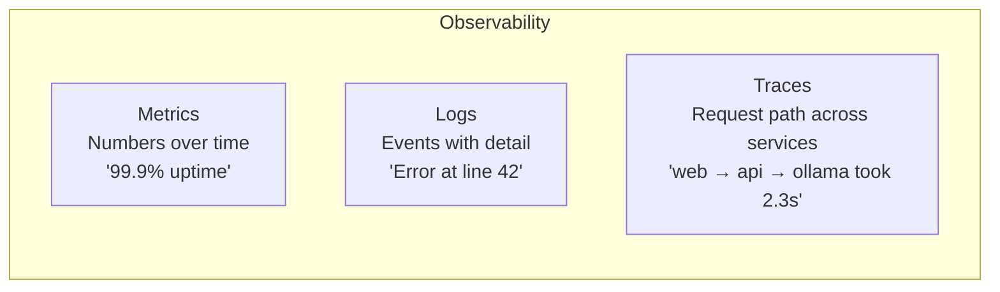

# Monitoring & Observability

Your AI app is deployed and running. But how do you know it's working *well*? Is it responding fast enough? Are errors creeping in? Is the model still giving good answers, or has something degraded? Monitoring answers these questions -- and for AI applications, it's more important than you might think.

---

## Why AI Apps Need Special Monitoring

Traditional web apps have straightforward success criteria: the page loads, the form submits, the database query returns results. AI applications are trickier because:

- **Model quality can degrade silently**: The app returns 200 OK, but the responses are garbage.
- **Token usage drives costs**: A bug in your prompts could burn through your budget overnight.
- **Latency varies wildly**: A 7B model responds in 2 seconds, but a 70B model takes 30. Users notice.
- **Drift happens**: The types of questions users ask change over time, and your prompts may not handle new patterns well.

You need to monitor not just "is it running?" but "is it running *well*?"

---

## Key Metrics for AI Applications

### Response Latency
How long each request takes. Track average, p95 (95th percentile -- the slowest 5% of requests), and p99. For AI apps, latency above 5 seconds often means users abandon the interaction.

### Token Usage
Track input tokens (your prompt) and output tokens (the model's response) per request. This directly impacts cost and can reveal prompt bloat.

### Error Rate
The percentage of requests that fail (5xx errors, timeouts, model errors). A healthy AI app should have an error rate below 1%.

### Requests Per Minute
Overall throughput. Sudden spikes might indicate a bot, while drops might mean your app is down.

### Response Quality
The hardest metric to track. Options include: user feedback (thumbs up/down), automated quality checks (does the response contain expected keywords?), and human review of samples.

---

## Structured Logging

Traditional logging (`print("something happened")`) is useless at scale. You can't search it, filter it, or analyze it. **Structured logging** outputs machine-readable JSON:

```json
{
    "timestamp": "2025-01-15T10:30:00Z",
    "service": "ai-api",
    "level": "info",
    "message": "LLM call completed",
    "model": "llama2",
    "prompt_tokens": 150,
    "completion_tokens": 89,
    "latency_ms": 1250,
    "success": true
}
```

With structured logs, you can:
- Search for all failed LLM calls: `level == "error" AND message == "LLM call failed"`
- Find slow requests: `latency_ms > 5000`
- Track token usage: sum `prompt_tokens + completion_tokens` over time
- Debug specific issues: filter by request ID

---

## Alerting Rules

Monitoring data is only useful if someone acts on it. Alerts notify you when metrics cross thresholds:

| Metric | Condition | Action |
|---|---|---|
| Error rate | > 5% for 5 minutes | Page on-call engineer |
| p95 latency | > 10 seconds | Investigate model performance |
| Token usage | > 1M tokens/hour | Check for prompt loops |
| Requests/min | Drops to 0 | App might be down |

```
  Metric: error_rate                  Action
  ┌────────────────────────┐         ┌──────────────┐
  │  ─────────╱╲───────    │  fire   │ Send alert:  │
  │  ·····───╱··╲──────    │ ──────→ │ • Log        │
  │  threshold╱····╲──     │         │ • Email      │
  │  ════════════════════  │         │ • PagerDuty  │
  │          time →        │         └──────────────┘
  └────────────────────────┘
   Metric crosses threshold → alert fires
```

Good alert rules:
- **Have clear thresholds**: "error rate > 5%" not "errors are high"
- **Include time windows**: Brief spikes are normal; sustained problems aren't
- **Are actionable**: Every alert should have a corresponding action

---

## The Observability Stack

Production observability has three pillars:



### 1. Metrics
Numerical measurements over time. "Average latency is 1.2 seconds." Tools: Prometheus, Grafana, Datadog.

### 2. Logs
Detailed records of individual events. "Request abc123 failed with timeout." Tools: ELK Stack, Loki, CloudWatch.

### 3. Traces
End-to-end request paths through your system. "This request hit the API, called Ollama, queried the vector DB, and returned." Tools: Jaeger, Zipkin, OpenTelemetry.

Together, metrics tell you *something is wrong*, logs tell you *what happened*, and traces tell you *where it happened*.

---

## Prometheus-Style Metrics

Prometheus is the industry standard for metrics collection. It uses four metric types:

- **Counter**: A value that only goes up (total requests, total errors).
- **Gauge**: A value that goes up and down (current memory usage, active connections).
- **Histogram**: Distribution of values (latency buckets: <100ms, <500ms, <1s, <5s).
- **Summary**: Similar to histogram but calculates percentiles (p50, p95, p99).

You don't need to run Prometheus for this lesson. Understanding the concepts helps you design metrics that work with any monitoring tool.

---

## Building a Dashboard

A monitoring dashboard should answer these questions at a glance:

1. **Is the app healthy?** -- Request count, error rate, uptime
2. **How fast is it?** -- Latency chart with p50 and p95 lines
3. **What's it costing?** -- Token usage over time
4. **What are users doing?** -- Top endpoints, request patterns

The best dashboards are simple. Three to five panels that show the most important signals. You can always drill deeper into logs when something looks off.

---

## Common Monitoring Mistakes

1. **Not monitoring at all**: "We'll add monitoring later" turns into "we have no idea why it's broken."
2. **Too many alerts**: Alert fatigue means people ignore everything, including real problems.
3. **No baselines**: You can't know if latency is "high" without knowing what "normal" looks like.
4. **Monitoring only infrastructure**: CPU and memory are important, but they don't tell you if the model's responses are good.
5. **No retention policy**: Logs that grow forever fill your disk. Set up rotation.

---

## Python Tools for Monitoring

The exercise uses a few Python standard library modules you'll need:

### Calculating Percentiles (p95)

The p95 latency means "95% of requests are faster than this." To calculate it, sort your latencies and pick the value at the 95th percentile index:

```python
latencies = [50, 120, 80, 200, 90, 150, 300, 60, 110, 95]
latencies.sort()
index = min(int(len(latencies) * 0.95), len(latencies) - 1)
p95 = latencies[index]  # 300 in this example
```

### Counting with collections.Counter

When you need to count occurrences (like "how many requests per endpoint"), `collections.Counter` is the standard tool:

```python
from collections import Counter

endpoints = ["/chat", "/grade", "/chat", "/hint", "/chat", "/grade"]
counts = Counter(endpoints)
# Counter({'/chat': 3, '/grade': 2, '/hint': 1})

top_3 = counts.most_common(3)
# [('/chat', 3), ('/grade', 2), ('/hint', 1)]
```

### ISO Timestamps

Structured logs should use ISO 8601 timestamps for consistency:

```python
from datetime import datetime, timezone

timestamp = datetime.now(timezone.utc).isoformat()
# "2026-03-21T14:30:00.123456+00:00"
```

### Error Rate as a Fraction

Error rate is expressed as a fraction from 0.0 to 1.0 (not a percentage):

```python
total = 100
errors = 5
error_rate = errors / total  # 0.05, not 5%
```

---

## Your Turn

In the exercise, you'll build a monitoring system with two classes: `AIMetrics` for recording and analyzing request metrics, and `StructuredLogger` for producing JSON-formatted log lines. You'll also create a function that transforms metrics into dashboard-ready data structures.

Let's observe!
