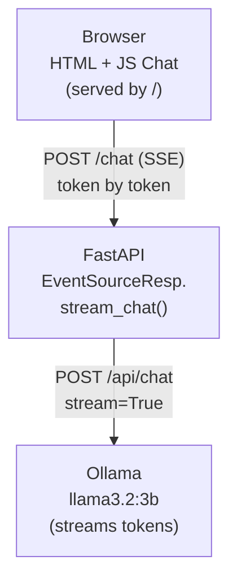

# Milestone Project: Streaming Chat App

Congratulations on completing Phase 11! You have learned about deployment strategies, environment management, and how to ship your applications to production. Now it is time to build something that combines backend engineering with a live user interface.

This is your **fourth milestone project** -- and the final one before your capstone. You have progressed from basic Python scripts, through data pipelines and REST APIs, to this: a real-time streaming chat application. This project ties together FastAPI, server-sent events, Ollama integration, and frontend JavaScript into a single cohesive application.

## What You'll Build

You will build a **real-time streaming chat application** with three components:

- **A streaming generator** that connects to Ollama and yields tokens as they arrive
- **A FastAPI SSE endpoint** (`POST /chat`) that streams those tokens to the client
- **An HTML chat interface** served at `/` with JavaScript that reads the stream and displays tokens in real time

The result is a ChatGPT-like experience running entirely on your local machine.

### Architecture



The key difference from your previous API project is **streaming**. Instead of waiting for the entire response and sending it all at once, your server sends each token to the browser the moment it arrives from Ollama. This creates the smooth, word-by-word typing effect users expect from modern chat applications.

## Step-by-Step Guide

### Step 1: Implement the `stream_chat()` Generator

The `stream_chat()` function is a Python generator that connects to Ollama's streaming API and yields tokens one at a time.

Use `requests.post()` with `stream=True` to get a streaming HTTP response. The JSON payload should include `model`, `messages` (a system message and the user's message), and `stream` set to `True` in the Ollama payload. This tells both the `requests` library and Ollama to stream the response.

Then iterate over the response line by line using `response.iter_lines()`. Each line is a JSON object containing a `message.content` field (the next token) and a `done` field (whether the response is complete). For each non-empty token, yield a dict like `{"data": token}` -- this is the format that `EventSourceResponse` expects. When `done` is `True`, stop iterating.

```python
for line in response.iter_lines():
    if line:
        data = json.loads(line)
        token = data.get("message", {}).get("content", "")
        if token:
            yield {"data": token}
        if data.get("done", False):
            break
```

### Step 2: Implement the `/chat` SSE Endpoint

The `/chat` endpoint receives a `ChatRequest` (with a `message` field) and returns a streaming response. Wrap your `stream_chat()` generator in an `EventSourceResponse`:

```python
return EventSourceResponse(stream_chat(req.message))
```

That is the entire endpoint body. The `EventSourceResponse` class from `sse-starlette` handles the SSE protocol: it sets the correct `Content-Type: text/event-stream` header and formats each yielded dict as an SSE event (`data: token_text\n\n`).

### Step 3: Implement the `/` HTML Page

The index endpoint serves an HTML page with a chat interface. The page needs three things:

1. **A display area** -- a `div` where messages appear
2. **An input row** -- a text input and a send button
3. **JavaScript** that sends the user's message to `/chat` via `fetch()`, then reads the streaming response using `response.body.getReader()` and a `TextDecoder`

The JavaScript reads chunks from the stream, splits them by newlines, looks for lines starting with `data:`, and appends each token to the assistant's message div. This creates the real-time typing effect.

```javascript
const reader = response.body.getReader();
const decoder = new TextDecoder();
while (true) {
    const { done, value } = await reader.read();
    if (done) break;
    // Parse SSE events from decoded text and append tokens to the UI
}
```

## Tips

- **Use `requests.post(..., stream=True)`** -- this is the `requests` library parameter that enables streaming. Without it, `requests` will buffer the entire response before returning.
- **Iterate with `response.iter_lines()`** -- this gives you one line at a time as they arrive from Ollama. Each line is a complete JSON object.
- **Test with `curl -N` first** -- the `-N` flag disables buffering so you can see tokens arrive in real time: `curl -N -X POST http://localhost:8000/chat -H "Content-Type: application/json" -d '{"message": "Hello"}'`
- **Install sse-starlette** -- this package provides `EventSourceResponse`. Install it with `pip install sse-starlette`.
- **Check the /health endpoint** -- if it responds but /chat does not stream, your Ollama connection or stream_chat() generator may have an issue.

## Your Turn

Open the starter file and implement all the TODO items. You have three pieces to build: the `stream_chat()` generator, the `/chat` SSE endpoint, and the `/` HTML page with its JavaScript. Start with `stream_chat()` and test it with curl before building the HTML interface. Once everything works, open `http://localhost:8000` in your browser and chat with your locally-running AI. This is the same streaming architecture used by ChatGPT, Claude, and every other modern chat application.
