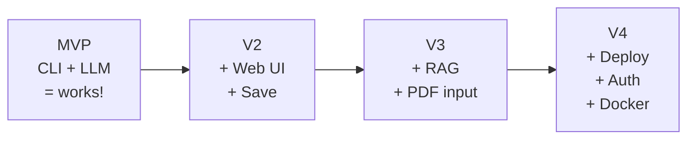

# Project Planning & Architecture

Congratulations -- you've made it to the capstone phase! Over the past eleven phases, you've learned Python, AI fundamentals, prompt engineering, RAG systems, agents, backend development, optimization, and deployment. You've already built four milestone projects along the way (AI Chatbot, RAG Knowledge Base, AI-Powered API, and Streaming Chat App). Now it's time to choose a capstone project and build it from scratch.

But before writing a single line of code, you need a plan. In this lesson, you'll learn how to plan an AI project the way professionals do -- and you'll choose your capstone from 11 remaining projects.

---

## Why Planning Matters

The most common reason personal projects fail isn't bad code -- it's no plan. Without a plan, you:

- Start building features you don't need
- Get overwhelmed by the scope and abandon the project
- Skip critical pieces (like error handling or deployment)
- End up with a mess that's hard to explain or showcase

A simple plan -- even just a README, a list of requirements, and a few milestones -- turns a vague idea into something you can actually finish.

---

## The MVP Approach

**MVP (Minimum Viable Product)** is the smallest version of your project that works and demonstrates value. For an AI project, your MVP should:

1. Accept user input
2. Call an LLM or use a model
3. Return a useful result
4. Handle basic errors

That's it. No fancy UI, no authentication, no deployment. Get the core working first, then iterate.

### Example: AI Study Buddy MVP
- **MVP**: CLI tool that takes a topic, generates flashcards using an LLM
- **V2**: Add Streamlit UI, let users save decks
- **V3**: Add RAG to pull from textbook PDFs
- **V4**: Deploy with Docker, add user accounts



---

## Choose Your Capstone Project

You've already completed 4 milestone projects during the course. Now pick **one** of the remaining 11 projects below as your capstone. Each comes with starter code, a reference solution, and automated tests in the `projects/` directory.

### Apply What You Know (Phases 1-5)
| # | Project | What You Build | Key Skills |
|---|---------|---------------|------------|
| 02 | **Document QA** | Ingest PDFs, answer questions via RAG | File I/O, ChromaDB, RAG |
| 03 | **Code Review Agent** | Parse Python files, get structured review feedback | Prompt engineering, agents |
| 11 | **AI Email Assistant** | Generate professional emails from bullet points | Prompt engineering, rich CLI |

### Build Real Systems (Phases 6-9)
| # | Project | What You Build | Key Skills |
|---|---------|---------------|------------|
| 04 | **Semantic Search Engine** | Embed documents, search by meaning via REST API | Embeddings, Flask, ChromaDB |
| 06 | **Multi-Agent Pipeline** | Chain Researcher/Writer/Reviewer agents | Agent orchestration |
| 09 | **AI Content Moderator** | Classify text as safe/warning/unsafe | FastAPI, structured outputs |
| 10 | **Local Copilot** | Code completion endpoint via Flask + Ollama | Prompt engineering, Flask |

### Production-Grade (Phases 9-11)
| # | Project | What You Build | Key Skills |
|---|---------|---------------|------------|
| 12 | **Image Description Service** | Multimodal LLM describes uploaded images | FastAPI, multimodal (llava) |
| 13 | **AI Testing Framework** | Generate pytest tests from Python source code | Code analysis, agents |
| 14 | **Model Evaluation Dashboard** | Compare models, track latency and quality | Pandas, Streamlit, benchmarks |
| 15 | **Full-Stack AI SaaS** | Complete app: FastAPI + RAG + HTML frontend | Full-stack, ChromaDB, Jinja2 |

**How to choose:** Pick a project that excites you. If unsure, go with **Project 02 (Document QA)** -- it's practical, uses skills from every phase, and makes a great portfolio piece.

Each project has starter code with TODO comments in `projects/NN-project-name/starter/main.py`. The reference solution is in `reference/main.py` if you get stuck.

---

## Requirements Gathering

Before building, write down what your project needs. Requirements come in two flavors:

### Functional Requirements
What the system *does*:
- "Users can upload a PDF and ask questions about it"
- "The system generates a summary of uploaded meeting notes"
- "The chatbot maintains conversation history"

### Non-Functional Requirements
How the system *behaves*:
- "Responses should take less than 5 seconds"
- "The app should work offline with Ollama"
- "The system should handle 10 concurrent users"

Write requirements with priorities: **must-have** (MVP), **should-have** (V2), and **nice-to-have** (future).

---

## Architecture Decisions

Every AI project involves a few key architecture decisions:

### 1. Model Choice
- **Local (Ollama)**: Full privacy, no API costs, works offline. Best for learning.
- **Cloud API**: More powerful models, but costs money and requires internet.
- **Hybrid**: Use local for development, cloud for production.

### 2. Interface
- **CLI**: Fastest to build, great for MVPs
- **Streamlit**: Quick web UI, good for demos
- **FastAPI**: Production-ready API, good for integration

### 3. Data Storage
- **Files**: Simplest. JSON or SQLite for small projects.
- **Vector DB**: ChromaDB or FAISS for RAG projects.
- **PostgreSQL**: For production apps with complex data.

### 4. Project Structure
A clean project structure makes your code maintainable:

```
my-ai-project/
    src/
        main.py
        llm.py
        prompts.py
        utils.py
    tests/
        test_main.py
    data/
    docs/
    requirements.txt
    Dockerfile
    README.md
    .env.example
```

---

## Estimating Complexity

Before committing to a project, estimate its complexity:

- **Small** (1-2 weekends): Few requirements, single interface, no external services. Examples: flashcard generator, code commenter.
- **Medium** (2-4 weekends): Multiple requirements, web UI, some integration. Examples: knowledge base, meeting summarizer.
- **Large** (4+ weekends): Many requirements, multiple services, deployment. Examples: multi-agent system, chatbot platform.

Be honest about your available time. A finished small project beats an abandoned large one.

---

## Writing a README First

Here's a counterintuitive tip: write your README before you write any code. A README forces you to articulate:

- What the project does (in one sentence)
- Why it exists (the problem it solves)
- How to set it up and run it
- What features it has

If you can't write a clear README, you don't understand your project well enough yet. The README becomes your north star during development.

---

## Your Turn

In the exercise, you'll build project planning utilities: a `ProjectPlan` class for managing requirements and milestones, and a `select_project` function that recommends capstone projects based on interests and skill level.

Let's plan!
