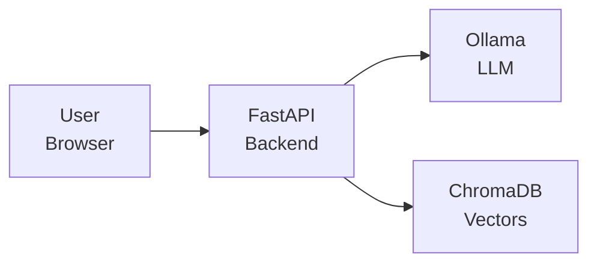

# Deployment & Showcase

This is it -- the final lesson. You've planned your project, built it, tested it, and now it's time to deploy it, document it, and show it to the world. A great project that nobody can find or understand is a missed opportunity. In this lesson, you'll learn how to create a professional showcase for your AI work.

---

## The Deployment Checklist

Before deploying, run through this checklist:

### Code Quality
- [ ] All tests pass
- [ ] No hardcoded secrets or API keys
- [ ] Error handling covers common failure modes
- [ ] Logging is in place for debugging

### Configuration
- [ ] Environment variables documented in `.env.example`
- [ ] Docker configuration tested locally
- [ ] Health check endpoint works

### Documentation
- [ ] README is complete and up to date
- [ ] Setup instructions tested on a clean machine
- [ ] Architecture decisions documented

### Security
- [ ] User input is validated before sending to LLM
- [ ] Prompt injection risks are mitigated
- [ ] Rate limiting is configured
- [ ] HTTPS is enabled for public-facing apps

This checklist applies to any AI project, regardless of size.

---

## Writing Project Documentation

Good documentation answers five questions:

### 1. What does it do?
One sentence. "An AI-powered flashcard generator that creates study materials from any topic using local LLMs."

### 2. Why does it exist?
The problem it solves. "Manual flashcard creation is tedious and time-consuming. This tool generates high-quality flashcards in seconds."

### 3. How do I set it up?
Step-by-step instructions that work on a clean machine. Test them yourself.

### 4. How do I use it?
Examples with actual commands and expected output. Screenshots or GIFs for web UIs.

### 5. How does it work?
A brief architecture overview for other developers. Which components talk to which, and why.

```
  Your README should answer:
  ┌────────────────────────────────────────────────┐
  │ 1. What?  → One-sentence description           │
  │ 2. Why?   → Problem it solves                   │
  │ 3. Setup? → Step-by-step install instructions   │
  │ 4. Usage? → Commands with example output        │
  │ 5. How?   → Architecture overview for devs      │
  └────────────────────────────────────────────────┘
```

---

## Creating Effective Demos

A demo is your project's first impression. Make it count:

### Demo Script
Write a step-by-step script of what you'll show. Don't wing it.

1. Start the application
2. Show the basic use case (happy path)
3. Show a more complex example
4. Show error handling in action
5. Highlight a unique or interesting feature

### Screen Recording Tips
- Keep it under 2 minutes
- Use a clean terminal with a readable font size
- Narrate what you're doing (or add text overlays)
- Start with the problem, then show the solution

### Live Demo Tips
- Have a backup recording in case the live demo fails
- Pre-load any models you'll need (first Ollama pulls are slow)
- Test on the same machine you'll demo from

---

## Architecture Diagrams

A simple architecture diagram helps people understand your project at a glance. You don't need fancy tools -- ASCII art works great:



Key elements to show:
- What the user interacts with
- How data flows through your system
- Which external services you use
- Where data is stored

---

## Portfolio Presentation

Your capstone project is a portfolio piece. Present it professionally:

### GitHub Repository
- Clean, descriptive repository name
- Comprehensive README with badges (build status, Python version)
- Well-organized code with consistent style
- Tagged releases (v1.0, v2.0)
- Issues and pull requests show your development process

### Portfolio Entry
A portfolio entry should include:
- **Project name and one-line description**
- **Tech stack** (as badges or a simple list)
- **Key features** (3-5 bullet points)
- **Screenshot or demo link**
- **What you learned** (1-2 sentences)

---

## Choosing a License

Every open-source project needs a license. Without one, nobody can legally use your code. Here are the two most common choices:

### MIT License

The simplest and most permissive. Anyone can use, modify, and distribute your code -- they just need to include the license text:

```
MIT License

Copyright (c) 2026 Your Name

Permission is hereby granted, free of charge, to any person obtaining a copy
of this software and associated documentation files (the "Software"), to deal
in the Software without restriction, including without limitation the rights
to use, copy, modify, merge, publish, distribute, sublicense, and/or sell
copies of the Software, and to permit persons to whom the Software is
furnished to do so, subject to the following conditions:

The above copyright notice and this permission notice shall be included in all
copies or substantial portions of the Software.

THE SOFTWARE IS PROVIDED "AS IS", WITHOUT WARRANTY OF ANY KIND, EXPRESS OR
IMPLIED.
```

### Apache License 2.0

Like MIT but adds patent protection -- if someone uses your code, they can't sue you for patent infringement:

```
Apache License
Version 2.0, January 2004
http://www.apache.org/licenses/

Licensed under the Apache License, Version 2.0 (the "License");
you may not use this file except in compliance with the License.
```

**Use MIT** for most projects. **Use Apache-2.0** if your project involves patented algorithms or you want extra legal protection. In the exercise, your `generate_license` function will produce the appropriate license text based on the type selected.

> **Tip:** Use `datetime.datetime.now().year` to insert the current year automatically instead of hardcoding it.

---

## Contributing to Open Source

Your bootcamp project can be the start of an open source contribution journey:

1. **Start with your own project**: Make it welcoming with CONTRIBUTING.md, good issues, and clear code.
2. **Contribute to tools you use**: Found a bug in a library? Fix it and submit a PR.
3. **Write documentation**: Many open source projects need better docs more than code.
4. **Join the community**: AI/ML communities on GitHub, Discord, and forums are welcoming.

Open source contributions demonstrate that you can work with others, follow coding standards, and communicate clearly -- all things employers value.

---

## Next Steps in Your AI Career

You've completed a comprehensive AI bootcamp. Here's where to go next:

### Keep Building
The best way to learn is to keep building. Pick another capstone project. Build something for a friend or a local business. Solve a problem you personally face.

### Stay Current
AI moves fast. Follow these to stay updated:
- Hugging Face blog and model releases
- Ollama release notes and new models
- arXiv papers (focus on practical ones with code)
- AI communities on Reddit, Discord, and Twitter

### Specialize
Consider going deeper in one area:
- **RAG systems**: Knowledge retrieval is in high demand
- **AI agents**: Autonomous systems are the frontier
- **Fine-tuning**: Customize models for specific domains
- **MLOps**: Production AI infrastructure

### Share Your Knowledge
Teaching is the best way to solidify your understanding. Write blog posts, create tutorials, answer questions on Stack Overflow, or contribute to this bootcamp.

---

## Creating a Changelog

Track your project's evolution with a changelog:

```markdown
# Changelog

## v1.0.0 - 2025-03-01
### Added
- Initial flashcard generation from topics
- CLI interface
- Basic prompt templates

## v1.1.0 - 2025-03-15
### Added
- Streamlit web interface
### Fixed
- Error handling for Ollama timeouts
```

A changelog shows future contributors (and employers) the project's history and your development process.

---

## Your Turn

In the exercise, you'll build showcase utilities: a `ProjectShowcase` class that generates demo scripts, architecture diagrams, portfolio entries, and deployment checklists. You'll also build functions to generate license text and changelogs.

Congratulations on reaching the end of the curriculum. Now go build something amazing!
