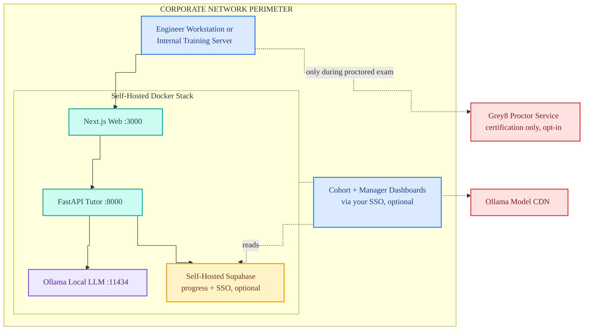

<!-- _class: title -->

# Learn AI With Grey8

## An Open-Source AI Bootcamp · Local LLM Tutor

**12 phases · 15 projects · 35 lessons**
No vendor API keys · Self-hostable · AGPL-3.0

---

*Enterprise deck — for CHROs, L&D heads, CTOs, and engineering managers*

`grey8.io` · `hello@grey8.io` · `github.com/grey8-io/learn-ai-with-grey8`

---

## The Unstructured AI Adoption Risk

- Engineering teams are commonly using **LLM tools** (ChatGPT, Copilot, others) in day-to-day work — without shared standards or training
- Three observable exposures that follow:
  - **Inconsistent quality** across teams
  - **Code and data sent to vendor APIs by default**
  - **Stalled internal AI initiatives** blocked by skill gaps
- Hiring AI-fluent developers is competitive; existing teams generally prefer to **grow into the work**, not be displaced
- Most upskilling options route through cloud APIs and aren't customizable to your codebase

---

## What the Course Is

- **12 progressive phases** — Python → ML → Deep Learning → LLMs → RAG → Agents → Deployment
- **35 structured lessons** — each with content + quiz + graded exercise
- **15 capstone projects** with starter code in the `projects/` directory of the public repo
- **AGPL-3.0** — full source readable, forkable, auditable on GitHub

---

## How a Lesson Works

- **Loop:** read content → take quiz → submit exercise → auto-graded feedback → proceed
- **Quiz size by phase:** 5 / 7 / 10 questions · pass threshold **70%**
- **Exercise grading:** pytest tests (60%) + AI rubric review (40%)
- **3-level progressive hints** — nudge → approach → near-solution
- **Solution reveal** unlocks after 5 failed attempts — for study, not copy
- Completion is **evidence-based** — no "Mark as Complete" button

---

## Enterprise Deployment View

> During normal training, **no prompt or line of code leaves your network**. Two outbound calls only: a one-time model download at setup, and Grey8 Proctor traffic only during certification exams *(opt-in)*.

---

## The Six Service Lines

- **Train** — this course; open-source, free, no licensing fee
- **Assess** — technical evaluations using the same exercises
- **Proctor** — timed, monitored exams · passing earns a Grey8 certificate
- **Place** — match certified candidates with employers
- **Bootcamp** — instructor-led cohort programs
- **Consulting** — AI project staffing

Enterprises typically engage with **Bootcamp + Place + Assess + Consulting**.

---

## Where Grey8 Fits

- **For existing teams** — a self-hostable upskilling platform: structured curriculum, AI tutor, auto-grading · no SaaS contract, no per-seat license
- **For hiring needs** — candidates who completed the bootcamp and passed the proctored assessment have a verifiable, auditable skill record
- **For regulated environments** — the platform runs entirely inside your network; the local LLM means student prompts and code never leave the perimeter
- All curriculum, grading logic, and tutor prompts are **open source** — your team can read them before adopting

---

## Compliance & Data Sovereignty

- **Local LLM only** — student code, prompts, and tutor conversations are processed by the local Ollama instance · they do not transit to OpenAI, Anthropic, Google, or any third party
- **Self-hosted Supabase** — optional progress and auth storage runs in your environment; nothing routes through a Grey8 server
- **AGPL-3.0 source** — every component reviewable by your security team

**Honest scope:**
- The **Proctor service** (used only for certification exams) runs on Grey8-hosted infrastructure — it is opt-in and not required to use the bootcamp
- **Model pulls** from the Ollama CDN require outbound HTTPS at setup and on upgrade

---

## Three Engagement Models

- **Self-paced platform deployment** — install the open-source platform in your environment; teams progress at their own pace · no fee
- **Cohort training (Bootcamp)** — instructor-led, scheduled programs for 10–30 engineers · scoped per engagement
- **Talent pipeline (Place)** — hire developers from the certified pool · pre-validated against the same auto-grader your team can run

Most engagements **combine self-paced + targeted cohorts**. Pricing is conversational and scoped on the call.

---

## The Talent Pipeline

- Candidates complete the 12-phase curriculum at their own pace · same content, same auto-grading
- Certification requires passing a **proctored exam** (Proctor service) · exercises drawn from the same curriculum — no separate exam bank
- Certificates are **HMAC-verifiable** via a public verification page
- Employers receive: candidate profile, exercise submission history, certification record, optional interview support
- **We do not maintain skill claims that aren't backed by an auditable submission** — what you see is what was graded

---

## Deployment & Hardware Fit

- Runs on engineering laptops — **4GB RAM** floor for the low-tier model; 8GB+ for the default llama3.2:3b
- **Single-server deployment** for cohort programs (Docker Compose stack)
- **GPU optional** · CPU-only operation supported across the platform
- **Anonymous-by-default** · SSO via Supabase is opt-in if you need manager dashboards / cohort progress reports
- **No per-seat licensing fee** · services (Bootcamp / Place / Assess / Proctor / Consulting) are the paid layer

---

## Get In Touch

**Suggested next step:** 30min pilot scoping call.

Three things we'll cover:
1. Which team or hiring gap to start with
2. Self-paced platform · cohort training · or talent pipeline
3. Timeline

| Channel | Address |
|---------|---------|
| **LinkedIn** | linkedin.com/company/grey8-io |
| **Email** | hello@grey8.io |
| **Repo** | github.com/grey8-io/learn-ai-with-grey8 |
