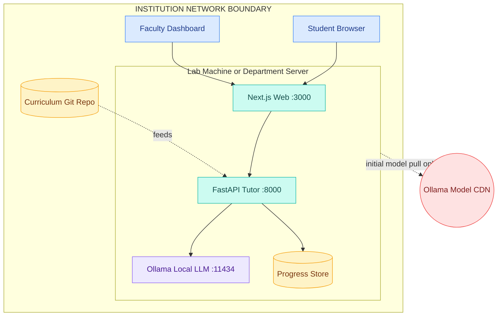

<!-- _class: title -->

# Learn AI With Grey8

## An Open-Source AI Bootcamp · Local LLM Tutor

**12 phases · 15 projects · 35 lessons**
No vendor API keys · Runs on lab hardware · AGPL-3.0

---

*Department deck — for HoDs, Deans, and Senior Faculty*

`grey8.io` · `hello@grey8.io` · `github.com/grey8-io/learn-ai-with-grey8`

---

## The Curriculum-to-Industry Gap

- AI tooling, libraries, and best practices evolve on a **6–12 month cycle**
- B.Tech curriculum revision cycles run **3–5 years**
- Faculty bandwidth is finite — content updates, grading at scale, and research advising compete for the same hours
- Recruiters increasingly ask for **deployable artifacts**, not notebooks
- Existing online platforms sit outside the institution — no faculty oversight, no academic-record integration, no placement path

---

## What the Course Is

- **12 progressive phases** — Python → ML → Deep Learning → LLMs → RAG → Agents → Deployment
- **35 structured lessons** — each with content + quiz + graded exercise
- **15 capstone projects** with starter code in the `projects/` directory of the public repo
- **AGPL-3.0** — full source readable, forkable, auditable on GitHub

---

## How a Lesson Works

- **Loop:** read content → take quiz → submit exercise → auto-graded feedback → proceed
- **Quiz size by phase:** 5 / 7 / 10 questions · pass threshold **70%**
- **Exercise grading:** pytest tests (60%) + AI rubric review (40%)
- **3-level progressive hints** — nudge → approach → near-solution
- **Solution reveal** unlocks after 5 failed attempts — for study, not copy
- Completion is **evidence-based** — no "Mark as Complete" button

---

## Department Deployment View

> Student code, prompts, and faculty data **never leave the institution** during normal operation. The only outbound traffic is the one-time model pull at setup.

---

## The Six Service Lines

- **Train** — this course; open-source, free, no licensing fee
- **Assess** — technical evaluations using the same exercises
- **Proctor** — timed, monitored exams · passing earns a Grey8 certificate
- **Place** — match certified candidates with employers
- **Bootcamp** — instructor-led cohort programs
- **Consulting** — AI project staffing

Universities typically engage with **Train + Proctor + Place**.

---

## What Departments Get

- A complete 12-phase curriculum already authored (`curriculum/` in the public repo)
- Curriculum schema documented (`curriculum/schema.json`) — faculty add, edit, remove lessons via the ACE CLI
- One platform deployment serves a full department (Docker Compose stack)
- **No per-student or per-seat fee · no API consumption charges**

---

## What Faculty Actually Get

- **Auto-grading** — pytest + AI rubric per submission; per-student scores, test breakdown, rubric feedback — no manual grading queue
- **Progress visibility** — lesson status, quiz scores, submission history, tutor chat logs · queryable per student
- **AI tutor** — Socratic in-platform Q&A; gives hints, not answers
- **Curriculum is files, not vendor SaaS** — fork, edit, contribute back
- **Train-the-trainer call** — 1hr onboarding before student rollout

*Tradeoff: supplements your summative assessment and institutional grading; doesn't replace them.*

---

## What Students Actually Get

- ~800–1000 word lesson content with embedded diagrams (Mermaid + ASCII)
- Browser-based **Monaco code editor** with auto-grading on submit
- Per-lesson AI tutor with lesson + code context — Socratic, gives hints not answers
- Progress in browser **localStorage** by default · optional sign-in for cross-device sync
- 15 capstone projects with starters, READMEs, architecture diagrams
- Gamification: XP, levels, achievements, **LinkedIn-shareable phase certificates**
- Optional Grey8 certification via the Proctor service · HMAC-verifiable

---

## Adoption Models — pick one, or combine

- **Self-hosted, lab-deployed** — install on existing CS lab machines (Docker, 4GB RAM minimum)
- **Self-hosted, institution-server** — single deployment serves many; SSO via self-hosted Supabase
- **Drop-in elective** — 1–2 semester elective alongside existing CSE/AIML curriculum
- **Full-track replacement** — 12-phase progression replaces existing AIML curriculum *(requires mapping work)*
- **Train-the-trainer first** — faculty complete the bootcamp before delivering to students

---

## Safety, Privacy, Compliance

- **No external LLM calls** — student prompts and code stay on institution machines
- **No vendor API keys** to manage, rotate, or leak
- **Anonymous-by-default** — no account required; localStorage progress
- **Sign-in is optional and self-hosted** — Supabase runs in your environment, not on a vendor cloud
- **AGPL-3.0** — every component readable and auditable

**Honest tradeoffs:** Docker + 4GB RAM required · model must be pre-pulled for offline use · the Proctor service (used only for certification) is the one piece on Grey8-hosted infrastructure.

---

## Get In Touch

**Suggested next step:** 1hr faculty-first call — train-the-trainer demo on the live platform.

| Channel | Address |
|---------|---------|
| **LinkedIn** | linkedin.com/company/grey8-io |
| **Email** | hello@grey8.io |
| **Repo** | github.com/grey8-io/learn-ai-with-grey8 |
