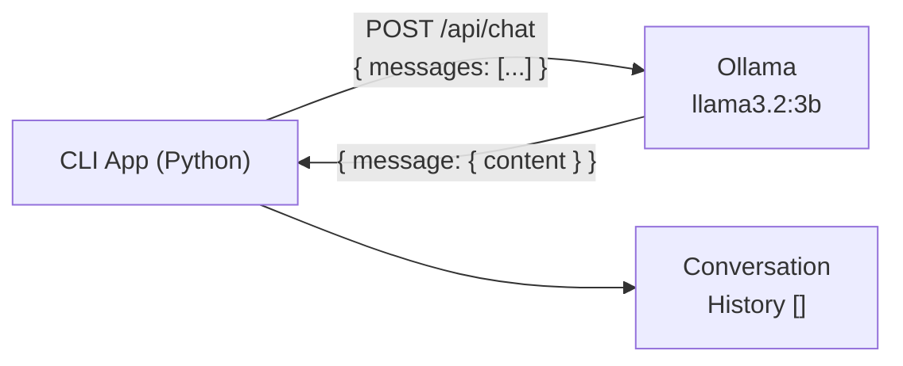

# Project 01: AI Chatbot

> Build a multi-turn conversational CLI chatbot powered by a local LLM via Ollama.

## Learning Objectives

- Understand how LLM chat APIs work with conversation history
- Build a multi-turn dialogue system that maintains context
- Format terminal output with the `rich` library
- Handle streaming and error cases gracefully
- Use the Ollama REST API (`/api/chat` endpoint)

## Prerequisites

- **Phase 1**: Python fundamentals, working with APIs
- **Phase 2**: Understanding of HTTP requests and JSON
- Ollama installed and running locally

## Architecture



## Setup

```bash
# Install dependencies
pip install -r starter/requirements.txt

# Pull the model (one-time)
ollama pull llama3.2:3b
```

## Usage

```bash
# Run the starter (your implementation)
python starter/main.py

# Run the reference solution
python reference/main.py
```

**Example session:**

```
You: What is Python?
AI:  Python is a high-level, interpreted programming language known for
     its readability and versatility...

You: What are its main features?
AI:  Building on what I mentioned, Python's main features include...

You: /quit
Goodbye!
```

## Extension Ideas

- Add `/clear` command to reset conversation history
- Support system prompts via a `--system` CLI flag
- Add token counting and display tokens used per response
