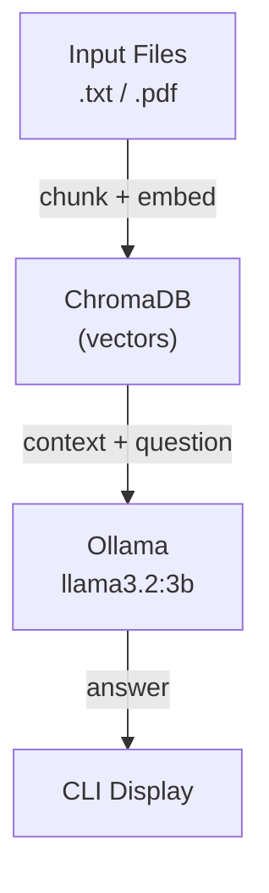

# Project 02: Document QA

> Ingest text and PDF files into a vector database, then answer questions using RAG.

## Learning Objectives

- Understand Retrieval-Augmented Generation (RAG) end to end
- Chunk and embed documents into ChromaDB
- Retrieve relevant context for a user query
- Combine retrieved context with an LLM prompt for grounded answers
- Handle both plain text and PDF file formats

## Prerequisites

- **Phase 1**: Python fundamentals, file I/O
- **Phase 2**: REST APIs, JSON handling
- **Phase 3**: Embeddings and vector databases concepts
- Ollama installed and running locally

## Architecture



## Setup

```bash
# Install dependencies
pip install -r starter/requirements.txt

# Pull the model (one-time)
ollama pull llama3.2:3b
```

## Usage

```bash
# Ingest a document then ask questions
python reference/main.py

# Example session:
#   Enter path to ingest (or 'ask' to query): notes.txt
#   Ingested notes.txt (5 chunks)
#   Enter path to ingest (or 'ask' to query): ask
#   Question: What are the key points about Python?
#   Answer: Based on the document, the key points are...
```

## Extension Ideas

- Add support for `.docx` and `.csv` files
- Implement chunk overlap for better context retrieval
- Add a `--top-k` flag to control how many chunks are retrieved
