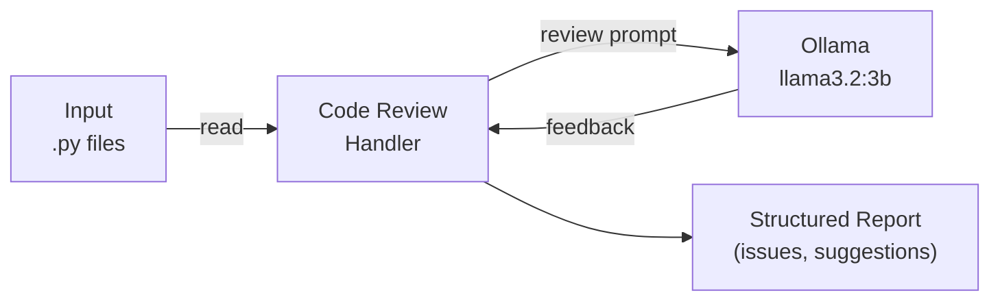

# Project 03: Code Review Agent

> Parse Python files and get structured code review feedback from a local LLM.

## Learning Objectives

- Build an AI agent that performs a specialized task (code review)
- Craft effective system/review prompts for structured output
- Parse and display structured feedback from LLM responses
- Work with file system operations using `pathlib`
- Understand prompt engineering for consistent output formatting

## Prerequisites

- **Phase 1**: Python fundamentals, file I/O
- **Phase 2**: REST APIs, prompt design
- Ollama installed and running locally

## Architecture



## Setup

```bash
# Install dependencies
pip install -r starter/requirements.txt

# Pull the model (one-time)
ollama pull llama3.2:3b
```

## Usage

```bash
# Review a single file
python reference/main.py path/to/script.py

# Review all .py files in a directory
python reference/main.py path/to/project/

# Example output:
#   === Code Review: script.py ===
#
#   Issues:
#   - No error handling around file operations (line ~15)
#   - Function `process` is too long (40+ lines)
#
#   Suggestions:
#   - Add type hints to function parameters
#   - Extract the validation logic into a separate function
```

## Extension Ideas

- Add severity levels (critical, warning, info) to issues
- Support reviewing multiple languages (JS, Go, etc.)
- Output results as JSON or HTML report
