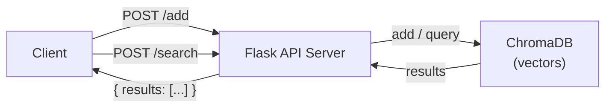

# Project 04: Semantic Search Engine

> Embed documents into ChromaDB and search by meaning via a Flask REST API.

## Learning Objectives

- Build a REST API with Flask for AI-powered search
- Understand semantic similarity vs keyword matching
- Store and retrieve vector embeddings with ChromaDB
- Design clean API endpoints with JSON request/response
- Combine embedding search with a web framework

## Prerequisites

- **Phase 1**: Python fundamentals
- **Phase 2**: REST APIs, HTTP methods (GET, POST)
- **Phase 3**: Embeddings and vector databases
- Ollama installed and running locally

## Architecture



## Setup

```bash
# Install dependencies
pip install -r starter/requirements.txt

# Pull the model (one-time)
ollama pull llama3.2:3b
```

## Usage

```bash
# Start the server
python reference/main.py

# In another terminal, add a document:
curl -X POST http://localhost:5000/add \
  -H "Content-Type: application/json" \
  -d '{"id": "doc1", "text": "Python is a high-level programming language."}'

# Search by meaning:
curl -X POST http://localhost:5000/search \
  -H "Content-Type: application/json" \
  -d '{"query": "What programming languages are easy to learn?", "n_results": 3}'

# Response:
# {"results": [{"id": "doc1", "text": "Python is a ...", "distance": 0.42}]}
```

## Extension Ideas

- Add a `DELETE /documents/{id}` endpoint to remove documents
- Build a simple HTML frontend with a search bar
- Add metadata filtering (e.g., search only within a category)
