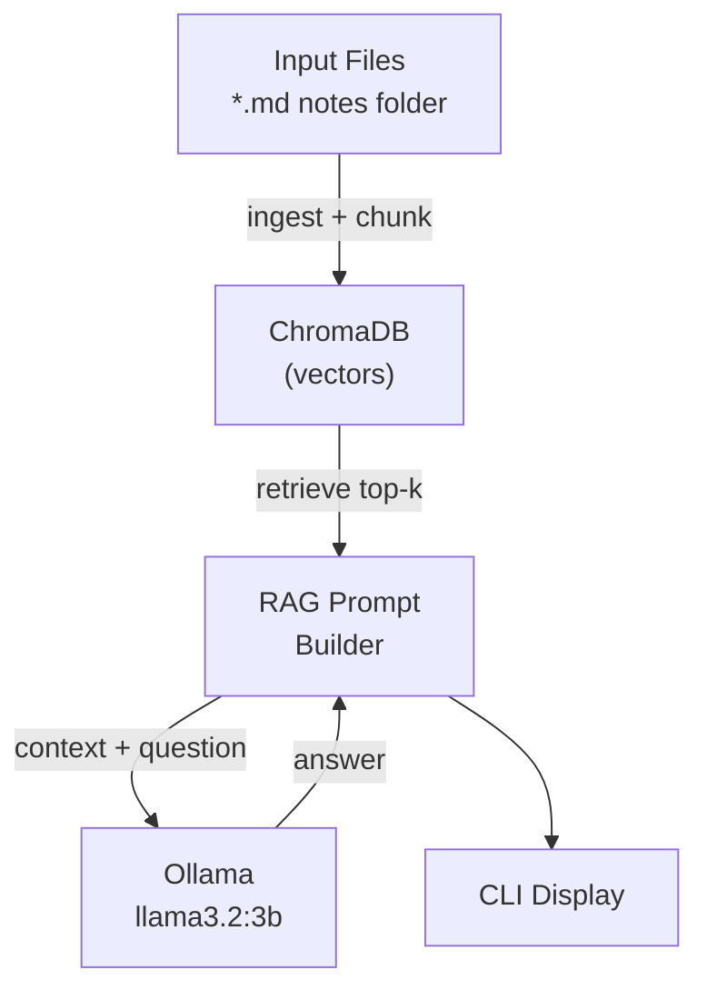

# Project 05: RAG Knowledge Base

> Ingest a folder of Markdown notes and answer questions using Retrieve-Augment-Generate.

## Learning Objectives

- Build a complete RAG pipeline from scratch
- Ingest and chunk Markdown documents at scale
- Retrieve relevant context and craft effective RAG prompts
- Understand the difference between RAG and plain LLM responses
- Build a practical CLI tool for personal knowledge management

## Prerequisites

- **Phase 1**: Python fundamentals, file I/O
- **Phase 2**: REST APIs, working with JSON
- **Phase 3**: Embeddings, vector databases, RAG concepts
- Ollama installed and running locally

## Architecture



## Setup

```bash
# Install dependencies
pip install -r starter/requirements.txt

# Pull the model (one-time)
ollama pull llama3.2:3b
```

## Usage

```bash
# Ingest a folder of Markdown notes, then ask questions
python reference/main.py

# Example session:
#   Enter notes folder path: ./my-notes
#   Ingested 12 files (47 chunks)
#
#   Ask a question (or 'quit'): How does Git branching work?
#   Answer: Based on your notes, Git branching works by...
#
#   Ask a question (or 'quit'): quit
#   Goodbye!
```

## Extension Ideas

- Add `--folder` and `--question` CLI flags for non-interactive use
- Show which source files contributed to each answer
- Implement a "freshness" check to re-ingest only changed files
