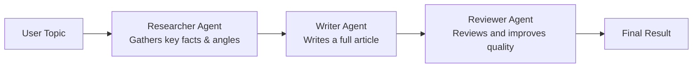

# Project 06: Multi-Agent Pipeline

Chain multiple specialized AI agents to research, write, and review content on any topic.

## Learning Objectives

- Understand the multi-agent pattern: specialized LLM calls with distinct system prompts
- Build a sequential pipeline where each agent's output feeds into the next
- Design effective system prompts that constrain agent behavior
- Handle intermediate state between pipeline stages
- Practice clean class-based design for AI workflows

## Prerequisites

- Phase 1 (Projects 01-05): comfortable calling Ollama, prompt engineering basics
- Python classes and string formatting

## Architecture



Each box is an Agent: one LLM call with a specialized system prompt.
The output of each agent becomes the input (user message) for the next.

## Setup

```bash
pip install -r requirements.txt
ollama pull llama3.2:3b
```

## Usage

```bash
# Run with default topic
python main.py

# Run with custom topic
python main.py "The future of renewable energy"
```

## Extension Ideas

- Add a **Fact-Checker** agent between Writer and Reviewer
- Let the Reviewer send feedback back to the Writer for a revision loop
- Add an **Editor** agent that formats the final output as Markdown with headings
