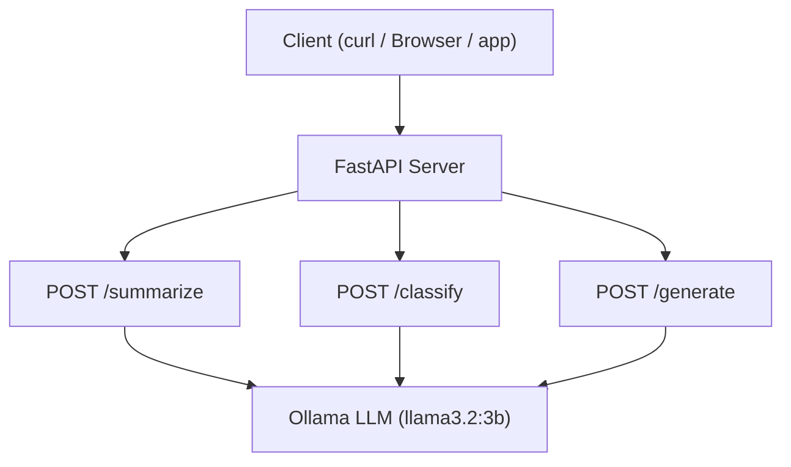

# Project 07: AI-Powered API

Build a REST API with FastAPI that exposes summarization, classification, and text generation endpoints.

## Learning Objectives

- Design RESTful API endpoints backed by LLM inference
- Use FastAPI request/response models (Pydantic) for validation
- Structure AI prompts for specific tasks (summarize, classify, generate)
- Handle errors gracefully in a production-style API
- Test APIs with curl and understand JSON request/response patterns

## Prerequisites

- Phase 1 (Projects 01-05): prompt engineering, Ollama basics
- Project 06: comfortable chaining LLM calls
- Basic understanding of HTTP methods and JSON

## Architecture



## Setup

```bash
pip install -r requirements.txt
ollama pull llama3.2:3b
```

## Usage

```bash
# Start the server
python main.py

# Summarize text
curl -X POST http://localhost:8000/summarize \
  -H "Content-Type: application/json" \
  -d '{"text": "FastAPI is a modern web framework for building APIs with Python. It is based on standard Python type hints and provides automatic validation, serialization, and documentation."}'

# Classify text
curl -X POST http://localhost:8000/classify \
  -H "Content-Type: application/json" \
  -d '{"text": "I absolutely loved this product!", "categories": ["positive", "negative", "neutral"]}'

# Generate text
curl -X POST http://localhost:8000/generate \
  -H "Content-Type: application/json" \
  -d '{"prompt": "Write a haiku about programming", "max_tokens": 100}'
```

## Extension Ideas

- Add a `/translate` endpoint that translates text between languages
- Implement request rate limiting with slowapi
- Add an `/embeddings` endpoint using Ollama's embedding API
