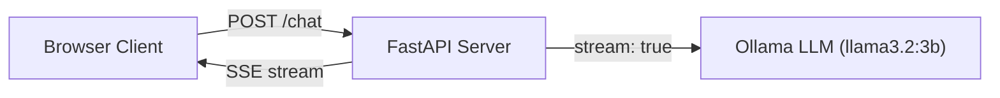

# Project 08: Streaming Chat App

Real-time streaming chat using Server-Sent Events (SSE) from Ollama via FastAPI, with a simple HTML client.

## Learning Objectives

- Understand streaming vs. blocking LLM inference and why streaming matters for UX
- Implement Server-Sent Events (SSE) with FastAPI and sse-starlette
- Consume Ollama's streaming API (`stream: true`) and forward tokens in real time
- Serve a static HTML/JS chat interface from FastAPI
- Manage conversation history across multiple turns

## Prerequisites

- Phase 1 (Projects 01-05): Ollama chat API basics
- Project 07: FastAPI fundamentals
- Basic HTML/JavaScript for the client

## Architecture



## Setup

```bash
pip install -r requirements.txt
ollama pull llama3.2:3b
```

## Usage

```bash
# Start the server
python main.py

# Open in browser
# Visit http://localhost:8000 for the chat UI

# Or test streaming with curl
curl -N -X POST http://localhost:8000/chat \
  -H "Content-Type: application/json" \
  -d '{"message": "Explain quantum computing in simple terms"}'
```

## Extension Ideas

- Add conversation history so the LLM remembers previous messages
- Support multiple concurrent chat sessions with session IDs
- Add a "stop generation" button that cancels the stream
