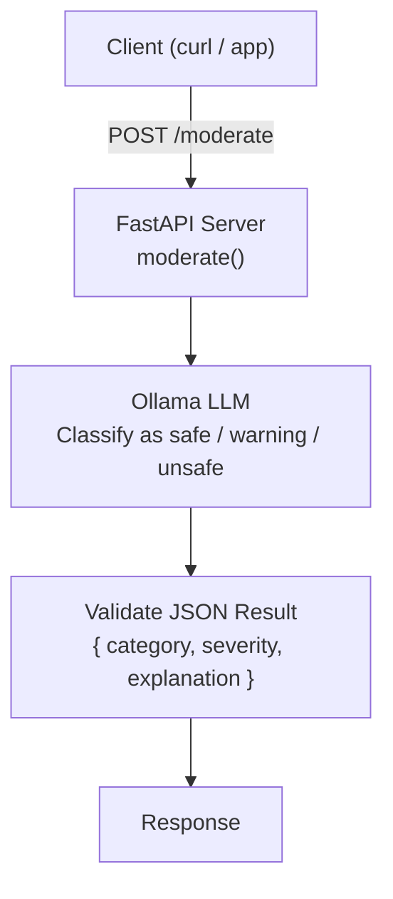

# Project 09: AI Content Moderator

Classify user-submitted text as safe, warning, or unsafe using an LLM with structured output.

## Learning Objectives

- Design prompts that produce structured, parseable output from an LLM
- Build a content moderation pipeline with severity levels and explanations
- Parse and validate LLM JSON output reliably
- Create a FastAPI service with typed request/response models
- Handle edge cases in LLM output (malformed JSON, unexpected values)

## Prerequisites

- Phase 1 (Projects 01-05): prompt engineering, structured output basics
- Project 07: FastAPI endpoint patterns
- Understanding of JSON parsing in Python

## Architecture



## Setup

```bash
pip install -r requirements.txt
ollama pull llama3.2:3b
```

## Usage

```bash
# Start the server
python main.py

# Moderate safe content
curl -X POST http://localhost:8000/moderate \
  -H "Content-Type: application/json" \
  -d '{"text": "I love sunny days and ice cream!"}'

# Moderate potentially unsafe content
curl -X POST http://localhost:8000/moderate \
  -H "Content-Type: application/json" \
  -d '{"text": "I am so angry I could scream"}'

# Batch moderation
curl -X POST http://localhost:8000/moderate/batch \
  -H "Content-Type: application/json" \
  -d '{"texts": ["Hello friend!", "This product is terrible"]}'
```

## Extension Ideas

- Add configurable moderation rules via a policy JSON file
- Implement a `/report` endpoint that logs flagged content for human review
- Add support for multiple languages by including language detection
