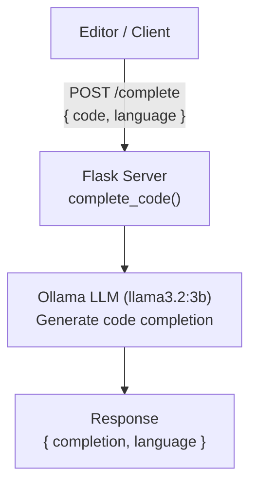

# Project 10: Local Copilot

A code completion endpoint that accepts code context and returns AI-powered suggestions, like a local GitHub Copilot.

## Learning Objectives

- Build an AI code completion service using a local LLM
- Design prompts that produce useful code completions (not full rewrites)
- Use Flask to create a lightweight REST API
- Handle multi-language code context (Python, JavaScript, etc.)
- Understand the difference between code completion and code generation

## Prerequisites

- Phase 1-2 (Projects 01-09): prompt engineering, API design, structured output
- Basic Flask knowledge (or willingness to learn -- it is simpler than FastAPI)
- Familiarity with how code completion tools work

## Architecture



## Setup

```bash
pip install -r requirements.txt
ollama pull llama3.2:3b
```

## Usage

```bash
# Start the server
python main.py

# Complete Python code
curl -X POST http://localhost:5000/complete \
  -H "Content-Type: application/json" \
  -d '{"code": "def fibonacci(n):\n    ", "language": "python"}'

# Complete JavaScript code
curl -X POST http://localhost:5000/complete \
  -H "Content-Type: application/json" \
  -d '{"code": "function sortArray(arr) {\n    ", "language": "javascript"}'

# Health check
curl http://localhost:5000/health
```

## Extension Ideas

- Add a `/explain` endpoint that explains what a code snippet does
- Support a `max_lines` parameter to limit completion length
- Build a simple VS Code extension or terminal UI that calls this API
