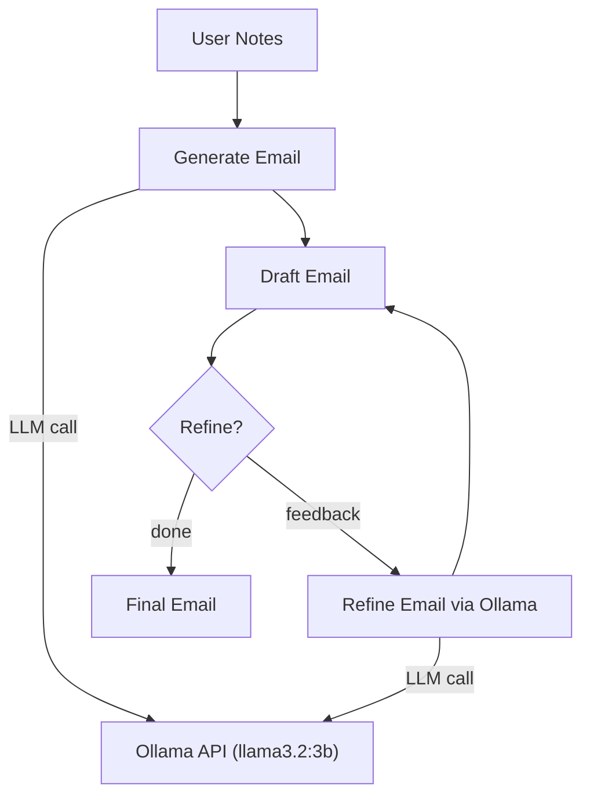

# Project 11: AI Email Assistant

Generate professional emails from bullet points and rough notes using a local LLM.

## Learning Objectives

- Build a practical CLI tool that transforms unstructured notes into polished emails
- Implement iterative refinement loops with LLM conversations
- Use the `rich` library for beautiful terminal output
- Practice prompt engineering for tone and format control
- Handle multi-turn interactions where context accumulates

## Prerequisites

- Phase 1: Python fundamentals, working with strings and user input
- Phase 2: Making HTTP requests to Ollama API
- Phase 3: Prompt engineering basics (tone, structure, constraints)

## Architecture



## Setup

```bash
cd projects/11-ai-email-assistant/starter
pip install -r requirements.txt
ollama pull llama3.2:3b
```

## Usage

```bash
python main.py
```

Then follow the prompts:
1. Enter your bullet points or rough notes
2. Choose a tone (professional, friendly, formal, casual)
3. Review the generated draft
4. Optionally refine with feedback like "make it shorter" or "add urgency"
5. Copy the final email

## Extension Ideas

- Add email templates (follow-up, introduction, complaint, thank you)
- Support reading notes from a text file
- Add clipboard copy with `pyperclip`
