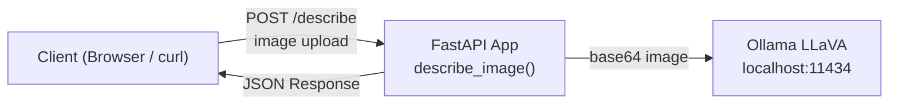

# Project 12: Image Description Service

Describe images using a multimodal LLM (LLaVA) served locally through Ollama and FastAPI.

## Learning Objectives

- Work with multimodal AI models that understand both text and images
- Build a REST API with FastAPI for file uploads
- Encode images to base64 for API consumption
- Handle binary file I/O and image processing
- Create a production-style microservice with proper error handling

## Prerequisites

- Phase 1: Python fundamentals, file I/O, base64 encoding
- Phase 2: FastAPI basics, HTTP endpoints, request/response handling
- Phase 4: Working with Ollama API and multimodal models

## Architecture



## Setup

```bash
cd projects/12-image-description-service/starter
pip install -r requirements.txt

# Important: pull the multimodal model (not llama3.2)
ollama pull llava
```

## Usage

Start the server:
```bash
python main.py
```

Then send an image:
```bash
curl -X POST http://localhost:8000/describe \
  -F "file=@photo.jpg" \
  -F "prompt=Describe this image in detail"
```

Or open http://localhost:8000/docs for the interactive Swagger UI.

## Extension Ideas

- Add an HTML upload form at the root endpoint
- Support URL-based image input (fetch image from URL)
- Add batch processing for multiple images
