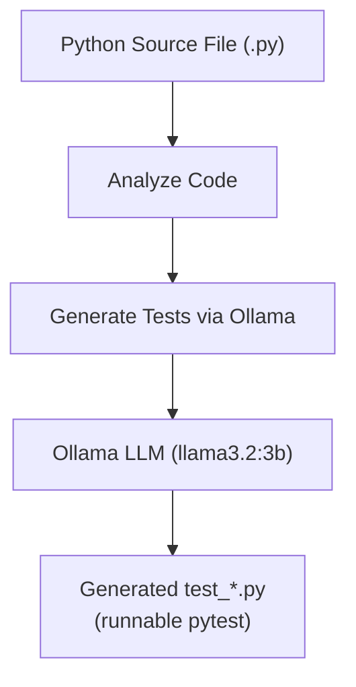

# Project 13: AI Testing Framework

Generate pytest unit tests from Python source code using a local LLM.

## Learning Objectives

- Use LLMs for automated code analysis and test generation
- Parse and understand Python source code structure programmatically
- Generate syntactically valid, runnable pytest test files
- Practice prompt engineering for code generation tasks
- Work with file I/O using `pathlib` for cross-platform paths

## Prerequisites

- Phase 1: Python fundamentals, file I/O, pathlib
- Phase 2: Working with Ollama API
- Phase 3: Prompt engineering for structured code output
- Familiarity with pytest basics (writing and running tests)

## Architecture



## Setup

```bash
cd projects/13-ai-testing-framework/starter
pip install -r requirements.txt
ollama pull llama3.2:3b
```

## Usage

```bash
# Generate tests for a Python file
python main.py path/to/your_module.py

# Run the generated tests
pytest test_your_module.py -v
```

Example with a sample file:
```bash
echo 'def add(a, b): return a + b' > sample.py
python main.py sample.py
pytest test_sample.py -v
```

## Extension Ideas

- Add support for generating tests for entire directories
- Include edge case detection (empty inputs, None, negative numbers)
- Generate property-based tests using hypothesis
