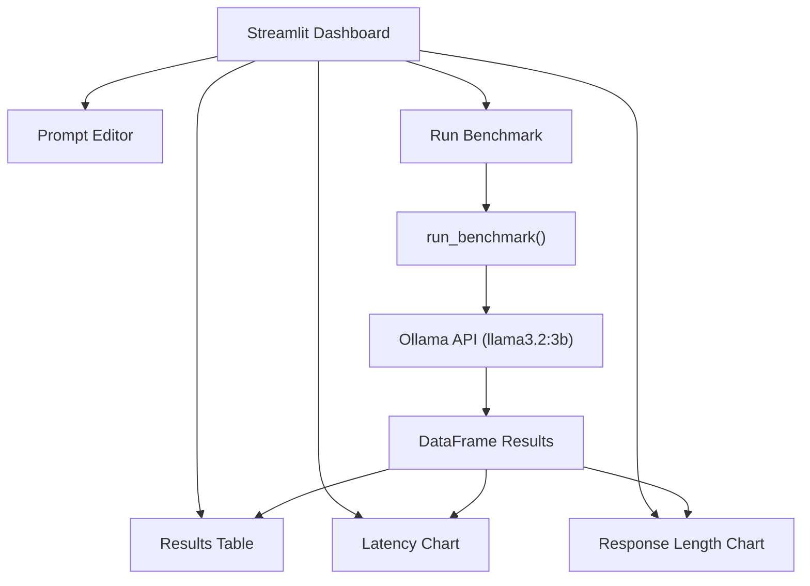

# Project 14: Model Evaluation Dashboard

Compare LLM outputs across prompts, track latency and quality metrics via a Streamlit dashboard.

## Learning Objectives

- Build interactive data dashboards with Streamlit
- Design benchmark suites to evaluate LLM performance
- Measure and compare latency, response length, and output quality
- Use pandas for data aggregation and analysis
- Visualize results with Streamlit's built-in charting

## Prerequisites

- Phase 1: Python fundamentals, data structures, timing
- Phase 2: Working with Ollama API
- Phase 3: Prompt engineering and evaluation concepts
- Basic familiarity with pandas DataFrames

## Architecture



## Setup

```bash
cd projects/14-model-evaluation-dashboard/starter
pip install -r requirements.txt
ollama pull llama3.2:3b
```

## Usage

```bash
streamlit run main.py
```

Then open http://localhost:8501 in your browser. The dashboard lets you:
1. Define a set of test prompts
2. Run benchmarks against the model
3. View latency, response length, and side-by-side outputs
4. Export results as CSV

## Extension Ideas

- Compare multiple models side by side (e.g., llama3.2:3b vs llama3.2:1b)
- Add a "quality score" using a second LLM as a judge
- Track results over time with persistent storage (SQLite)
