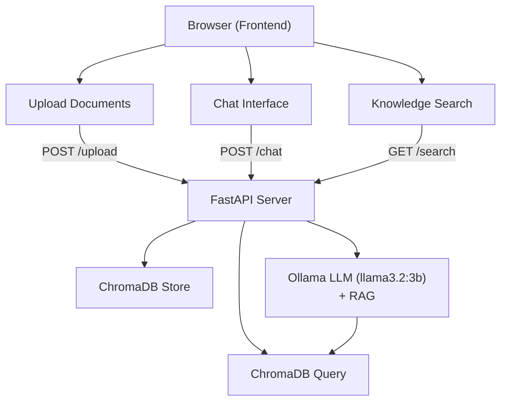

# Project 15: Full-Stack AI SaaS

A complete mini-application combining RAG, chat, and a web frontend — the capstone of capstones.

## Learning Objectives

- Architect a full-stack AI application from scratch
- Combine RAG (Retrieval-Augmented Generation) with a chat interface
- Build a FastAPI backend serving both API endpoints and HTML pages
- Use ChromaDB as a local vector store for document knowledge
- Create a usable web frontend with Jinja2 templates

## Prerequisites

- Phase 1-3: Python, APIs, prompt engineering
- Project 7 or 8: RAG fundamentals and ChromaDB experience
- Project 5 or 6: FastAPI and web service experience
- This project ties together skills from the entire curriculum

## Architecture



## Setup

```bash
cd projects/15-full-stack-ai-saas/starter
pip install -r requirements.txt
ollama pull llama3.2:3b
```

## Usage

```bash
python main.py
```

Open http://localhost:8000 in your browser. The app provides:

1. **Document Upload** — Upload .txt files to build a knowledge base
2. **Chat** — Ask questions; the AI uses uploaded documents as context (RAG)
3. **Search** — Search the knowledge base directly

## Project Structure

```
starter/
  main.py              # FastAPI app with all endpoints
  requirements.txt
  templates/
    index.html         # Main page with chat, upload, and search
```

## Extension Ideas

- Add PDF upload support with PyPDF2
- Persist chat history in a SQLite database
- Add user authentication with session tokens
